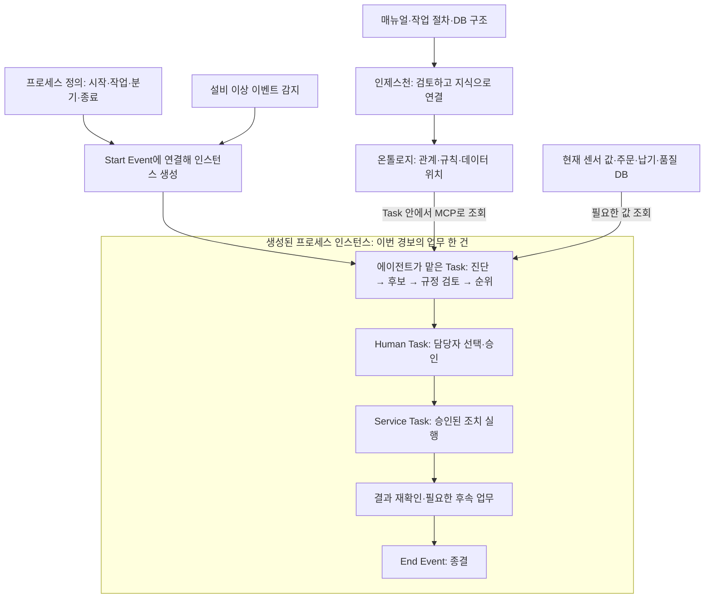

# ProcessGPT 구조를 HYD로 구현 — 목적·하나의 실행 흐름·현재 위치

2026-10-05 중간 보고. 완료 판단은 검증 근거가 확보된 A071까지를 기준으로 한다.

## 1. 왜 이 일을 하고 있는가

**온톨로지와 에이전트를 중심으로 강의 내용을 더 채우기 위해, ProcessGPT의 핵심 구조를 HYD 사례로 직접 구현하는 작업이다.** 회의에서는 75시간 규모의 강의를 염두에 두고, 설비·SCADA 외에 온톨로지와 에이전트 쪽 내용을 충분히 다루어야 한다고 했다. 완성된 기능을 보는 것에 더해, 문서와 DB를 지식으로 만들고 그 지식을 사용하는 에이전트를 업무 흐름 안에 연결하는 개발 과정 자체가 강의의 재료가 된다.

그래서 **하나의 설비 이상 대응 프로세스를 만들어 가면서 각 구성요소가 왜 필요하고 어떻게 연결되는지 이해할 수 있게 하는 것**이 방향이다. 후반에는 “지금까지 우리가 만든 프로세스·에이전트·사람 작업의 구조가 ProcessGPT와 이렇게 연결된다”는 것을 실제 제품과 함께 보여 주려는 취지다. 기존 사용자 지시에서도 “우리가 ProcessGPT를 만드는 것”, “에이전트는 Task에 속한다”를 명시했다.

지금 개발하는 대상은 이 흐름을 실제로 실행할 수 있는 HYD 시스템이다. ProcessGPT의 실제 참고 레포를 따라 필요한 구조와 기능을 구현하고 검증한다. 교육용이라는 이유로 고정된 정답이나 정상 시연만 남기도록 축소하지 않는다. 현재 내가 맡은 범위에서 교재·슬라이드 제작은 제외됐지만, **이 시스템을 개발하는 교육 목적은 그대로다.** 기업 컨설팅 활용과 여러 DB를 연결하는 데이터 패브릭은 회의에서 함께 언급한 활용·확장 방향이다.

## 2. 최종 목표는 하나의 프로세스가 실제로 도는 것이다

**문서·DB에서 지식을 준비하고, 이벤트가 발생하면 프로세스 인스턴스를 만들고, 그 안의 Task에서 에이전트·사람·시스템이 맡은 일을 수행해 종결하는 구조**를 완성한다. 유압설비의 쿨러·펌프·팬 이상 대응을 이 구조의 구체적인 사례로 사용한다.

먼저 두 가지를 준비한다. 하나는 **프로세스 정의**, 즉 어떤 이벤트로 시작해 어떤 작업과 분기를 거쳐 끝나는지 정한 업무 설계도다. 다른 하나는 **온톨로지 인제스천**, 즉 회사의 매뉴얼·작업 절차·DB 구조를 읽어 설비·이상·조치·규칙·데이터 위치 사이의 관계를 지식으로 넣는 과정이다. 현재 온도나 납기 같은 값은 실제 데이터 저장소에서 필요할 때 조회한다.

준비한 정의와 지식은 아래 실행 흐름에서 만난다.

여기서 **프로세스 인스턴스는 ‘이번에 발생한 경보를 처리하는 업무 한 건’**이고, Task는 그 안의 작업 단위다. 에이전트는 자신에게 배정된 Task에서 지식과 현재 데이터를 찾아 결과를 제출한다. 프로세스는 그 결과와 정의된 조건을 보고 다음 Task를 연다. 사람의 선택이 필요한 곳에서는 Human Task로 기다리고, 승인이 이뤄지면 정해진 서비스 작업으로 실행한다. 각 Task의 진행 상태·도구 사용·판단 결과는 같은 인스턴스의 이력으로 확인한다.

예를 들어 쿨러 경보로 인스턴스가 시작되면, 진단 Task의 에이전트가 온톨로지에서 고장·매뉴얼 관계를 찾고 현재 온도와 팬 상태를 조회한다. 이어 조치 후보·규정 검토·순위 Task가 설비 보호와 납기 영향을 비교한다. 담당자는 Human Task에서 대안을 선택하고, 승인된 조치의 실행·회복 확인·정비 업무가 이어진다. 위 그림은 이 기본 흐름을 보여 주며, 실제 정의에는 거부·시간초과·회복 실패 등의 분기도 필요하다.

인제스천은 이 실행을 위한 지식을 만들고 갱신하는 과정이다. 매번 경보가 날 때 모든 문서를 처음부터 다시 적재한다는 뜻은 아니다. 강의에서는 **지식을 만드는 과정과 그 지식이 Task 안에서 사용되는 과정을 하나의 이야기로 연결**한다.

최종적으로는 프로세스 정의, 매뉴얼, 규칙, 업무 데이터가 바뀌었을 때도 지원 범위 안에서 해당 인스턴스·Task의 조회·판단·승인·실행에 변화가 반영돼야 한다. 정상 완료뿐 아니라 오류·재시작·재작업도 확인한다.

## 3. 그래서 어떤 작업이 필요하고, 지금 어디까지 했는가

기존 저장소에는 설비 모의 환경, 온톨로지 구조, 규칙 판단, 승인·제어의 기본 코드가 있었다. 이를 바탕으로 업무를 단계별로 관리하고 실제 데이터·AI·사람의 승인을 연결하며, 변경이나 장애가 생겨도 상태가 맞도록 보강해 왔다.

| 해야 할 작업 | 필요한 이유 | 지금까지 한 일 | 아직 해야 할 일 |
|---|---|---|---|
| ① 이벤트→Start Event→인스턴스·Task 연결 | 경보마다 업무 한 건을 만들고 정의된 순서대로 진행해야 함 | 정의 판본을 정해 인스턴스와 소속 작업 생성, 에이전트·사람 작업 배정, 승인·분기·시간초과를 구현·검증 | 남은 복잡한 분기와 변경 상황까지 처리 범위 확인 |
| ② 회사 문서와 데이터 구조를 지식으로 연결 | AI가 매뉴얼과 데이터의 의미·위치를 찾아야 함 | 문서와 DB 구조를 검토해 지식에 넣고, 수정·되돌리는 경로를 구현·부분 검증 | 새 문서에서 AI가 내용을 정확히 읽고 실제 판단까지 연결하는지 확인 |
| ③ 현재 설비·업무 데이터를 조회 | 과거 값이나 추측으로 조치하지 않도록 함 | 센서와 회사 DB 조회, 새 컬럼 연결, 누락·오래된 값의 판단 보류를 확인 | 더 다양한 데이터 구조와 질문에서도 올바르게 조회하는지 검증 |
| ④ AI가 근거를 찾아 진단·대안 제시 | 설비와 납기 등 여러 관점을 함께 판단해야 함 | 과거 버전에서 실제 AI의 자료 조회를 확인. 별도 규칙 실행 시험에서 납기·업무 값에 따른 권고 변화도 확인 | 최신 코드에서 새 지식과 새 질문을 실제 AI가 처리하는지 종합 검증 |
| ⑤ 조치 실행과 회복 확인 | 버튼을 누른 이후 실제 처리가 됐는지 알아야 함 | 모의 설비 명령 응답, 이후 상태 재확인, 로컬 정비 DB의 작업지시 생성·종결을 확인 | 이미 실행한 명령·업무를 다시 검토할 때 취소 가능한 것과 후속 조치가 필요한 것을 구분·처리 |
| ⑥ 중단·중복·재작업 대응 | 재시작이나 재요청으로 조치가 중복되거나 옛 승인이 쓰이면 안 됨 | 저장 후 재시작, 중복·늦은 제출 방어, 새 입력 대기와 새 승인 기한을 확인 | 실제 실행 효과가 남은 상황을 포함한 복합 실패·복구 검증 |
| ⑦ 사람이 볼 화면과 운영 방법 정리 | 진행 상태와 실패 이유를 보고 다음 행동을 할 수 있어야 함 | 업무·에이전트·실행 이력 화면과 변경·복구 방법 문서 마련 | 최신 화면을 직접 조작해 실제 상태와 일치하는지 전체 동선 확인 |
| ⑧ 참고 제품 구조와 여러 설비 사례 대조 | 이후 확장에 연결되는 구조를 갖추고 특정 사례에만 묶이지 않도록 함 | 47개 참고 레포의 버전·관련성을 정리하고 필요한 코드를 대조. 쿨러·펌프·팬의 기본 실행 경로를 확인 | 남은 참고 기능의 적용 여부를 깊게 검토하고 변경된 조건의 여러 사례를 검증 |

**현재 위치는 ‘이벤트 → 인스턴스 → Task → 승인·실행의 기본 흐름을 연결해 돌려 봤고, 지식·조건 변경과 실패 후 복구를 보강하는 단계’다.** 초기 설계만 있는 상태는 지났지만, 새로운 자료와 상황에서도 전체 흐름이 맞게 동작한다고 모두 확인한 단계는 아니다.

최근에는 입력이나 조건이 달라졌을 때 새 검토가 필요한 작업을 다시 열고, 필요한 최신 데이터가 준비될 때까지 기다리며, 예전 승인 기한을 잘못 재사용하지 않도록 보강했다. 내부 평가 62.5/100은 이런 요구별 도달 단계를 점수로 정리한 값이다. 남은 공수나 기간이 37.5%라는 뜻은 아니다.

## 4. 다음에는 무엇을 할 것인가

우선 **이미 실행한 조치를 다시 검토하는 절차**를 마무리해야 한다. 정비 작업지시를 이미 만들었는데 판단이 바뀌었다면 실제 작업 상태를 확인하고, 취소가 가능한지 또는 다른 후속 조치가 필요한지 처리해야 한다. 화면의 업무 상태만 되돌리는 것으로 끝낼 수 없다.

그다음은 **새 문서·데이터·규칙이 실제 판단에 이어지는지** 확인하는 일이다. 예를 들어 새 매뉴얼이나 납기 조건을 넣었을 때 AI가 바뀐 내용을 찾고, 필요한 데이터를 다시 조회하고, 조치안과 승인 내용까지 바꾸는지를 확인한다. 뜻이 불명확하거나 값이 없으면 확인이 필요하다고 남겨야 한다.

이 과정에서 관련 참고 레포의 실제 코드와 비교해 빠진 기능을 보완하고, 마지막으로 **최신 AI 실행과 사람이 사용하는 화면을 함께 검증**한다. 정상 실행뿐 아니라 거부, 시간초과, 데이터 없음, 재시작도 포함한다. 현재 최신 AI 실행과 직접 화면 검증에는 실행 환경의 제약이 있어 확인하지 못한 부분이 남아 있다.

완료 시에는 지원 범위의 여러 사례에서 **‘무슨 근거로 판단했는가 → 누가 승인했는가 → 무엇이 실행됐는가 → 문제가 해결됐는가’**를 실제 결과로 설명할 수 있어야 한다.

## 회의와 확정 지시를 어떻게 반영했는가

아래는 회의 발언을 쉬운 말로 풀어 쓴 대응표다. 회의의 목적, 이후 사용자가 확정한 개발 범위, 실제 수행 결과를 구분했다.

| 확인한 근거 | 보고와 개발 방향에 반영한 내용 |
|---|---|
| 회의 원문 2, 51~79행 | 지식에 적어 둔 기준과 계속 변하는 현재 값을 구분하고 실제 데이터 저장소에서 조회 |
| 같은 원문 88~178행 | AI가 지식 구조를 이해하고 도구로 조회하며 서버·화면과 연결 |
| 같은 원문 187~193행, 222~238행, 253~302행 | 75시간 규모를 염두에 둔 강의 내용 확충, 온톨로지·에이전트 중심 개발 과정, 문서·DB에서 출발하는 지식과 질의 |
| 같은 원문 340~404행 | 센서뿐 아니라 회사 업무 데이터를 함께 조회해 상황 판단 |
| 같은 원문 410~448행 | 사람 선택과 인스턴스 모니터링을 구현하면서 ProcessGPT의 구조로 연결하고 데이터 연결의 확장 필요성을 설명 |
| 같은 원문 456~457행 | 교육과 향후 기업 컨설팅에 함께 활용하려는 목적 |
| 기존 사용자 발화 3·4·21과 이번 정정 | ProcessGPT 구조를 직접 구현하는 강의용 개발. 에이전트는 프로세스 인스턴스의 Task에서 수행 |
| GOAL의 현재 인수조건 | 교육 목적을 유지하면서 담당 작업은 시스템 개발·검증에 집중. 교재 제작 제외와 교육 목적을 혼동하지 않음 |
| 참고 레포 채택 기록과 실제 검증 기록 | 제품 이름이나 레포 개수가 아니라 실제 코드·HYD 대응 기능·실행 근거로 완료 판단 |

근거: [회의 원문 2](handoff/sources/meeting-2.txt), [현재 목표와 완료 조건](handoff/GOAL.md), [기존 사용자 지시](handoff/USER_UTTERANCES.md), [참고 레포 대응](handoff/REFERENCE_ADOPTION.md), [요구별 진척](handoff/PROGRESS.md). 회의 원문 1의 국방·데이터 패브릭 논의는 참고 자료이며 HYD의 필수 개발 범위로 자동 편입하지 않았다. 이 보고 수정에서는 회의 원문과 현재 계약·채택/검증 기록을 대조했으며 47개 레포 전체 코드를 새로 검증한 것은 아니다.

개발·검증 담당자를 위한 실행 근거와 범위

| 증거 | 결과 | 이 결과가 증명하는 범위 |
|---|---|---|
| A071 전체 자동 검사 | **982 passed, 6 warnings**, 23.92초 | 현재 코드의 자동 검사 범위. 실제 AI·화면·전체 시스템 완료를 대체하지 않음 |
| A071 새 정의·재작업 실제 연동 | **24/24**, exit 0 | HTTP·PostgreSQL 저장·강제 종료/재시작·2세대·조건 분기·실제 타이머·Neo4j 투영 |
| A071 동일 배포본 쿨러 | **42/42**, exit 0 | 실제 모의 설비 경보→검토/승인→soft-PLC ACK→재관측→실제 로컬 CMMS DB 작업지시→종결. 20배속/기존 허용치 유지 |
| A069/A070 정책·조건 변경 | 각각 **16/16**, **14/14** | 실제 PG/그래프/MCP/API에서 식·업무값·조건 변경, 미확인 입력, 오래된 승인 보류 |
| 과거 A034 Codex 경로 | **42/42** — 당시 기록 | 실제 Codex 4작업과 MCP 호출을 포함한 당시 실행. 최신 A071 코드의 Codex 검증은 아님 |

최신 쿨러 실행은 `anomaly_response.5a980f8f-be6a-4ed5-83e6-5c6e8e3b7637`, 사건 `INC-1004-01-a4f9`, 명령 `CMD-1004-0001-b4a2`, CMMS `WO-1004-9047`이다. 최신 회귀는 기존 결정론 엔진이 작업 결과를 연결하는 **legacy bridge**를 사용했다. 실제 공장 하드웨어 검증은 아니다.

A071에서는 검사기 오류 1건과 “과거 시간초과 작업이 새 타이머 전에 열리는” 제품 결함을 발견했다. 실패를 보존하고 후자의 단위 반례·수정·실제 재검증을 완료했다. 정상 실행만 모아 통과로 보고하지 않는다.

보고용 검증 발췌와 원본 해시는 [verification/2026-10-05/manifest.json](handoff/verification/2026-10-05/manifest.json)에 있다. 전체 실행 산출물은 로컬 `.evidence/reaudit/`에 보존하며 저장소 발췌를 전체 원시 증거라고 부르지 않는다. 마지막 환경 확인은 18서비스 running, unhealthy 0, worker/probe/scenario 0이며 실패 사례를 포함한 6개 검사 인스턴스가 모두 종결됐다.

A072 보상 관련 추가 코드·시험·화면·문서는 로컬에서 작업 중이다. 이번 보고 수정에서 새 실행·배포·완료 여부를 확인하지 않았으며, 완료 실적과 이번 문서 PUSH에 포함하지 않는다. 최신 실행 환경 확인도 위 A071 시점의 기록이다.

구체적인 변경 방법은 [정의 작성](definition-authoring.md), [물리 원천](enterprise-catalog.md), [센서 질의](sensor-queries.md), [순위 정책](ranking-policy.md), [BSC 조건](bsc-conditions.md), [재작업 조건](rework-conditions.md)을 따른다.

재개 기록은 [HANDOFF](handoff/HANDOFF.md)를 따른다.

