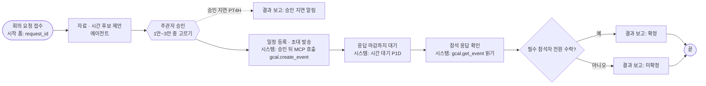

# 전체 과정 랩업 — 내 업무 하나를 처음부터 끝까지 만든다 (설계안)

> 2026-10-09 · 설계안(사용자 확인 전) · 코드 변경 없음, 이 파일 하나만 새로 씀
> 근거: `docs/보고서/2026-10-09_HYD_시나리오_3개.md`(흐름 뼈대), `docs/실라버스.md`(OL1~OL9 · AL1~AL8 · BL1~BL5 랩업 행), `TODO.md` 확정 TODO B(B1 에이전트 · 스킬, B2 MCP 등록, B3 흐름 가져오기, B4 배포, B6 내보내기 · 가져오기), `docs/definition-authoring.md`, `docs/ontology/schema-v2.md`, 최신 코드 c3 worktree(`.claude/worktrees/agent-afd136e4b22934cb9`)
> 전제(사용자 결정): 과정 맨 끝에 둔다. 수업 시간 제한은 따지지 않는다. 구글 연결(계정 · 인증)은 사용자가 맡는다. 실현 가능하다고 본다.

---

## 1. 목표와 가치

세 막 동안 학생은 강사와 함께 **남이 준비한 공장 사건 세 개**(A 긴급 대응 · B 정기 정비 · C 예비품 구매)를 따라 만들었다. 전체 과정 랩업에서는 준비된 것을 하나도 쓰지 않고 **자기 업무 하나**를 골라, 내 문서로 내 지식 그래프를 세우고, 내 업무 표에 자리를 잇고, 내 에이전트에 내 요령과 내 도구(구글 드라이브 · 캘린더 같은 실제 서비스)를 붙이고, 내가 그린 흐름을 포털에 올려 한 건을 끝까지 닫는다. 가치는 세 문장이다. **"따라 한 것이 아니라 내가 할 수 있다"** — 같은 틀(지식 → 일꾼 → 흐름)이 공장이 아닌 내 업무에도 그대로 맞는다는 것을 손으로 확인한다. **"블랙박스가 없다"** — 내가 만든 처리 건의 task를 하나씩 눌러 어떤 근거로 무엇을 제안했고, 내가 무엇을 승인했고, 시스템이 무엇을 실제로 했는지 전부 본다. **"월요일에 회사에서 쓸 수 있다"** — 결과물(내 온톨로지 · 에이전트 · 흐름 파일)이 내 업무에 바로 옮길 수 있는 첫 버전이다.

---

## 2. 단계별 흐름 (권장 순서)

뼈대는 세 사건과 같다: **시작 → ① 에이전트 판단 · 제안 → ② 담당자 승인(1회) → ③ 시스템 처리 → ④ 시스템 결과 확인 → ◇ → 결과 보고 → 끝.** 학생은 이 뼈대에 자기 업무를 끼운다.

| # | 학생이 하는 일 | 어디서 | 끝났다는 증거 | 다시 쓰는 앞 단원 |
|---|---|---|---|---|
| 0 | **업무 고르기** — 한 장 양식(사례 카드)에 "무엇이 시작을 알리나 / 에이전트가 답할 질문 / 승인하는 사람 1명 / 승인 뒤 시스템이 하는 쓰기 / 시스템이 확인할 것 / 지는 대안 2개 / 미달 가지 1개"를 채운다 | 종이 · Notion 과정 노트 | 사례 카드 7칸이 다 찼고 강사 확인 표시(2.1 판정 기준 통과) | 시나리오 3개 비교표(시작 출처 · 승인자 · 결과 확인), OT 카페 그림(OT4) |
| 1 | **내 문서 모으기** — 업무 규칙 · 절차가 적힌 문서 2~3개(내 것 또는 출발본 예시)를 내 구글 드라이브 폴더와 레포 `students/<내ID>/docs/`에 둔다 | 구글 드라이브 · VS Code | 폴더에 문서가 있고, 문서마다 "이 문서로 답할 질문" 3개를 적었다 | OPA2 문서 적재, OT10 꼭 답할 질문 |
| 2 | **내 틀 세우기** — Claude Code에게 사례 카드와 문서를 주고 "스키마 v2의 상위 클래스는 그대로 쓰고, 내 업무 고유 개념만 내 이름 공간에 같은 형식으로 정의하라"고 시킨다 | Claude Code → Neo4j Browser | `students/<내ID>/schema.json`이 생기고, Neo4j Browser에 내 클래스 · 관계 그림이 뜬다. 확정 스키마 `it/neo4j/v2/schema.json`은 변경 0 | OL2(틀 세우기), OT3 |
| 3 | **문서에서 지식 뽑기** — 내 문서를 나누고 → 틀에 맞는 것만 원문 구간과 함께 뽑고 → 내가 승인한 것만 적재한다(되돌리기 1회 연습) | Claude Code(또는 포털 지식 관리 — 갭 G4가 풀리면) | 내 이름 공간 노드에 원문 근거(ManualSection)가 붙고, 꼭 답할 질문 3개가 그래프 질의로 통과 | OL4 · OL5 · OL6 · OL7 |
| 4 | **내 업무 표 만들고 자리 잇기** — 내 업무 데이터 표(예: 회의 요청 · 참석자)를 만들고 몇 줄 넣은 뒤, 지식에는 값이 아니라 "어느 표 어느 칸"(InputData의 table · column)만 잇는다 | Claude Code → Supabase(학생 스키마) → Neo4j | 표에 행이 있고, InputData 노드가 표 · 칸을 가리키며, 자리로 조회하면 지금 값이 나온다. 값 노드 0개 | OL8, OT11, A11 데이터 패브릭 미니 |
| 5 | **내 도구 서버 등록** — (가) 내 업무 표 읽기 서버, (나) 구글 드라이브 · 캘린더 서버를 포털에 등록하고 연결 검사를 통과시킨다. 읽기 도구는 에이전트에, 쓰기 도구(일정 만들기 · 메일)는 승인 뒤 시스템 task에만 | Claude Code(작은 서버 만들기) → 포털 MCP 등록 | 포털 MCP 화면에 서버가 "검사 통과", 읽기 도구 목록 · 막힌 쓰기 도구 목록이 보인다. 읽기 도구 하나를 포털에서 직접 불러 결과를 본다 | AL3 · AL4(서버 만들기 · 등록 · 연결 검사), B2 |
| 6 | **내 에이전트 만들기** — 목표 · 지시문 · 내 지식 그래프 · 읽기 도구를 붙이고, 내 요령(SKILL.md)을 써서 붙인다. 질문 하나로 시험해 근거 있는 답을 받는다 | 포털 에이전트(만들기) · Claude Code(요령 초안) | 포털 "에이전트에게 질문하기"에서 도구 호출 기록과 근거가 붙은 답. 요령 전 · 후로 첫 도구 호출이 달라진다 | APA1 일꾼 만들기, AL5 요령, B1 · B5 |
| 7 | **내 흐름 그리기** — bpmn.io에서 레인 3개(담당자 / 에이전트 / 시스템), task 5개 안팎, 승인 1회, 분기 1개로 그린다 | bpmn.io → `.bpmn` 저장 | bpmn.io에서 열리는 `.bpmn` 파일 | BPA1(흐름 그려 올리기), BL1 |
| 8 | **포털로 가져와 묶기** — 흐름을 가져와 task마다 부품(에이전트 · 사람 승인 · 승인 뒤 MCP 호출 · 대기 · 결과 보고)을 고르고, 레인을 사람 · 에이전트에 잇고, 시작 조건은 "사람 입력 · 직접 시작"으로 정한 뒤 사전 검사 → 판본 등록 → 배포 | 포털 흐름 가져오기 | 사전 검사 문제 0, 판본 1 등록 · 배포. 승인 앞 쓰기를 일부러 놓아 거절 사유(칸 위치)를 한 번 본다 | B3 · B4, BPA1 |
| 9 | **한 건 끝까지 돌리기** — 시작 폼을 채워 처리 건을 만들고, 에이전트 제안 → 내 작업함에서 승인 → 실제 구글 일정 생성 → 자동 확인 → 결과 보고까지 닫는다. 이어서 미달 가지를 한 번 일부러 밟는다 | 포털 처리 건 · 내 작업함 · 구글 캘린더 | 처리 건이 "완료", task마다 다섯 칸(받은 입력 · 판단 근거 · 도구 호출 · 출력 · 넘긴 값)이 차 있고, 구글 캘린더에 실제 일정이 있다. 미달 건은 "미확정" 보고로 닫힘 | BPA2 · BPA3, A1 블랙박스 0, BL4 |
| 10 | **내보내고 발표** — 구성 내보내기(에이전트 · 스킬 · MCP · 매핑 · 흐름)와 내 스키마 · 적재 스크립트를 한 묶음으로 저장하고, 처리 건 화면으로 3분 발표 | 포털 구성 내보내기 · 레포 | `students/<내ID>/` 묶음 + 내보낸 구성 파일. "되돌리기 → 가져오기"하면 같은 상태 | B6 출발본(내보내기 · 가져오기), E1 ProcessGPT 대응표 |

### 2.1 업무 고르기 판정 기준 (단계 0에서 강사가 보는 것)

- **시작이 하나의 사건이다.** 요청 한 건 · 기한 도래 한 건 = 처리 건 하나.
- **에이전트가 근거로 고를 대안이 둘 이상 있다.** 해피패스만 있는 업무(그냥 옮겨 적기)는 고르지 않는다. 지는 대안이 실제 이유(규칙 · 비용 · 시간)로 진다.
- **승인 뒤 쓰기가 실제 시스템에 남는다**(일정 · 메일 · 표 한 줄). 그리고 그 결과를 **시스템이 다시 읽어 확인**할 수 있다.
- **미달 가지를 실제로 밟을 수 있다**(응답 없음 · 마감 초과 · 기준 미달).
- 개인정보 · 회사 기밀 문서는 쓰지 않는다(출발본 예시 문서로 대신).

---

## 3. 풀어 본 예: 고객사 분기 리뷰 회의 준비

### 3.1 왜 이 사례인가

사용자가 낸 "회의 준비"를 그대로 쓰되, 판단이 생기도록 **필수 참석자 · 자료 마감 · 회의실**이 부딪치는 "고객사 분기 리뷰 회의"로 좁혔다. 이유는 네 가지다.

1. **뼈대가 세 사건과 똑같다.** 요청 접수(시작) → 자료 · 시간 후보 제안(에이전트) → 주관자 승인(1회) → 일정 등록 · 안내(시스템) → 참석 응답 확인(시스템) → 확정/미확정 보고. 새로 배울 것 없이 다시 쓴다.
2. **읽기와 쓰기가 깔끔하게 갈린다.** 드라이브 검색 · 읽기, 캘린더 빈 시간 조회는 읽기라 에이전트가 쓰고, 일정 만들기 · 안내 메일은 쓰기라 승인 뒤 시스템 task만 한다. "승인 전 에이전트는 조회만"이 그대로 지켜진다.
3. **해피패스가 아니다.** 가장 빠른 시간은 자료 공유 마감(48시간 전)을 못 지키고, 가장 많이 모이는 시간은 필수 참석자 한 명이 빠진다. 미달 가지(필수 참석자 거절 · 무응답)도 실제로 밟힌다.
4. **누구나 자기 데이터로 바꿔 끼울 수 있다.** 학생 본인의 구글 계정 · 드라이브 · 캘린더로 돌아간다.

### 3.2 문서 (구글 드라이브 `capstone-<내ID>/` 폴더, 출발본에 예시본 제공)

| 문서 | 담긴 것 | 지식으로 뽑히는 것 |
|---|---|---|
| D1 회의 운영 규칙(1쪽) | 필수 참석자 전원 가능해야 확정, 자료는 회의 48시간 전 공유, 근무시간 09~18시, 고객 회의는 회의실 6인 이상, 점심 12~13시 금지 | 규칙(Rule) 5개 · 원문 구간 |
| D2 분기 리뷰 준비 절차(SOP, 1쪽) | ① 지난 회의록 찾기 ② 계약 · 이슈 요약 ③ 안건 초안 ④ 시간 후보 3개 ⑤ 승인 뒤 초대 · 자료 링크 첨부 | 요령(Skill = SOP)과 단계(Step) 5개 |
| D3 지난 분기 회의록(2쪽) | 미결 이슈 3건, 다음 분기 확인할 지표 | 안건(AgendaItem) 후보 · 근거 |

### 3.3 온톨로지 — 어디에 두나 (세 안 비교, 권장 = 다)

| 안 | 내용 | 장점 | 문제 |
|---|---|---|---|
| 가. 확정 스키마 v2 클래스만 쓰기 | 회의를 Process · Task로, 참석자를 Role로만 표현 | 바꿀 것 없음 | "회의" "안건" "자료" 같은 업무 개념이 사라지거나 Asset · FailureMode에 억지로 끼워져 뜻이 틀어진다(온톨로지는 객체 모델이지 프로세스 설명이 아니다 — CLAUDE.md §4) |
| 나. 확정 스키마에 추가 확장 | `schema.json`에 Meeting 등 클래스 추가 | 한 그래프에서 검사 | 학생 30명이 같은 원본을 고치게 되고, "이번 세 주제는 확장 없이 된다"는 확정 원칙(TODO C 원칙 1)을 깬다. 반 전체 validate가 학생마다 흔들린다 |
| **다. 학생 이름 공간 + v2 상위 클래스 재사용 (권장)** | 업무 고유 개념만 `students/<내ID>/schema.json`(확정 스키마와 **같은 형식**: name · label_ko · layer · properties · 관계 from/to · cardinality)에 정의. 가치 · 프로세스 · 리소스 · 규칙 층은 v2 클래스를 그대로 쓴다. 모든 노드에 `ns = "<내ID>"`, id 앞에 `<내ID>:` | 확정 스키마 변경 0. 학생 것끼리 · 수업 시나리오와 섞이지 않음(지우기도 ns 한 줄). v2 상위 층을 쓰니 포털 지식 지도 · 규칙 · KPI 질의 모양이 그대로 통한다 | 이름 공간 검사 · 지식 지도 필터가 아직 없음(갭 G4) |

**권장 이유 한 줄:** 확정 스키마는 "공장 공통 언어"로 지키고, 학생은 그 위에 "내 업무 사전"을 덧댄다. ProcessGPT ontology-studio도 스키마를 여러 개 따로 두는 모양이다(`process-gpt/services/ontology-studio/backend/src/modules/ontology/api.py` `/api/schemas/{schema_id}` 232~326행).

**비유:** 공용 사전(v2)은 그대로 두고, 내 부서 용어집(학생 이름 공간)을 따로 만들어 공용 사전 단어에 연결한다.

#### 클래스 · 관계 (예)

v2 클래스 그대로 쓰는 것(인스턴스만 내 이름 공간):

| v2 클래스 | 이 사례의 인스턴스 |
|---|---|
| Objective · Measure | 고객 유지(전략 목표) · 필수 참석률(%) · 자료 사전 공유율(%) · 준비 리드타임(일) — `INFLUENCES` 부호 관계: 리드타임 ↓ → 사전 공유율 ↓ |
| Process · Task · Role | 분기 리뷰 회의 준비 · 흐름 task 5개(가져오기 뒤 투영) · 주관자(영업 담당) · 참석자 역할 |
| System | 구글 드라이브 · 구글 캘린더 · 내 업무 표(회의 요청 DB) |
| Skill · Step | `skill:<ID>:qbr-prep`(D2 SOP)와 단계 5개, `Step-[:REFERS_TO]->ManualSection` |
| Decision · DecisionTable · Rule · InputData | 판단 "시간 후보 고르기", 규칙 5개(D1). 예: `Rule(필수 참석자 불가 → EXCLUDE)-[:TESTS {operator:'<', value:1}]->InputData(필수 참석 가능 비율)` |
| KnowledgeSource · ManualSection | D1 · D2 · D3 문서와 절 |

내 이름 공간에만 두는 것(같은 형식의 추가 정의):

| 학생 클래스 | 속성 | 관계 (v2에 잇는 다리) |
|---|---|---|
| Meeting 회의 | title!, kind!(qbr · weekly), durationMin!, dueBy | `Meeting-[:FOR_CUSTOMER]->Customer`, `Process-[:ACTS_ON]->Meeting`(v2의 ACTS_ON을 대상 클래스만 넓혀 학생 쪽 선언) |
| Customer 고객사 | name!, tier | `Customer-[:HAS_CONTACT]->Attendee` |
| Attendee 참석자 | name!, email!, required!(bool) | `Attendee-[:PLAYS]->Role` |
| AgendaItem 안건 | title!, status(open · closed) | `AgendaItem-[:RAISED_IN]->Document`, `AgendaItem-[:ABOUT]->Customer` |
| Document 자료 | title!, driveFileId!, modifiedAt | `Document-[:STORED_IN]->System(구글 드라이브)`, `Document-[:HAS_SECTION]->ManualSection` |

### 3.4 업무 표와 연결

- 표(학생 스키마 `stu_<내ID>`): `meeting_request(request_id, customer, title, kind, duration_min, due_by, organizer_email, status)`, `attendee(request_id, name, email, required)`, `room(room_id, capacity, calendar_id)`.
- 지식에는 값을 넣지 않고 **자리만** 잇는다. v2 InputData에 이미 있는 물리 바인딩 속성(`datasource · catalog · schema · table · column · sqlType · assetColumn`, `it/neo4j/v2/schema.json` InputData)을 그대로 쓴다.
  - `InputData{id:'<ID>:in:due-by', variable:'due_by', schema:'stu_<ID>', table:'meeting_request', column:'due_by', assetColumn:'request_id'}-[:SOURCED_FROM]->System(내 업무 표)`
  - `InputData{variable:'required_attendees', table:'attendee', column:'email'}`(필수 = required true), `InputData{variable:'room_capacity', table:'room', column:'capacity'}`
  - 바뀌는 값(빈 시간)은 표가 아니라 캘린더에서 온다: `InputData{variable:'free_slots'}-[:SOURCED_FROM]->System(구글 캘린더)`.
- 확인 질문: "자리로 조회하면 지금 값이 나오는가? 지식에 값 노드가 0개인가?"(OL8과 같은 판정).

### 3.5 에이전트 · 요령 · 도구

| 항목 | 내용 |
|---|---|
| 이름 | 회의 준비 에이전트(`agent:<ID>:qbr-prep`) |
| 목표 | "회의 요청 한 건에 대해 필요한 자료를 찾아 요약하고, 운영 규칙을 지키는 시간 후보 3개를 순위와 함께 제안한다. 승인 전에는 조회 · 계산 · 요약만 한다." |
| 요령(SKILL.md) | D2 절차를 그대로: ① 지식 그래프에서 이 고객의 미결 안건 · 규칙 읽기 → ② 드라이브에서 지난 회의록 · 계약 요약 찾기 → ③ 업무 표에서 필수 참석자 · 마감 읽기 → ④ 캘린더 빈 시간 조회 → ⑤ 규칙으로 빼고(필수 불참 · 48시간 미달 · 근무시간 밖) 남은 안을 순위 → 추천 1 + 지는 안 이유 |
| 읽기 도구(에이전트) | 지식 그래프(기준 서버, 읽기) · `my-biz.query_requests` · `my-biz.list_attendees`(내 업무 표 서버) · `gdrive.search_files` · `gdrive.read_file` · `gcal.find_free_slots`(또는 free/busy 조회) |
| 쓰기 도구(시스템 task만) | `gcal.create_event`(참석자 · 회의실 · 자료 링크) · `hyd-effects.send_mail`(수업 메일함, 실제 발송 없음) 또는 `gmail.send` |
| 결과(출력 값) | `proposal = {options:[{slot, room, attendees_ok, prep_hours, score, reason}] , recommended, losers:[{slot, why}], docs:[{title, link}], agenda:[…]}` |

**지는 대안(예).** 1안 "내일 10시" — 가장 빠르지만 자료 공유 48시간 규칙 위반으로 제외. 2안 "목 14시" — 6명 중 5명 가능하나 필수 참석자(고객 담당 임원) 불가로 제외. **3안 "금 10시, 6인실 B" — 추천.** 4안 "다음 주 화 15시" — 모두 가능하지만 고객 요청 마감(due_by)을 넘겨 감점.

### 3.6 흐름 (bpmn.io, 레인 3개 · task 5개 · 승인 1회 · 분기 1개)

| 레인 | task | 포털 부품(현재 이름) |
|---|---|---|
| 에이전트 | 자료 · 시간 후보 제안 | 에이전트 task(`agent`) — 내 에이전트, 출력 `proposal` |
| 담당자(주관자) | 주관자 승인 | 사람 승인 — **지금은 카드 승인(`formHandler:select_card`)만 승인으로 인정** → 갭 G1의 "일반 승인" 부품 필요 |
| 시스템 | 일정 등록 · 초대 발송 | 승인 뒤 MCP 호출(`svc:mcp-call`, server `gcal`, tool `create_event`, 인자 틀 `{approved_option.slot}` · `{approved_option.room}` · `{proposal.docs}`) |
| 시스템 | 응답 마감까지 대기 | 시간 대기(`svc:wait`, duration P1D, 수업 압축 적용) |
| 시스템 | 참석 응답 확인 | 승인 뒤 MCP 호출(읽기 도구 `get_event`) + 결과에서 `all_required_accepted` 뽑기 → 갭 G3 |
| 시스템 | 결과 보고(확정 / 미확정 / 승인 지연) | 결과 보고(`svc:report`, outcome 정상 · 미달 · 승인 지연) |

### 3.7 한 건 돌리기와 기록에서 보이는 것

1. 포털 처리 건 → 내 흐름 → 시작 폼에 `request_id = QBR-2026-Q4-01` → 시작.
2. **에이전트 task**를 누르면: 받은 입력(request_id) → 도구 호출이 순서대로(그래프 질의로 규칙 5개 · 미결 안건 3건, `my-biz.list_attendees` 6명 중 필수 2명, `gdrive.search_files "회의록 Q3"` → `read_file`, `gcal.find_free_slots`) → 규칙에 걸려 빠진 안(1안 · 2안)과 이유 → 추천 3안과 순위표 → 넘긴 값 `proposal`.
3. **내 작업함**에 승인 카드: 추천 1 + 지는 안 펼치기, 자료 링크 3개, 안건 초안. "3안" 고르고 승인 → 처리 건 값 `approved_by` · `approved_option`.
4. **일정 등록 task**: 승인 뒤 MCP 호출 기록(`tool_usage_started/finished`, 인자 · 결과 · 멱등 키) → 구글 캘린더에 실제 일정이 생긴다(학생이 캘린더 앱에서 확인).
5. **대기 task**: 남은 시간 표시(수업 압축으로 몇 분).
6. **응답 확인 task**: `get_event` 결과에서 필수 2명 accepted → 분기 "예" 하이라이트 → **결과 보고: 확정**, 처리 건 완료.
7. **미달 가지**: 같은 요청을 다시 시작하고, 필수 참석자 역할의 테스트 계정으로 초대를 거절 → "미확정" 보고. 승인을 미루면 경계 타이머로 "승인 지연" 알림만 오고 일정은 만들어지지 않는다(승인 전 쓰기 0회).

판정 질문(학생 스스로): "내 처리 건의 어느 task에서든 '왜 이렇게 됐지?'에 화면만 보고 답할 수 있는가? 승인 전에 구글에 쓴 기록이 0건인가? 지는 안이 규칙이나 수치 이유로 졌는가?"

---

## 4. 다른 사례 후보 (학생이 고를 수 있는 것)

| 사례 | 시작 | 에이전트가 답할 질문 · 지는 안 | 승인 1회 | 승인 뒤 쓰기 → 시스템 확인 | 미달 가지 | 쓰는 도구 |
|---|---|---|---|---|---|---|
| **출장 경비 정산 검토** | 영수증 묶음 업로드(시작 폼: 청구 ID) | 규정 한도 · 증빙 누락 검사, "전액 / 일부 승인 / 반려" 중 추천 — 한도 초과분 전액 승인은 규정상 제외 | 팀장 | 업무 표 정산 행 기록 + 신청자 메일 → 지급 예정일 기록 확인 | 증빙 보완 기한 초과 → 반려 보고 | 드라이브(영수증 PDF 읽기) · 내 업무 표 · 메일 |
| **신규 입사자 첫 주 준비** | 입사 확정 행 추가(시작 폼: 사번) | 계정 · 장비 · 교육 일정 묶음 제안 — 장비 재고 없는 모델, 교육과 겹치는 날 제외 | 인사 담당 | 캘린더 교육 일정 3건 + 장비 요청 행 → 일정 · 요청 상태 확인 | 장비 미입고 → 지연 보고 | 캘린더 · 내 업무 표(장비 재고) · 드라이브(온보딩 체크리스트) |
| **고객 문의 답변 초안** | 문의 접수 행(시작 폼: 문의 ID) | FAQ · 약관 근거로 답변안 2개(환불 / 교환) 비교 — 약관상 기한 지난 환불은 제외 | 고객지원 담당 | 답변 메일 발송(수업 메일함) + 문의 상태 "답변 완료" → 상태 확인 | 고객 재문의(기한 내 미해결) → 미해결 보고 | 드라이브(약관 · FAQ) · 내 업무 표 · 메일 |

세 후보 모두 2.1 판정 기준(사건 하나 · 대안 경쟁 · 승인 뒤 쓰기와 재확인 · 미달 가지)을 만족한다. 고르는 기준: 구글 연결이 부담되면 "고객 문의 답변"(메일은 수업 메일함)으로 시작하고, 캘린더를 써 보고 싶으면 "회의 준비" · "입사자 준비".

---

## 5. 갭 분석 — 지금 포털 · 코드로 되는 것과 모자란 것

기준 코드: c3 worktree(`.claude/worktrees/agent-afd136e4b22934cb9`). 파일 경로는 그 아래 기준.

### 5.1 이미 되는 것 (처음부터 만들기에 그대로 쓴다)

| 기능 | 근거 | 사례에서 쓰는 곳 |
|---|---|---|
| 에이전트 만들기 · 고치기 · 복제, 이름 · 역할 · 목표 · 성격 · 모델 · 도구(등록 MCP) · 스킬, 단계 → 에이전트 배정, 내가 만든 것만 되돌리기 | `it/process/procsvc/agent_authoring.py`(머리말 1~12행, origin seed/user, activity_agent_map), `agent_authoring_api.py` `POST /api/agents` · `/clone` · `/skills`, 포털 `it/portal/www/agents.js` | 단계 6 |
| 스킬(SKILL.md) 만들기 · 붙이기, 워커 실행에 반영 | `tenant_skills` · `agent_skills`(같은 파일), 워커 `it/agent-worker/worker/` 프로필 읽기 | 단계 6 요령 |
| MCP 등록 · 고치기 · 지우기 + 실제 연결 검사, 주소형(streamable_http + headers, 화면에서 가림) · 명령형(stdio, npx · uvx · node · python만, env), 읽기 표시 도구만 에이전트에 | `mcp_registry.py` 1~20 · 80~128행, `mcp_check.py` `read_only_verdict`(275행), 포털 `mcp.js` | 단계 5 |
| `.bpmn` 가져오기: 레인 → 역할, task → 부품(일반 사람 · 에이전트 + 승인 뒤 실행 부품 7종), 배타 · 병렬 분기, 경계 타이머, 사전 검사(효과 앞 승인 · 값 연결 · 끝 닫힘), 다시 가져오면 매핑 유지, 판본 등록 · 배포 · 되돌리기 | `bpmn_import.py`(33~65행 지원 요소, 300~325행 일반 부품), `flows_api.py`(import · mapping · check · register), `flow_deploy.py`, 포털 `flows.js` | 단계 7 · 8 |
| **경보 없이 시작**: 시작 조건 "사람 입력 · 직접 시작" + 시작 폼 칸, 포털 직접 시작 버튼 | `bpmn_import.py` 584~590행(kind human → start_form), `flows.js` 341행 `startForm`, `POST /api/instances/start`(`instance_mode.py` 966행) | 단계 9 시작 |
| 승인 뒤 MCP 호출(쓰기 도구도 됨, 에이전트에겐 안 보임), 인자 틀에 처리 건 값 치환, 멱등 키, 호출 기록이 도구 호출 이벤트로 남음 | `effect_parts.py` `svc:mcp-call`(56행), `service_parts.py` `_run_mcp_call` · `_call_mcp`(77~122행) | 일정 등록 · 응답 확인 |
| 시간 대기(수업 압축), 결과 보고(사건이 없어도 동작 — 사건 닫기는 incident가 있을 때만) | `service_parts.py` `_run_wait`(138행), `_run_report`(301~330행, 325행 조건) | 대기 · 결과 보고 |
| 처리 과정 실시간 · 블랙박스 0: task 클릭 → 입력 · 출처 · 도구 호출 · 출력 · 넘긴 값, 진행 중 하이라이트, 내 작업함 | `taskDetail.js`, `instanceSteps.js`, `liveStream.js`, `/api/todolist/{wid}` · `/api/events/stream`, `inbox.js` | 단계 9 |
| 에이전트에게 질문하기(시험), 구성 내보내기 · 가져오기 | `ask.py`, `config_bundle.py`, 포털 `ask.js` · `configBundle.js` | 단계 6 · 10 |
| 지식 쪽 자리 잇기 속성: InputData의 `datasource · catalog · schema · table · column · sqlType · assetColumn` + `SOURCED_FROM System` | `it/neo4j/v2/schema.json` InputData, `instances.cypher` 385~401행 | 3.4 표 연결 |

### 5.2 모자란 것

크기: S = 하루 안 · 파일 1~3개, M = 2~4일 · 여러 층(API + 화면 + 시험), L = 일주일 이상. "필수"는 3절 예시가 끝까지 돌려면 꼭 있어야 하는 것.

| # | 갭 | 지금 상태 (근거) | 구체 변경 | 파일 | 크기 | 진행 중 작업과 충돌 |
|---|---|---|---|---|---|---|
| **G1 (필수)** | **일반 사람 승인 부품** — 카드 승인이 아닌 "에이전트 제안 중 하나 고르고 승인" | 승인으로 인정되는 것은 `formHandler:select_card`뿐(`bpmn_import.py` 60 · 287행). 이 경로는 HYD 판단 엔진의 카드(decision_id)를 전제로 `approved_by`를 넣는다(`instances.py` 640~683행). 일반 사람 폼은 `approved_by`를 쓸 수 없다(보호 값, `definition_registry.py` 13행). 그래서 `svc:mcp-call`이 학생 흐름에서는 "승인 기록이 없습니다"로 멈춘다(`service_parts.py` 57~61행) | 새 일반 부품 `human:approve`(`formHandler:approve`): 설정 = 고를 안이 든 처리 건 값(예: `proposal.options`) · 추천 칸 · 지는 안 칸. 제출은 역할 검사(`inbox.check_actor`)가 있는 승인 경로로만, 서버가 `approved_by · approved_role · approved_option`(고른 안 사본)을 넣는다. 사전 검사에서 이 부품도 승인으로 센다. 내 작업함에 "추천 1 + 지는 안 펼치기" 카드(기존 승인 카드 모양 재사용). 거절 → 결과 보고(반려) 가지 | `bpmn_import.py`, `instances.py`(select 옆에 approve), `instance_mode.py`(경로 1개), `definition_registry.py`(보호 값에 approved_option), 포털 `approvalCard.js` · `inbox.js` · `taskDetail.js`, 시험 | M | **있음** — TODO C의 C3 조립 · U1/U2 화면이 `instances.py` · `approvalCard.js`를 고치는 중. C3 합친 뒤 착수 |
| **G2 (필수, 인증은 사용자)** | **구글 MCP를 등록할 포털 쪽 자리** | 주소형 + 헤더(가림) · 명령형 + env는 이미 됨(`mcp_registry.py` 86~128행). 하지만 ① 토큰이 `tenants.mcp`에 값 그대로 저장되고 바꿀 자리가 등록 폼뿐, ② 읽기 판정이 `readOnlyHint=true` + 쓰기 아닌 이름을 둘 다 요구(`mcp_check.py` 275~290행) — 공개 구글 MCP 서버 중 표시가 없는 것은 검색 · 읽기 도구까지 막힘, ③ 명령형은 process 컨테이너 안에서 뜨므로 인증 파일 경로가 컨테이너 안에 있어야 함, ④ 401 · 만료가 일반 연결 실패로만 보임, ⑤ **워커가 에이전트용 `.mcp.json`을 쓸 때 주소형 서버의 headers를 버린다** — `{"type", "url"}`만 씀(`it/agent-worker/worker/bridge.py` 136~137 · 203~204행). 연결 검사(`mcp_check.py` 433~437행)와 승인 뒤 시스템 호출(`instance_mode.py` 453~473행)은 헤더를 보내므로, 토큰이 필요한 구글 서버는 "검사 통과, 시스템 task는 됨, 에이전트는 인증 실패"가 된다 | ⓪ `bridge.install`이 headers를 `.mcp.json`에 함께 쓰기(지문 계산은 이미 headers 포함인지 시험으로 대조) — **필수, S** ① 헤더 · env에 비밀 자리표시자 `${SECRET:KEY}`를 받고 실행 직전에 채우기(ProcessGPT mcp-hub와 같은 모양: `process-gpt/services/mcp-hub/src/mcp_hub/catalog.py` 116~137행 `resolve_template`, `gallery/servers.json` 108행). 비밀 값은 별도 칸(학생 · 강사가 갈아 끼움) ② 강사 확인 읽기 목록: 서버별로 "이 도구는 읽기"를 사람이 표시하면 게이트의 read_tools에 넣기(이유 · 확인자 기록) ③ 연결 검사 결과에 `error_kind = auth`(401/403) 문구 "인증이 만료되었거나 없습니다 — 연결을 다시 하세요" ④ 등록 폼 도움말에 "구글은 사용자 안내(T5)대로" 링크. OAuth 흐름 자체(동의 화면 · 갱신)는 넣지 않음 | `mcp_registry.py`, `mcp_check.py`, 워커 `it/agent-worker/worker/bridge.py`(gate_servers, 자리표시자 채우기), `mcp_calls.py`(시스템 task 쪽 채우기), 포털 `mcp.js` | ①③④ S, ② S | 낮음 — B2 코드는 합쳐진 상태, TODO C는 MCP 등록을 건드리지 않음. 단 워커 `bridge.py`는 지문(fingerprint) 계산을 공유하므로 시험 `test_*fingerprint*` 같이 고침 |
| **G3 (필수)** | **MCP 결과를 분기 값으로** | `svc:mcp-call` 결과는 영수증 하나(`result` = 글자)뿐(`service_parts.py` 118~121행). 분기 조건 "필수 참석자 전원 수락?"에 쓸 참/거짓 값이 안 생긴다 | 부품 설정에 `extract: {값이름: "JSON 경로"}` 추가 — 결과 글자를 JSON으로 읽어 값을 꺼내 outputData에 함께 낸다(못 읽으면 사유와 함께 실패, 빈 값으로 넘기지 않음). 등록 검사에서 자료형 선언(Boolean · Number · Text). 읽기 도구만 부르는 "확인" 용도는 효과로 세지 않게 `effect: false` 표시 칸 | `effect_parts.py`(PARTS · validate · activity_for), `service_parts.py`, `bpmn_import.py`(출력 자료형), 시험 | S | 중간 — `effect_parts.py` · `service_parts.py`는 C2 실행 작업 파일. 더하기만 하면 되므로 C2 뒤 짧게. 우회: 응답 확인을 에이전트 task(읽기 도구)로 두면 갭 없이 됨(단 "결과 확인은 시스템이" 원칙에서 벗어남) |
| **G4 (필수)** | **학생 온톨로지 이름 공간** | 지식 적재 · 검사 · 지식 지도는 확정 스키마 v2 하나만 안다(`scripts/ontology_v2.py` validate, 포털 지식 지도). 포털 지식 관리의 추출은 고장 유형 · 원인 · 규칙 · 조치 틀로 뽑는다(`manual_extraction.py`) — 회의 · 안건 같은 학생 클래스는 못 뽑음. 노드에 학생 표시 칸이 없음 | ① 학생 스키마 파일 `students/<ID>/schema.json`(확정 스키마와 같은 형식)을 검사기에 "추가 층"으로 함께 넘기기(`validate --extra`): v2 클래스 · 관계는 그대로 검사, 학생 클래스는 학생 파일로 검사, 확정 스키마 수정 0 ② 적재 규칙: 학생 노드는 `ns` 필수 · id 접두어 `<ID>:` ③ 지식 지도 · 질의 보기에 "이름 공간" 고르기(기본 = 수업 기준) ④ 포털 추출은 이번엔 바꾸지 않음 — 학생 지식 추출은 Claude Code 랩업 경로(OL4~OL6 재사용)로 | `scripts/ontology_v2.py`, 포털 `layers.js` · 지식 지도 화면, 출발본 T1 · T2 | M (①②③), 포털 추출까지 넓히면 L | 낮음 — 확정 스키마 · 시드 · C1 인제스천 코드를 건드리지 않음. 지식 지도 화면은 U1 화면 정리와 겹칠 수 있어 필터 칸만 더함 |
| **G5 (필수)** | **학생 업무 표 연결** | 업무 DB MCP(enterprise-mcp)는 `ent` 스키마 · `hyd_enterprise_reader` 계정만 읽는다(`docs/definition-authoring.md` 119~121행). 데이터 패브릭 미니(`fabric_api.py` 55~77행)는 원천이 `ent` · TimescaleDB로 고정이고 클래스 ↔ 표 연결이 코드에 박혀 있다(`common/hydcommon/fabric.py` 34~52행 `SOURCES` · `CLASS_KEYS`: Asset · Sensor · Actuator · Part · Supplier). 포털 DDL 인제스천(`/api/kg/ddl/preview` · `commit`, `main.py` 1211~1290행)은 DDL 글을 읽어 System · InputData를 만들 뿐 표를 만들지 않는다. 참고: ProcessGPT ontology-studio에도 데이터 원천 연결 기능은 없다(가져올 원본 없음, 설계해야 함) | 권장(코드 변경 없음): 학생이 T3로 `stu_<ID>` 스키마 · 읽기 전용 계정을 만들고, T4로 자기 표 읽기 MCP 서버를 만들어 B2로 등록(AL4와 같은 일). 선택(+M): 데이터 패브릭 원천 목록에 학생 스키마를 더하고, InputData의 table · column 자리가 실제 있는지 바인딩 상태(OK · MISSING)를 학생 스키마에도 계산 | 권장안: 출발본 T3 · T4만. 선택안: `fabric_api.py`, `ddl_sync.py`, 포털 `fabric.js` | 권장 S(키트), 선택 M | 없음(권장안) |
| G6 | **학생 것 격리** | "내가 만든 것"은 origin `user` 한 가지라(에이전트 · 스킬 `agent_authoring.py` 4~12행, MCP `mcp_registry.py` 10~12행) 기준 시나리오와는 갈리지만 학생끼리는 안 갈린다. 되돌리기는 모든 학생 것을 지운다. 흐름 · 처리 건 목록도 주인 칸이 없다 | 수업이 **학생 노트북마다 스택 하나**(README "학생 노트북에서 docker compose up")면 학생끼리 격리는 이미 됨 → 할 일은 "내 사례" 묶음 표시뿐(S): 흐름 · 에이전트 · MCP · 스킬에 `case` 꼬리표, 목록에 "내 사례만" 거르기, 내보내기를 꼬리표 단위로. **공용 서버 하나에 여러 학생**이면(M~L): `owner`(포털 "나") 칸을 users(is_agent) · tenant_skills · MCP hyd 표시 · 흐름 정의 · 처리 건에 더하고, 목록 거르기 · 되돌리기 · 내보내기를 owner 단위로 | 노트북별: `agent_authoring.py`, `mcp_registry.py`, `flows_api.py`, `config_bundle.py`, 포털 목록 화면. 공용 서버: + Supabase 마이그레이션 · `inbox.py` 권한 | 노트북별 S, 공용 M~L | 공용 서버안은 C3 · U1과 넓게 겹침 → 노트북별 운영을 권장 |
| G7 | 에이전트 제안을 승인 카드로 보여 주기 | 일반 에이전트 task 출력은 처리 건 값(JSON)으로만 보인다. 추천 · 지는 안 · 근거 링크를 카드로 펼치는 것은 판단 엔진 카드 전용 | G1의 승인 카드가 `proposal.options`(slot · reason · score) · `losers` · `docs` 칸 이름 약속을 읽어 그린다(칸 이름은 출발본 T6 요령이 정함). 약속에서 벗어나면 JSON 그대로 보여 줌 | `approvalCard.js`, `taskDetail.js` | S (G1에 포함 가능) | G1과 같음 |
| **G9 (필수)** | **업무 중립 에이전트 작업 규칙** | 워커가 모든 에이전트 작업 폴더에 넣는 고정 규칙이 HYD 설비 전용이다(`it/agent-worker/worker/workspace.py` 26~60행 `CONSTITUTION`: "HYD 설비 이상 조치", 지식은 Neo4j · 업무 값은 enterprise · 규칙은 hyd-dmn). 회의 준비 에이전트가 설비 규칙 아래에서 돈다 | 규칙을 공통부(작업 폴더 밖 금지 · 도구로 확인 · 승인 전 쓰기 금지 · 근거 인용)와 업무부로 나누고, 업무부는 에이전트(또는 흐름)에 붙은 값으로 고르기. 기준 에이전트는 지금 문구 그대로(회귀 영향 0) | `workspace.py`, `agents_store.py`(에이전트 칸 하나), 시험 | S | 중간 — 워커 프롬프트는 C3 실제 워커 완주 검증의 기준. 기준 에이전트 문구를 바꾸지 않는 조건으로 C3 뒤 |
| G10 | **포털에서 역할 만들기** | 레인 → 역할은 이름이 같을 때 자동으로 잇지만(`bpmn_import.py` `merge_mapping` 392~395행), 역할은 기준 정의와 `users`의 `role:` 행에서만 온다(320~331행). 포털에는 역할을 새로 만드는 API가 없고 `/api/role-members`는 구성원만 더한다. 또 일반 에이전트 부품은 기준 정의의 `agent_role`을 빌린다 | 업무분장 화면에 "역할 만들기"(`role:<ID>-organizer` 같은 `users` 행, origin user) 추가 → 흐름 가져오기 역할 목록에 바로 보임. 되돌리기 대상에 포함 | `agent_authoring.py`(업무분장), `agent_authoring_api.py`, 포털 업무분장 화면 | S | 낮음 |
| G8 | 학생 흐름을 지식 그래프에 투영 | 가져온 흐름의 Process · Task가 학생 이름 공간 그래프에 자동으로 생기지 않는다(기준 흐름은 시드에 있음) | 선택: 판본 등록 때 학생 흐름을 `ns` 붙여 Process · Task · Role · SEQUENCE_FLOW로 MERGE하는 스크립트(출발본 T2에 포함). 포털 자동화는 하지 않음 | 출발본 T2 | S | 없음 |

**순서 권장:** C3 합침 → G2⓪ · G3 · G9 · G10(작고 따로 됨) → G2 나머지 → G1 · G7(승인 경로, 함께) → G4(검사기 · 지도 필터) → 키트 T0~T8 → 3절 예시 실제 완주 1회(증거 `.evidence/`). G5 · G6은 수업 운영 방식(노트북별)으로 키트만.

**스스로 판정할 질문:** ① 학생 흐름 하나가 기준 흐름(A · B · C)의 판본 · 기본 에이전트 · 시드를 하나라도 바꾸는가?(바꾸면 안 됨) ② 승인 전에 구글에 쓴 호출이 기록에 0건인가? ③ 확정 스키마 파일의 변경 줄이 0인가?

---

## 6. 강사 키트

### 6.1 출발본 (`students/_template/`, B6 구성 내보내기와 같은 형식)

| 출발본 | 내용 | 왜 |
|---|---|---|
| T0 사례 카드 양식 | 2.1의 7칸 + 판정 기준 체크박스, 3절 예시가 채워진 한 장 | 업무 고르기가 늘어지지 않게 |
| T1 학생 이름 공간 스키마 틀 | `schema.json`의 형식(name · label_ko · layer · properties · relations)을 빈 칸으로, v2 상위 클래스 목록과 "다리 관계" 예 3개 | 형식이 확정 스키마와 같아야 검사기를 그대로 쓴다 |
| T2 적재 · 되돌리기 스크립트 틀 | MERGE 적재(ns · id 접두어 강제), ns 단위 삭제, 꼭 답할 질문 자동 검사 | OL3 · OL6 · OL7을 내 이름 공간에 다시 쓰기 |
| T3 업무 표 DDL 틀 | `stu_<ID>` 스키마 만들기 · 읽기 전용 계정 권한 · 예시 행 넣기 | 표 만들기에 시간 안 쓰게 |
| T4 업무 표 읽기 MCP 서버 틀 | AL4에서 만든 서버의 뼈대(readOnlyHint=true 표시, 스키마 이름만 바꾸면 됨) | 등록 · 연결 검사를 바로 통과 |
| T5 구글 MCP 연결 안내 | 사용자(강사)가 정한 인증 방식대로 서버 주소 · 헤더 · 환경 변수 넣는 자리, 읽기 · 쓰기 도구 구분표 | 인증은 사용자 몫, 포털 쪽 넣는 자리만 안내 |
| T6 에이전트 · 요령 틀 | 목표 문장 틀 + SKILL.md 틀(절차 5단계 · 규칙으로 빼기 · 추천 1 + 지는 안) | APA1 · AL5와 같은 모양 |
| T7 흐름 틀 `.bpmn` | 레인 3개 · 시작 · 승인 · 분기 · 끝만 있는 빈 그림(task 이름 비움) | bpmn.io 그리기 시간 줄이기 |
| T8 예시 묶음(정답이 아닌 참고) | 3절 회의 준비 전체(문서 3개 예시본 · 스키마 · DDL · 에이전트 · 흐름) — 강사 시연용 | 막힌 학생이 볼 완성 예 |

### 6.2 체크리스트

**강사 사전 준비 (과정 전)**
- [ ] 5.2의 "필수" 갭(G1 · G2 · G3 · G4 · G5 · G9)이 모두 들어간 배포본으로 기동, 3절 예시가 처음부터 끝까지 한 번 완주(증거 `.evidence/<A번호>/`)
- [ ] 구글 연결: 강사 계정으로 드라이브 · 캘린더 서버가 포털 연결 검사 통과, 읽기 도구 · 쓰기 도구 판정이 기대대로(사용자 담당 인증 포함)
- [ ] 학생 계정마다 `stu_<ID>` 스키마 · 읽기 계정 · Neo4j 이름 공간 · 포털 담당자(나) 준비
- [ ] 수업 메일함(Inbucket)과 시험용 참석자 계정 2개(거절 · 무응답 재현용)
- [ ] 반 전체 시나리오(A · B · C) 기준 흐름 · 기본 에이전트가 학생 작업 뒤에도 그대로인지 확인할 회귀 명령 준비

**학생 단계별 완료 확인 (2절 증거 칸과 같음)**
- [ ] 0 사례 카드 7칸 · 강사 확인
- [ ] 1 문서 2~3개 · 문서마다 꼭 답할 질문 3개
- [ ] 2 내 스키마 그림이 뜨고, 확정 스키마 변경 0
- [ ] 3 내 지식에 원문 근거가 붙고, 꼭 답할 질문 통과 · 되돌리기 1회
- [ ] 4 업무 표 행이 있고, 자리로 지금 값 조회 · 값 노드 0
- [ ] 5 서버 2개 검사 통과 · 읽기 도구 직접 호출 · 쓰기 도구는 막힘
- [ ] 6 질문하기에서 근거 있는 답, 요령 전 · 후 차이
- [ ] 7 `.bpmn`이 bpmn.io에서 열림
- [ ] 8 사전 검사 0건 · 판본 등록 · 배포, 승인 앞 쓰기 거절 사유 1회 확인
- [ ] 9 처리 건 완료 · task 다섯 칸 · 실제 구글 일정, 미달 가지 1회
- [ ] 10 구성 내보내기 · 되돌리기 → 가져오기로 같은 상태

**마친 뒤 정리**
- [ ] 학생별 내보내기 파일 회수, 학생 MCP 서버의 자격 증명 제거(헤더 · 환경 변수)
- [ ] 포털 "기준으로 되돌리기"(학생 것만), Neo4j `ns` 단위 삭제, `stu_<ID>` 스키마 삭제 — 기준 시나리오 회귀 통과 확인
- [ ] 구글 쪽 테스트 일정 · 공유 정리(사용자 계정)
