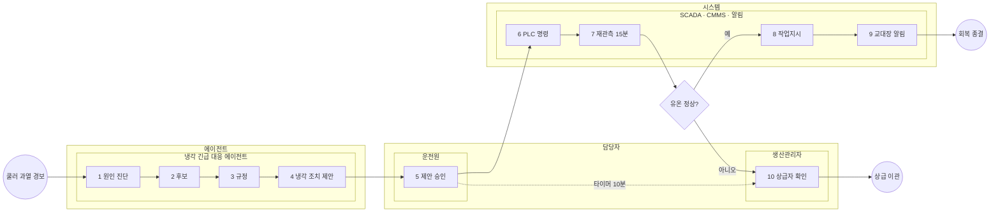
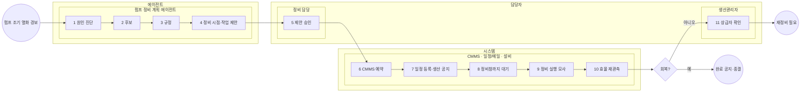
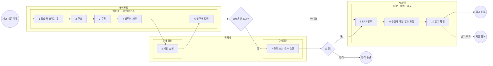

# 세 시나리오 조사 · 설계 — A 긴급 대응 / B 정비 계획 / C 예비품 구매

작성 2026-10-09. **읽기 전용 조사 · 설계**다. 코드 · 시드 · 정의 · DECISIONS/HANDOFF/TODO 는 바꾸지 않았고 커밋하지 않았다.

## 사용자 결정 (2026-10-09, 이 문서의 전제)

1. 설비는 같은 모델의 유압 파워팩 3대(HYD-01~03)로 고정한다. 구조와 온톨로지 스키마 v2도 고정하되, 같은 양식의 추가 확장은 대안으로만 둔다.
2. 시나리오는 **업무 주제가 다른 셋**이다.
   - **A 긴급 대응**: HYD-01 쿨러 과열
   - **B 정비 계획**: HYD-02 펌프 효율 저하 → 언제 세워서 고칠지 정한다
   - **C 예비품 구매**: 재고 기준 이탈 → 공급사 비교 → 금액별 승인 → 발주
   - 품질 이상 처리와 작동유(HM-9)는 이번 셋에서 뺀다(§3).
3. 문서는 시나리오마다 따로 두고 따로 적재한다. 고장 · 조치 지식은 적재로 들어오며, 시드에는 설비 구조만 남긴다.
4. **사람은 승인만 한다.**
   - 에이전트가 분석 · 판단을 끝까지 하고 근거와 함께 "이렇게 하겠습니다"를 제안한다. 사람은 승인 · 반려만 한다.
   - 중간의 사람 입력 · 일정 확정 · 공급사 선택은 없다.
   - 흐름 시작은 자동이다(센서 경보 / 예측 경보 / 재고 기준).
5. **모든 흐름은 "실행 → 효과 확인 → 종결"로 닫힌다.** 알림은 그럴 만한 자리에 둔다.
   - 쓰기(메일 · 일정 · 발주 · 기록)는 **사람 승인 뒤의 시스템 task**가 한다.
   - 에이전트는 읽기 도구만 쓴다(B2 규칙).
6. 학생은 API 키로 실제 AI를 쓴다. 결정론 대체 경로를 전제로 설계하지 않는다.
7. BPMN 은 적당한 크기로 둔다(작업 6~10 · 분기 1~2 · 반복 ≤ 1 · 칸 3~4). 엔진이 지원하는 요소만 쓴다.

**비유 한 줄**: 같은 차종 세 대를 두고 정비소가 하는 일이 셋이다.
- **고장 출동**(엔진 과열 → 바로 조치 → 온도 확인)
- **정비 예약**(변속기 조짐 → 다음 쉬는 날 입고 → 고친 뒤 시운전)
- **부품 주문**(부품 재고 바닥 → 업체 비교 → 결재 → 주문 → 입고 확인)

셋 다 "AI 가 제안하고 사람이 결재한다"는 점은 같다. 결재 앞에서 AI 가 하는 일과 결재 뒤에 시스템이 하는 일이 다르다.

---

## 0. 결론 요약

| | A 긴급 대응 · HYD-01 | B 정비 계획 · HYD-02 | C 예비품 구매 · (재고 예약 설비 HYD-03) |
|---|---|---|---|
| 정비 · 업무 유형 | 즉시 시정 정비 (EN 13306) | 예지 정비 · 계획 정비 (EN 13306, ISO 13374 PA) | MRO 예비품 보충 (재주문점) |
| 자동 시작 | 센서 경보 COOLER_DEGRADATION | 조기 열화 경보 (P점, 새 패턴 내용) | 재고 기준 이탈 (ERP 재고 감시, 새로 만듦) |
| 에이전트 제안 | 냉각 조치(명령) | 정비 시점 + 작업 | 발주안(공급사 · 수량 · 금액) |
| 사람 승인 | 운전원 (미응답 → 생산관리자) | 정비 담당(정비관리자) | 구매 담당 + 금액 초과 시 구매팀장 |
| 승인 뒤 시스템 | PLC 명령 → 재관측 → CMMS 작업지시 → 알림 | CMMS 예약 → 일정 · 생산 공지 → 정비창 대기 → 정비 실행(모사) → 효율 재관측 | ERP 발주 → 공급사 발주 메일 · 입고 부서 요청 → 입고 확인 |
| 닫힘 확인 | 유온 정상 · 경보 해제 | 펌프 압력 · 유량 회복(경보 해제) | 입고 확인(ERP) |
| BPMN (주 경로 작업 · 분기) | 9 · 1 (+실패 가지 1) | 10 · 1 (+실패 가지 1) | 10 · 2 |
| 스키마 v2 로 표현 | **된다** | **된다** | **된다** — 한 곳(시작 패턴과 증상의 연결)은 되읽기 단언을 고치거나 해석을 넓혀야 한다(§5.C, 결정 1) |

**핵심 판정**

- **스키마 확장 없이 세 주제 모두 기존 클래스 · 관계로 매핑된다**(§5 매핑표).
  - C 의 부품 · 공급사 · 공급 조건(`Part`, `Supplier.avl`, `SUPPLIED_BY {price, failRate, leadDays}`), 부품이 쓰이는 곳(`Component-USES_PART`, `Cause-INVOLVES_PART`), 단가 ↔ 품질 상충(`INFLUENCES`), 구매 규정(`KnowledgeSource` regulation PR-07, `rule:avl`), 원자 조치 `action:purchase-request`(PR_CREATE → sys:erp)는 **이미 스키마와 시드에 있다**.
  - B 는 기존 진단 사슬(`FailureMode` · `Cause` · `Evidence`) + `Forecast` + `InputData`(잔여 시간 · 정비창 · 리드타임) + `Rule` 로 된다.
- **막히는 것은 스키마가 아니라 코드다**(§10).
  1. 적재가 고장 지식 · 규칙 · 원자 조치를 만들지 못한다.
  2. 승인 뒤 효과 부품이 설비 명령 · 작업지시 둘뿐이다. 발주 · 메일 · 일정 · 기록 · 정비 실행 모사 · 입고 확인 · 대기 부품이 없다.
  3. 재고 감시 자동 시작이 없다.
  4. 정비 시점이 작업지시에 실리지 않는다.
  5. 에이전트 시험 실행(드라이런)의 시나리오가 코드에 고정돼 있다.
- **소주제 자르는 곳**(§9): 막마다 2~3개로 자르고, 각 끝에서 A · B · C 모두 눈에 보이는 완성 결과가 남게 했다. 에이전트 막에서는 BPMN 을 배우기 전에 **에이전트 시험 실행(드라이런)** 으로 제안 카드를 받는다. BPMN 막의 첫 행동은 그 제안을 흐름 안에서 승인하는 것이다. 단, 드라이런의 시나리오 목록 확장이 필요하다.

---

## 1. 외부 조사 (출처)

표준 원문(EN · ISO)은 유료라서 2차 요약에서 읽었다. **[2차]** 는 2차 자료, **[미확인]** 은 출처를 못 찾은 것이다.

### 1.1 정비 유형 · 상태 감시

**EN 13306 [2차]**
- 시정 정비는 고장을 발견한 뒤 기능을 되돌리는 정비다. 즉시 시정은 바로 하고, 지연 시정은 규칙에 따라 미룬다.
- 상태 기반 정비는 감시값이 기준을 넘을 때 하는 정비다.
- **예지 정비는 열화 추세를 외삽해 고장 시점을 예측하고, 그에 맞춰 계획하는 정비다.**
- 출처: https://en.wikipedia.org/wiki/Corrective_maintenance · https://www.intechopen.com/chapters/67580
- A 는 즉시 시정, B 는 예지 · 계획이다.

**ISO 14224 [2차]**
- 고장 모드(관찰 증상) · 고장 메커니즘 · 고장 원인을 나누고, 설비 단위 → 하위 단위 → 정비 가능 품목 → 부품의 위계를 둔다.
- 온톨로지 `FailureMode` · `Cause` · `Component` · `Part` 가 이를 따른다.
- 출처: https://www.fabrico.io/blog/iso-14224-failure-taxonomy-codes/

**ISO 13374-2 [2차]**
- DA → DM → SD(상태 감지) → HA(진단) → **PA(예지 · 잔여 수명)** → AG(권고).
- B 의 핵심이 PA 다.
- 출처: https://webstore.ansi.org/preview-pages/ISO/preview_ISO+13374-2-2007.pdf

**ISO 17359:2018 [2차] · P-F 간격(RCM)**
- 감시 주기와 주의/경보 기준을 정한다.
- 잠재 고장(P)에서 기능 고장(F)까지의 시간 안에 계획해야 하므로, 감시는 P-F 의 ½ 이하 주기로 한다.
- B 를 "조기 경보(P점)"로 시작하는 근거다.
- 출처: https://webstore.ansi.org/preview-pages/ISO/preview_ISO+17359-2018.pdf · https://www.plantengineering.com/how-to-extend-the-p-f-interval-for-critical-assets/

### 1.2 A — 유압 쿨러 과열

**Brendan Casey (Machinery Lubrication)**
- 82 ℃를 넘으면 대부분의 씰 재질이 손상되고 오일 열화가 빨라진다.
- 원인: 방열 부족, 쿨러 코어 막힘, 외기 대비 용량 부족, 통풍 막힘, 내부 누설, 릴리프 설정 부적절.
- 조치: 쿨러 앞뒤 온도차를 재고 코어를 점검한다. 과열이면 부하를 줄이거나 정지한 뒤 원인을 고친다.
- 출처: https://www.machinerylubrication.com/Articles/Print/680?id=680

**온도와 수명**
- 10 ℃ 오를 때마다 반응 속도 2배, 씰 한계를 10 ℃ 넘기면 씰 수명 최대 −80 %.
- 출처: https://www.powermotiontech.com/hydraulics-at-work/article/21884669/3-big-problems-caused-by-hot-running-hydraulics

**팬 · 핀 · 바이패스 고착 점검 순서 [2차]**
- 출처: https://boarparts.com/blog/filtration-1/hydraulic-system-running-hot-a-diagnostic-checklist-hydhot01/

**교육용 기준 (표준 값 아님)**
- 정상 ≤ 60 ℃ · 주의 ~70 · 경보 80~82 · 트립 85~90.
- 저장소의 55/65 ℃는 교육용 축소 기준이므로 문서에 그렇게 적는다.

### 1.3 B — 펌프 내부 누설 · 체적 효율 · 정비 계획

**UCI 데이터셋 447 (Helwig 외, I2MTC 2015, CC BY 4.0)**
- 60초 사이클 2,205개, 센서 PS1~6 · FS1~2 · TS1~4 · VS1 · CE · CP · SE.
- 상태 표지 중 **펌프 내부 누설은 0 = 없음 · 1 = 약함 · 2 = 심함**이다. 저장소 센서 이름이 이 데이터셋을 따른다.
- 출처: https://archive.ics.uci.edu/dataset/447/condition+monitoring+of+hydraulic+systems

**체적 효율 (Casey)**
- 체적 효율 = 실제 유량 ÷ 이론 유량이다. 시험 압력 · 점도를 고정해 비교한다.
- 보편적인 교체 기준 %는 없다. 체적 효율 하락이나 베어링 잔여 수명 중 먼저 오는 쪽으로 교체한다.
- 출처: https://www.machinerylubrication.com/Articles/Print/659?id=659

**케이스 드레인 유량**
- 신품 기준선 대비 **추세**로 본다.
- 출처: https://www.fluidpowerworld.com/how-to-prevent-case-drain-failure/
- "2~3배면 교체", "85~90 % 미만이면 교체"는 **[미확인]** 이다. 문서에는 "기준선 대비 교육용 설정값"으로 적는다.

**예비품 리드타임 (제조사 주장)**
- 피스톤 펌프 6~10주(Atos · Parker), 씰 키트 수주~110일(Vickers).
- 출처: https://www.atos.com/en-it/The_fastest_delivery_time_in_the_market_for_PVPC_LW_pumps · https://hydraulicsonline.com/?p=19704 · https://www.hydraulic-supply.com/919312.html
- 교육 결론: **"잔여 시간 vs 부품 리드타임 vs 다음 정비창"을 비교하는 것이 정비 계획 판단의 핵심이다.**

**계획 · 일정 (Prometheus Group 백서)**
- 계획자는 범위 · 부품 · 키팅을 맡고, 일정 담당은 생산과 정지 시점을 맞춘다.
- 출처: https://info.prometheusgroup.com/hubfs/1%20Collateral/1%20Planning%20and%20Scheduling/Whitepapers/Best_Practices_for_Planners_and_Schedulers.pdf
- SAP PM 흐름: 통지 → 오더 → 릴리스 → 실적 → TECO → 정산 → 종료.
- 출처: https://help.sap.com/saphelp_470/helpdata/EN/32/543d3854126956e10000009b38f842/content.htm

**정비 작업 안전**
- 유압 잔압은 LOTO 대상이다(OSHA 29 CFR 1910.147 (d)(5)).
- 출처: https://www.osha.gov/laws-regs/regulations/standardnumber/1910/1910.147/
- B 문서의 SOP 단계에 "잔압 해제 · 확인"을 넣는다.

### 1.4 C — 예비품 구매 (MRO)

**재주문점**
- 재주문점 = 일평균 수요 × 리드타임 + 안전재고. 리드타임은 견적이 아니라 실측으로 잡는다.
- 중요 예비품은 결품 비용(정지 일수)이 보관비보다 크다. 서비스 수준은 90~95 %(업체 자료, 참고치).
- 출처: https://www.fabrico.io/blog/spare-parts-min-max-vs-reorder-point/ · https://oxmaint.com/industries/aviation-management/critical-spares-min-max-stocking-aviation-mro · https://tractian.com/en/glossary/lead-time

**공급사 선택**
- 단가만이 아니라 품질(불량률) · 납기 · 승인 공급사 목록(AVL)을 함께 본다.
- 시드에 이미 "부품 단가 ↓ → 구매비 ↓ 이지만, 공급사를 바꿔 단가를 낮추면 품질 ↓ → 클레임 ↑ → 브랜드 ↓ → 매출 ↓" 상충이 있다(`instances.cypher` 60~95행 주석).

**금액별 전결 (위임 결재)**
- 일정 금액 이하는 담당 또는 팀장이 결재하고, 초과하면 상위가 결재한다. 일반 내부통제 관행이다.
- 특정 회사 규정을 따르지 않고 **교육용 PR-07** 로 정한다(예: 300만 원 초과 → 구매팀장 추가 결재).
- [미확인]: 이 관행을 정한 국제 표준 조문은 찾지 않았다. COSO 등 내부통제 일반 원칙 수준이다.

### 1.5 이번에 뺀 주제의 근거 (참고만)

- **작동유 분석**(ISO 4406 청정도 17/15/12, TAN ≤ 0.3 정상 · > 0.5 심각, 수분 · 점도, 리턴 필터 상류 채취): HM-9 · B7 은 기존 기능으로 남긴다.
  - 출처: https://ayalytical.com/iso-4406/ · https://www.snowyhydro.com.au/wp-content/uploads/2023/12/SHL-MEC-118_-Hydraulic-and-Lubricating-Oil-Tests-and-Limits.pdf
- **MOC**(OSHA 1910.119(l)): 변경 요청 → 영향 분석 → 승인 → 절차 개정. 범위가 커서 후속으로 둔다.
  - 출처: https://www.osha.gov/laws-regs/standardinterpretations/2009-03-31-0

---

## 2. 저장소 확인 (읽기 · 파일:줄)

### 2.1 적재 파이프라인이 만드는 것 · 못 만드는 것

| 단계 | 파일 | 하는 일 |
|---|---|---|
| 추출 | `it/process/procsvc/manual_extraction.py:16` (정의 1.8) | 절 · SOP · 단계만 제안한다. "새 클래스·규칙·그래프를 만들거나 수정하지 마세요" |
| 검토 | `manual_review.py:69` | 고장 유형은 **이미 있는** FailureMode 목록에서 추천한다. 사람이 관계 · 종류 · 승인자 · AFFECTS 를 정한다 |
| 적재 | `manual_graph.py:60` `desired` | KnowledgeSource · ManualSection · Skill · Step 노드와 `FailureMode-[MITIGATED_BY/REMEDIED_BY]->Skill`, `Rule-[OUTPUTS]->Skill`, `APPROVED_BY`, `HAS_SKILL`, `AFFECTS` 간선 |
| 대상 검사 | `manual_graph.py:112` | 문서 밖 노드(FailureMode · Rule · Role · System)가 없으면 거절한다 |
| 후보 연결 | `skill_graph.py` `CANDIDATE_RULES_Q` | `in:failure-mode == fm` **하나만** 검사하는 후보 규칙에 자동으로 OUTPUTS 를 단다 |

**만들지 못하는 것**: FailureMode · Cause · Evidence · Symptom 연결 · 진단/후보/규정 Rule · **CONSISTS_OF(원자 조치와 값)** · ADDRESSES.
CONSISTS_OF 가 없으면 카드에 명령 · 발주 값이 없다. 카드 actions 는 `templates/t3_skills.cypher` 가 읽고, 실행은 `work_orders.request_for_option` 이 한다.

### 2.2 시드가 미리 넣는 고장 지식과 지울 때 깨지는 곳

**시드 내용**
- `it/neo4j/v2/instances.cypher` 3~4절: FailureMode 5 · Cause 4 · Evidence 7 · Skill 14 · Rule 21 · Forecast 9 · DecisionCase 3.
- `knowledge_a098.cypher`: 원인 4 · 트립 2 · 규칙 6.
- 구조(설비 · 부품 · 공급사 · 역할 · 시스템 · 원자 조치 · BSC · InputData)도 같은 파일에 있다.

**`seed_checks.cypher` 되읽기 단언** — 적재 전에는 실패해서 **kg-seed 가 exit 1** 이 되고, agent · dmn-mcp 가 뜨지 않는다.
- "failure mode with neither skill nor cause"
- "skill not matched to a failure mode"
- "pattern not linked to a failure mode"
- "no seeded DecisionCase"

**탐지기**
- held 패턴 1~64개를 요구한다(`seed.sh` A156). 실행 중 다시 읽는다(`det/main.py` poll_catalog).

**시드 id 를 쓰는 파일**
- tests 25 · scripts 20 · 정의 3 · seed.sql · portal `names.json` · dmn-mcp server.py · agent-worker 1.
- 통합 시험(`scenario_instance_test.py` · `scenario_pump_fan_test.py`)이 시드 스킬을 전제로 한다.

→ **수업 시작용 "구조판"과 시험 · 회귀용 "전체판"으로 시드를 나누는 것을 권한다**(§10 K4).

### 2.3 에이전트가 카드 순위를 매기며 온톨로지에서 읽는 것

`dmn-mcp` 도구 기준이다.

1. `diagnose`
   - 패턴 → 증상 → 고장 유형 ← 원인(prior) → 증거(SQL)를 따라간다(`templates/t1_causes.cypher`).
   - 사람 입력 패턴은 서버 기록을 근거로 쓴다(B7).
2. 후보 규칙 `dt:action-candidates`(TESTS · OUTPUTS)
3. 규정 규칙 `dt:compliance`(EXCLUDE · WARN · PENALTY)
4. 스킬 상세: 단계 · 매뉴얼 절 · 승인 역할 level · CONSISTS_OF · ADDRESSES
5. 순위 `rule:rank-value.rankingPolicy`
   - 구성: BSC 득실(AFFECTS → INFLUENCES), 예측 유온(설비 모델), 경고 · 감점, 선례, 납기 · 품질(업무 DB InputData)
6. `tradeoffs`(상충 경로) · `precedents` · `submit_decision`(쓰기, 카드 묶음 제출)

### 2.4 에이전트 · MCP · 사람 배정

| 항목 | 지금 상태 | 세 시나리오에 대한 판정 |
|---|---|---|
| 에이전트 | 포털에서 만들기 · 복제 · 고치기(이름 · 역할 · 목표 · 성격 · 모델 · MCP 서버 · SKILL.md). 시드는 `sys:agent` 하나(`it/supabase/seed.sql:70`) | 세 에이전트를 따로 만들 수 있다 |
| 단계 → 에이전트 | `activity_agent_map (tenant, proc_def_id, activity_id)`. 흐름 가져오기 매핑에서도 task 마다 에이전트를 지정(`bpmn_import.py:582-585`) | **흐름별로 다른 에이전트를 묶을 수 있다(코드 변경 없음)** |
| MCP | `tenants.mcp` 등록 → 연결 검사 통과 → 에이전트에는 **읽기 도구만**(B2). 기준 서버는 neo4j · enterprise · hyd-dmn | 고르는 단위는 **서버**다. 서버 안 도구 거르기(tool_filters)는 없다 |
| 시나리오 에이전트 부품 지시문 | 기준 정의에 고정. 일반 에이전트 task 는 지시문을 흐름마다 쓴다 | 에이전트 차이는 프로필 · SKILL.md · MCP 와 일반 에이전트 task 로 낸다 |
| 역할 → 사람 | users 의 사람 역할은 `role:operator` · `role:prod-mgr` · `role:maint-mgr` 셋(`seed.sql:67-69`). 온톨로지 Role 에는 `role:purchasing-mgr`(구매팀장 L2) · `role:plant-mgr`(L3) 등도 있음(`instances.cypher:98-100`) | C 의 구매 담당(새 Role **인스턴스**) · 구매팀장은 users 행을 더해야 한다 |
| API 키 | 워커가 `ANTHROPIC_API_KEY` 를 받으면 실행마다 설정 폴더를 분리한다(`worker/settings.py:102-103`, `env_guard.CLI_AUTH_KEEP`, `agent-worker/Dockerfile`, `compose.yaml:478`) | 코드는 된다. 운영 문서 · 스크립트가 구독 로그인 전제다(`scripts/run_worker_host.sh:2`, CLAUDE.md §3 "agent-worker 컨테이너 안 올림") → 학생별 키 · 워커 절차 필요(R1) |

### 2.5 BPMN 가져오기 · 배포 · 실행 부품

**가져오기가 지원하는 것** (`bpmn_import.py:39-56`)
- task 8종 · 배타/병렬 분기 · 시작/끝 · 경계 타이머 · 칸(**childLaneSet 중첩, 가장 안쪽 칸이 담당**, `:246`) · 되돌아가는 선.
- subProcess · callActivity · 포함/이벤트/복합 분기 · 중간 이벤트는 지원하지 않는다.

**부품**
- 시나리오 부품 9개는 기준 정의(`anomaly_response_v22.json`)에서 온다.

| 부품 | 받는 값 → 내는 값 |
|---|---|
| 원인 진단 | pattern, asset, alert → cause, failure_mode, guide_card |
| 조치 후보 | failure_mode, cause, asset → candidates |
| 규정 검토 | candidates → compliance |
| 우선순위 | → decision, decision_id |
| 조치 카드 선택(승인) | → chosen_skill, chosen_skill_kind |
| 상급자 호출 · 설비 명령 · 재관측 · 작업지시 | — |

- 일반 부품은 사람 task(폼 칸)와 에이전트 task(지시문 · 결과 값)다.
- **효과 부품은 `incident:command` · `enterprise:WO_CREATE` 둘뿐**이다(`bpmn_import.py:61`). 효과 앞 모든 경로에 승인(`formHandler:select_card`)이 있어야 한다(`:754-768`).
- 승인 경로가 넣는 값은 `incident · commands · approved_by · approved_role · chosen_option` 이다(`definition_registry.py:11`). **카드의 금액 같은 업무 값은 나오지 않는다.**

**배포**
- `flow_deploy.route_definition` 이 **경보 패턴마다 최근 배포 흐름**을 고른다(B4). A · B · C 를 따로 배포할 수 있다.

### 2.6 시뮬레이터 · 업무 시스템 · 알림 (닫힘 확인용)

| 필요 | 있는 것 | 판정 |
|---|---|---|
| B 느린 누설 열화 | plant-sim `POST /api/fault {asset, type:"pump_leakage", target, ramp_sim_s}` (`ot/plant-sim/plantsim/main.py:31-38`) | **됨.** `ramp_sim_s` 로 느리게 할 수 있다 |
| B 정비 실행(교체) 모사 | 같은 API `type:"restore"` (설비별) | API 는 있다. **BPMN 서비스 부품이 없다** |
| B 효율 회복 확인 | `incident:reobserve`(경보 해제 + 회복 기준) | 부품은 있다. **명령 없이 작업지시로 닫힌 사건에서 재관측이 도는지 확인 필요**(B7: 작업지시 전용 사건은 WORK_ORDER_CREATED → CLOSED) |
| B 정비 시점을 작업지시에 | `ent.exec_skill` 의 `skill:schedule-maintenance` 가 `params.window` 를 `work_orders.window_label` 에 넣는다(`migrations/20261007000019_transactions_before_after.sql:25,46-48`) | DB 쪽은 된다. **process 의 WO 요청이 window 를 넘기지 않는다**(`work_orders.request_for_option`) |
| C ERP 발주 | `ent.exec_skill` 의 `skill:procure-part` → `ent.purchase_requests`(같은 파일 `:26,69-72`) | DB 쪽은 된다. **BPMN 효과 부품이 없다** |
| C 입고 확인 | 없음 (`ent` 에 입고 표 없음, enterprise-sim 엔드포인트 `/mes /erp /cmms /qms /scm /ems /api/exec` 뿐 — `it/enterprise-sim/entsim/main.py:87-153`) | **새로 필요**: 입고 표 + 리드타임 경과 뒤 자동 입고(시뮬레이터) + 조회 |
| C 재고 · 재주문점 | `erp_inventory` 는 완제품 재고(`enterprise_mcp/server.py:47`). `ent.parts` 에 재고 칸 없음 | **새로 필요**: 예비품 재고 · 재주문점 · 예약 |
| C 공급사 조건 | 온톨로지 `SUPPLIED_BY`(씰 키트 sup:a 35/0.12/2일 · sup:b 55/0.02/5일 · sup:c 20/0.30/1일 비AVL). `ent.suppliers` 는 쿨러 코어 행뿐 | 온톨로지는 충분하다. 업무 DB 행은 추가해야 한다 |
| 메일 · 일정 · 기록 | `tenants.mcp` 에 없음. Supabase 로컬에 **Inbucket 메일 수집기**(`it/supabase/config.toml:35-38`, SMTP 54325) | 수업용 안전한 메일 받는 곳은 이미 있다. 메일 MCP 를 그쪽에 붙이면 된다 |
| 승인 뒤 MCP 쓰기 도구 호출 | 포털 써 보기는 쓰기 도구를 거절한다(`mcp_api.py:166-183`, `not_read_only` → 403). 엔진에 MCP 호출 서비스 부품이 없다 | **새로 필요**(§8) |
| 기다림(정비창까지) | 대기 전용 부품 없음. 경계 타이머는 task 에 붙는다 | **새 부품 "시간 대기"** 권장(§10) |

---

## 3. 주제 결정

**선택지 1 (기각): 셋 다 "이상 → 대처"**
- 같은 설비의 이상 대응이라 뼈대가 같고, 다름은 시작 · 승인자 · 명령 유무 · 재확인 반복에서만 생긴다.
- 억지 분기를 넣지 않으면 B · C 가 A 의 변형으로 보인다.

**선택지 2 (채택): 같은 설비에서 업무 주제가 다른 셋**
- 다름이 업무 자체에서 나온다.
  - A: 분 단위 · 명령 · 재관측
  - B: 날 단위 · 일정 · 대기 · 정비 실행
  - C: 돈 · 공급사 · 금액 결재 · 입고
- 각 주제는 실제 공장 업무 유형(EN 13306 시정 · 예지, MRO 재주문)에 기대고, 특정 공장에 맞추지 않는 수준으로 그럴듯하게 둔다.

**뺀 것**
- **품질 이상 처리**: 제품 · 로트 · 부적합 클래스가 없어 설비 증상으로 돌려 말해야 하므로 뺀다.
- **작동유(HM-9 · B7)**: 이번 셋에서 빼고 기존 기능으로 남긴다.

---

## 4. 세 흐름의 공통 규칙

1. **자동 시작**: 센서 경보(A) · 예측 경보(B) · 재고 감시 경보(C). 모두 "경보 한 건 = 처리 건 한 건"이다(사건 Incident 가 있어야 승인 · 효과 안전 검사가 성립한다, B7 결정).
2. **에이전트가 끝까지 판단**: 진단(또는 소요 산정) → 후보 → 규정 → 순위 · 제안. 근거 인용이 붙는다. 읽기 도구만 쓴다.
3. **사람은 승인만 한다**: 카드 승인(`select_card`, 승인 역할 level 검사). C 는 금액 초과 시 추가 승인 한 번(승인/반려 폼).
4. **승인 뒤 시스템 task**: 명령 · 작업지시 · 발주 · 메일 · 일정 · 기록. 한 번만 실행된다(영수증).
5. **효과 확인 뒤 종결**: A 유온 · B 압력/유량 · C 입고. 확인 실패 가지는 상급자 확인으로 간다(승인 · 확인만).

**칸**: 바깥 칸은 **담당자 / 에이전트 / 시스템**, 안쪽 칸이 실제 담당이다. 가져오기는 가장 안쪽 칸을 담당으로 읽는다.

---

## 5. 시나리오별 설계

### 5.A 긴급 대응 — HYD-01 쿨러 과열

**사건 이야기**

- **왜:** 쿨러 핀이 먼지 · 유막으로 막혀 냉각 효율 CE 가 84 → 65 %로 떨어지고 유온 TS1 이 오른다. 65 ℃ 인터록에 닿으면 설비가 서고 긴급 오더 납기를 놓친다.
- **어떻게:**
  1. 탐지기가 경보를 낸다.
  2. 냉각 긴급 대응 에이전트가 원인(핀 오염 / 외기 고온)을 증거로 판정한다.
  3. 에이전트가 즉시 완화 3안을 예측 유온 · 납기 · 팬 수명 · 전력으로 비교해 1안을 제안한다. 3안은 팬 최대 / 팬 최대 + 부하 80 % / 부하 70 % + 야간 세척이다.
  4. 운전원이 승인하면 PLC 명령이 나간다.
- **결과:**
  - 15분 재관측에서 유온이 정상이면 핀 세척 작업지시와 교대장 알림을 내고 닫는다.
  - 회복하지 않거나 운전원이 10분 안에 승인하지 않으면 생산관리자가 확인한다.
  - 지는 대안: 팬 최대만 하면 예측 55.4 ℃로 해제에 실패할 수 있다(WARN).

**시작**: 센서 경보 `COOLER_DEGRADATION`(기존 held 패턴).

**문서 (A 문서 새로 씀, 1~2쪽)**
- HM-8(팬 벨트)은 이 주제에 맞지 않는다.
- 들어갈 것:
  - 판정 기준표(유온 · CE)
  - 고장 유형 냉각 성능 상실과 원인(핀 오염 · 외기 고온 · 팬 고장)별 확인 증거
  - 즉시 완화 SOP 3개(단계마다 명령 · 값)
  - 회복 판정(15분, TS1 < 55 ℃ · 경보 해제)
  - 근본 조치 SOP(핀 세척 · 환기)
  - 금지(REMOTE_AUTO 에서만, 팬 100 % 24 h 이내, 부하 60 % 미만 금지)
- 시드 ManualSection HM-3.2 · 7.3 · 7.5 · 7.6 · 7.7 · 9.1 을 문서로 옮겨 적는다.

**온톨로지 매핑 (스키마 v2 그대로)**

| 필요한 지식 | 클래스 · 관계 | 들어오는 길 |
|---|---|---|
| 설비 · 쿨러 · 팬 · 유온 센서 | Asset · Component(comp:cooler, comp:fan) · Sensor · StateVariable(sv:ts1, sv:ce) · `HAS_COMPONENT` · `OBSERVES` | 시드(구조) |
| 경보 · 증상 | AnomalyPattern(COOLER_DEGRADATION) `-DETECTS->` Symptom(sym:ts1-rise, sym:ce-drop) `-OBSERVED_BY->` Sensor · `TESTS` | 시드(감시 설정) |
| 고장 · 원인 · 증거 | FailureMode(fm:cooling-loss) `-OCCURS_IN->` comp:cooler, Symptom `-INDICATES->` FM, Cause `-CAUSES->` FM, Cause `-EVIDENCED_BY->` Evidence(sql) | **A 문서 적재** |
| 조치 | Skill(control: SOP-COOL-01~03, work_order: 04 · 05) `-CONSISTS_OF {value}->` Action(FAN_SET · LOAD_SET · WO_CREATE), `-HAS_STEP->` Step `-REFERS_TO->` ManualSection, `-APPROVED_BY->` Role(operator · prod-mgr · maint-mgr), FM `-MITIGATED_BY/REMEDIED_BY->` Skill, Skill `-ADDRESSES->` Cause | **A 문서 적재** |
| 규칙 | Rule(dx-cooler, cand-cooler, fan-24h PENALTY, ts1-warn WARN) `-TESTS->` InputData, `-DERIVED_FROM->` ManualSection | **A 문서 적재** |
| 회사 지표 영향 | Skill `-AFFECTS->` sv/msr → `INFLUENCES` → msr:op-profit | 적재(AFFECTS) + 시드(INFLUENCES) |
| 승인 시간 초과 | Event(boundary timer) `-ATTACHED_TO->` Task | 흐름 투영 |

**에이전트 · MCP · 스킬 · 사람**

| 항목 | 내용 |
|---|---|
| 에이전트 | **냉각 긴급 대응 에이전트** — "인터록 전에 유온을 내리고 생산 손실을 최소로". 초점: 예측 유온 여유 · 납기 · 팬 수명 |
| MCP (읽기) | `hyd-dmn`(있음): diagnose · timeseries_query · forecast_actions · evaluate_cards · tradeoffs · precedents · submit_decision / `enterprise`(있음): mes_orders · qms_lots · ems_demand / `neo4j`(있음) |
| 에이전트 스킬 | `cooling-emergency-triage` — "인터록까지 남은 시간부터 계산하고, 명령은 제안만 한다" |
| SOP 스킬 | SOP-COOL-01~05 |
| 사람 (승인만) | 운전원(카드 승인), 생산관리자(미승인 · 미회복 확인) |
| 승인 뒤 쓰기 | SCADA 명령(있음) · CMMS 작업지시(있음) · **교대장 · 관리자 알림 메일 또는 채팅**(MCP, 새 부품) · (선택) Notion 사건 기록 |

**BPMN**

| # | 작업 | 부품 | 칸 |
|---|---|---|---|
| S | 쿨러 과열 경보 | 메시지 시작 | — |
| 1 | 원인 진단 | 에이전트 · diagnose | 에이전트 / 냉각 긴급 대응 에이전트 |
| 2 | 조치 후보 | 에이전트 · candidates | 〃 |
| 3 | 규정 검토 | 에이전트 · compliance | 〃 |
| 4 | 냉각 조치 제안 | 에이전트 · rank | 〃 |
| 5 | 제안 승인 | 사람 · select_card + **경계 타이머 10분** | 담당자 / 운전원 |
| 6 | PLC 명령 | 서비스 · incident:command | 시스템 |
| 7 | 재관측 15분 | 서비스 · incident:reobserve | 시스템 |
| G1 | 유온 정상? | 배타 분기 `recovered == true` | — |
| 8 | 근본 조치 작업지시 | 서비스 · WO_CREATE | 시스템 |
| 9 | 교대장 · 관리자 알림 | **서비스 · MCP 알림(새)** | 시스템 |
| 10 | 상급자 확인 | 사람 · escalate (G1 아니오 · 5 타이머) | 담당자 / 생산관리자 |
| E1 / E2 | 회복 종결 / 상급 이관 | 끝 | — |

작업 9(+ 실패 가지 1) · 분기 1 · 칸 4.

**KPI**
- 경보 → 승인 시간(MTTA), 경보 → 회복 시간(MTTR).
- 인터록 트립 0(msr:safety-margin), 납기(msr:otd) · 생산량(msr:throughput), 전력비(msr:energy-cost) → 영업이익.

### 5.B 정비 계획 — HYD-02 펌프 효율 저하 → 언제 세워서 고칠까

**사건 이야기**

- **왜:** HYD-02 주 펌프 A 의 씰 · 슈가 마모되며 내부 누설이 몇 주에 걸쳐 는다. 같은 부하에서 FS1 9.0 → 8.6 l/min, PS1 182 → 172 bar 로 내려간다.
  - 저압 경보(PS1 < 165)는 아직 아니다. 이 지점이 P-F 의 **P점**이다.
  - 지금 바로 세우면 A 처럼 긴급 대응이 되고 생산 손실이 크다. 너무 미루면 F점에 닿아 비계획 정지가 된다.
- **어떻게:**
  1. 조기 열화 경보가 자동으로 열린다.
  2. 펌프 정비 계획 에이전트가 정보를 모은다.
     - 시계열로 체적 효율 추정과 F점(165 bar)까지의 **잔여 시간**을 외삽한다.
     - CMMS 정비 이력 · 다음 정비창 · 생산 일정(긴급 오더) · 씰 키트 재고 · 리드타임을 읽는다.
  3. 에이전트가 **"○일 야간 정비창에 씰 교체(SOP-PMP-11), 예비 펌프 B 로 생산 유지"** 를 근거와 함께 제안한다.
  4. 정비 담당이 승인한다.
- **결과:**
  - CMMS 예약 · 일정 등록 · 생산팀 공지 → 정비창까지 대기 → 정비 실행(교체 모사) → 효율 재관측.
  - 회복하면 완료 공지와 함께 닫는다. 회복하지 않으면 상급자가 확인한다.
  - 지는 대안: "이번 주말 계획 정지"는 생산 손실이 크다. "감시 강화 후 재평가"는 리드타임보다 잔여 시간이 짧아 결품 위험이 있다(WARN).
  - 금지 대안: "압력 설정 상향"은 누설을 가속한다(EXCLUDE).

**시작**: 조기 열화 경보(새 패턴 **내용** `PUMP_DEGRADATION_EARLY`)
- held 조건 예: `PLC RUN and LoadSP >= 80 and PS1 < 174 and FS1 < 8.7`, 유지 10분, 심각도 MEDIUM, 해제 `PS1 >= 178 and FS1 >= 8.8`.
- 지금 탐지기 계약(변수 · 연산자 · 값)으로 표현할 수 있다.
- 정기(타이머) 시작은 엔진이 지원하지 않는다. 체적 효율 같은 파생 변수로 탐지하려면 탐지기를 고쳐야 한다(후속).

**문서 (B 펌프 문서 새로 씀, 1~2쪽, 교육용 가상)**

> **HM-5.1 판정 기준** — 기준선 대비 교육용 설정값:
>
> | 항목 | 정상 | 주의 (계획 착수) | 경보 (기능 저하) |
> |---|---|---|---|
> | PS1 (부하 90 %) | ≥ 178 bar | 165~174 | < 165 |
> | FS1 | ≥ 8.8 l/min | 8.0~8.7 | < 8.0 |
> | 체적 효율 추정 | ≥ 95 % | 88~95 % | < 88 % |
>
> 시험 조건(부하 · 유온 · 점도 VG46)을 고정한다(Casey).
>
> **HM-5.2 고장 · 원인** — 체적 효율 저하 ← 씰 · 슈 마모(가장 흔함, PS1 · FS1 동시 하락) / 오염 마모 / 흡입 공기 혼입. 예비 펌프 B 는 누설이 없다.
>
> **HM-5.3 정비 시점 판단** — 추세 외삽으로 165 bar 도달 시점을 계획 기한으로 삼는다.
> - 기한 < 부품 리드타임 + 2일이면 즉시 발주(C 로 이어짐)
> - 기한 안의 가장 이른 야간 정비창을 우선한다
> - 긴급 오더 납기 전이면 예비 펌프 B 로 생산을 유지한다
>
> **HM-5.4 금지** — 누설 의심 시 압력 설정 상향을 금지한다. 옛 SOP-PMP-03 은 폐지됐다.
>
> **SOP-PMP-11 야간 정비창 씰 교체** (승인 정비관리자, 작업지시)
> 1. 예비 펌프 B 로 전환한다.
> 2. 주 펌프를 LOCAL · LOTO 한다.
> 3. **잔압 해제를 확인**한다.
> 4. 씰 키트(P-PMP-SEAL)를 교체한다.
> 5. 시운전 후 PS1 ≥ 178 · FS1 ≥ 8.8 을 확인하고 CMMS 에 기록한다.
>
> **SOP-PMP-12 계획 정지 교체** · **SOP-PMP-13 감시 강화 점검**(케이스 드레인 측정 · 1주 뒤 재평가).

**온톨로지 매핑 (스키마 v2 그대로)**

| 필요한 지식 | 클래스 · 관계 | 들어오는 길 |
|---|---|---|
| 펌프 · 예비 펌프 · 압력/유량 · 누설 외란 | Component(comp:pump-a, comp:pump-b) · Sensor · StateVariable(sv:ps1, sv:fs1, sv:leak) · `INFLUENCES`(sv:fs1 → msr:throughput) | 시드(구조) |
| 조기 경보 | AnomalyPattern(새 **인스턴스**) `-TESTS->` InputData(in:ps1, in:fs1, in:load, in:plc-state) `-DETECTS->` Symptom(sym:ps1-drop, sym:fs1-drop) | 시드(감시 설정) — 결정 1 |
| 고장 · 원인 · 증거 · 부품 | FailureMode(fm:volumetric-loss) `-OCCURS_IN->` comp:pump-a, Cause(씰 · 슈 마모 등) `-CAUSES->`, `-EVIDENCED_BY->` Evidence(PS1 · FS1 SQL), Cause `-INVOLVES_PART->` Part(part:pump-seal), Cause `-DISTURBS->` sv:leak | **B 문서 적재**(Part 는 시드) |
| 예측 | 잔여 시간은 실행 중 계산(에이전트 결과 · InputData `in:rul-hours` SOURCED_FROM sys:agent). 교체 후 목표값은 Forecast `-FORECASTS->` sv:ps1 `-ASSUMES->` Skill · `-GIVEN->` Cause | 실행값 + 적재(Forecast 선택) |
| 정비창 · 생산 · 리드타임 | InputData(in:next-window-h ← sys:cmms, in:order-due ← sys:mes(있음), in:part-lead-days ← sys:scm, in:standby-ready ← sys:cmms(있음)) — 값은 업무 DB, 지식에는 위치만 | DDL 적재(InputData) |
| 조치 | Skill(work_order: SOP-PMP-11~13) `-CONSISTS_OF->` Action(WO_CREATE), `-APPROVED_BY->` role:maint-mgr, FM `-REMEDIED_BY->`, `-ADDRESSES->` Cause, `-AFFECTS->` msr:availability · maint-cost · mtbf | **B 문서 적재** |
| 규칙 | 진단 rule:dx-pump, 후보 rule:cand-pump, 규정 rule:no-pressure-raise(EXCLUDE) · "잔여 시간 < 리드타임 → 발주 경고"(WARN, TESTS in:rul-hours · in:part-lead-days) · rule:standby(EXCLUDE) | **B 문서 적재** |

**에이전트 · MCP · 스킬 · 사람**

| 항목 | 내용 |
|---|---|
| 에이전트 | **펌프 정비 계획 에이전트** — "기능 고장 전에, 생산 손실이 가장 작은 정비창에, 부품을 맞춰 교체 계획을 제안". 초점: 잔여 시간 vs 리드타임 vs 정비창 · 생산 |
| MCP (읽기) | `hyd-dmn`(있음): timeseries_query(추세 — 당장은 SQL 회귀로 외삽) · diagnose · evaluate_cards · submit_decision / `enterprise`(있음 + **표 추가**): cmms_history · mes_orders · `maintenance_windows`(새) · `spare_parts`(새) / `hyd-prognostics`(**새 서버**, 선택): pump_health · rul_estimate |
| 에이전트 스킬 | `pump-maintenance-planning` — "잔여 시간을 범위로 말하고, 리드타임 · 정비창과 비교한 뒤 날짜를 제안한다" |
| SOP 스킬 | SOP-PMP-11~13 |
| 사람 (승인만) | 정비 담당 = 정비관리자(role:maint-mgr, 있음). 회복 실패 시 생산관리자 확인 |
| 승인 뒤 쓰기 | CMMS 예약(WO + window, 연결 필요) · **일정 등록**(Google Calendar MCP 또는 CMMS 일정) · **생산팀 공지 메일** · 정비 실행 모사(plant-sim restore, 새 부품) · **완료 공지 메일** |

**BPMN**

| # | 작업 | 부품 | 칸 |
|---|---|---|---|
| S | 펌프 조기 열화 경보 | 메시지 시작 | — |
| 1 | 원인 진단 | 에이전트 · diagnose | 에이전트 / 펌프 정비 계획 에이전트 |
| 2 | 조치 후보 | 에이전트 · candidates | 〃 |
| 3 | 규정 검토 | 에이전트 · compliance | 〃 |
| 4 | 정비 시점 · 작업 제안 (잔여 시간 · 정비창 · 생산 반영) | 에이전트 · rank | 〃 |
| 5 | 제안 승인 | 사람 · select_card | 담당자 / 정비 담당 |
| 6 | CMMS 정비 예약 | 서비스 · WO_CREATE (+ window 연결) | 시스템 |
| 7 | 일정 등록 · 생산팀 공지 | **서비스 · MCP 알림(새)** | 시스템 |
| 8 | 정비창까지 대기 | **서비스 · 시간 대기(새)** — 배속 20배로 압축 | 시스템 |
| 9 | 정비 실행 (교체 모사) | **서비스 · plant 복구(새)** | 시스템 |
| 10 | 효율 재관측 | 서비스 · incident:reobserve | 시스템 |
| G1 | 압력 · 유량 회복? | 배타 분기 `recovered == true` | — |
| E1 | 완료 공지 후 종결 | 끝 (공지는 7과 같은 부품을 한 번 더 두거나 끝 직전 task — 칸 수 때문에 7에 "완료 공지 예약"으로 합치는 안도 가능) | — |
| 11 | 상급자 확인 | 사람 · escalate (G1 아니오) | 담당자 / 생산관리자 |
| E2 | 재정비 필요 | 끝 | — |

주 경로 10(+ 실패 가지 1) · 분기 1 · 칸 4(정비 담당 · 생산관리자 · 에이전트 · 시스템).
"바로 세우기"가 아니라 **승인 → 예약 → 대기 → 실행 → 확인** 순서라서 A 와 다르다.

**KPI**
- 계획 정비 비율, F점 도달 0건, 정비창 준수율.
- 가동률(msr:availability) · MTBF · 보전비 · 생산량 → 영업이익.

### 5.C 예비품 구매 — 재고 기준 이탈 → 공급사 비교 → 금액별 승인 → 발주 → 입고

**사건 이야기**

- **왜:** 펌프 씰 키트(P-PMP-SEAL)의 가용 재고가 재주문점 아래로 떨어진다.
  - B 에서 HYD-02 교체에 1개를 썼고, HYD-03 예방 교체에 2개가 예약됐다. 가용 1 < 재주문점 2.
  - 리드타임이 길어(공급사별 1~5일, 실제 업계는 수주~수개월) 지금 사지 않으면 다음 고장 때 결품으로 설비가 선다.
- **어떻게:**
  1. ERP 재고 감시가 경보를 낸다.
  2. 구매 에이전트가 필요량을 정한다. 근거는 목표 재고 − 가용 − 입고 예정과, 이 부품이 쓰이는 곳(어느 설비 · 고장 · 원인)이다.
  3. 에이전트가 공급사 셋을 비교한다.
     - 단가 · 불량률 · 리드타임 · 승인 공급사(AVL)
     - BSC 상충(단가 ↓ ↔ 품질 ↓ → 클레임)
     - 구매 규정(비AVL 금지, 금액 전결)
  4. 에이전트가 **"B-OEM 6개 330만 원 발주"** 를 제안한다.
  5. 구매 담당이 승인한다. 300만 원 초과라 구매팀장 추가 승인을 받는다.
- **결과:**
  - ERP 발주 → 공급사 발주 메일 · 입고 부서 요청 → 리드타임 뒤 입고 확인 → 종결.
  - 지는 대안: A정밀 6개 210만 원은 싸고 빠르지만 불량률 12 % → 품질 클레임 위험이 있고, 팀장 승인이 필요 없다는 것만 장점이다.
  - 금지 대안: C트레이딩 120만 원 · 1일은 비AVL 이라 EXCLUDE 된다.

**시작**: 재고 기준 이탈 경보 `SPARE_BELOW_MIN`(새 패턴 **내용**, 자동)
- 탐지기는 센서만 읽으므로 ERP 재고를 볼 수 없다.
- **ERP 재고 감시기**(새 코드)가 재주문점 이탈을 B7 과 같은 경보 계약(출처 `erp`)으로 넣는다.
- 경보의 설비 키는 재고를 예약한 설비(HYD-03)다.

**문서 (C 문서 새로 씀 — "예비품 관리 · 구매 기준 PR-07(교육용)", 1~2쪽)**

1. 중요 예비품 목록과 재주문점 · 목표 재고 계산(일평균 수요 × 리드타임 + 안전재고).
2. 승인 공급사(AVL)만 구매한다. 비AVL 은 긴급이어도 금지한다.
3. 공급사 비교 기준(총비용 = 단가 + 불량 기대비용, 리드타임 ≤ 필요일).
4. 금액 전결: 300만 원 이하는 구매 담당, 초과는 구매팀장 추가 승인.
5. 발주 절차:
   - SOP-PUR-11 OEM 표준 발주
   - SOP-PUR-12 대체 승인 공급사 발주(입고 검사 강화)
   - SOP-PUR-13 긴급 발주(최단 리드타임)
   - 단계: 발주서 → 공급사 통지 → 입고 부서 통지 → 입고 · 검수
6. 입고 확인 기준(수량 · 로트 · 검사).

**온톨로지 매핑 (스키마 v2 그대로 — 대부분 이미 시드에 있음)**

| 필요한 지식 | 클래스 · 관계 | 들어오는 길 |
|---|---|---|
| 부품과 쓰이는 곳 | Part(part:pump-seal, partNo P-PMP-SEAL) ← `USES_PART` Component(comp:pump-a) ← `HAS_COMPONENT` Asset(HYD-01~03) | **시드(구조, 있음)** |
| 부품이 왜 필요해지나 | Cause(씰 마모) `-INVOLVES_PART->` Part, Cause `-CAUSES->` FailureMode(fm:volumetric-loss) | B 문서 적재(같은 노드 재사용) |
| 공급사 · 조건 | Supplier {avl} ← `SUPPLIED_BY {price!, failRate!, leadDays}` Part — sup:a 35/0.12/2 · sup:b 55/0.02/5 · sup:c 20/0.30/1(avl=false) | **시드(구조, 있음)** |
| 단가 ↔ 품질 상충 | Measure(msr:part-price, msr:part-quality, msr:quality-claim, msr:brand, msr:revenue, msr:part-cost, msr:inventory-cost) `INFLUENCES {sign, strength, condition}` | **시드(있음)** |
| 구매 규정 | KnowledgeSource(ks:pr-07, kind regulation), Rule(rule:avl EXCLUDE, TESTS in:supplier-avl, 있음) + **금액 전결 WARN** (TESTS in:po-amount `>` 300, DERIVED_FROM ks:pr-07) + 리드타임 WARN (in:part-lead-days > in:need-by-days) | rule:avl 시드 · 나머지 C 문서 적재 |
| 발주 절차 | Skill(SOP-PUR-11~13, kind work_order) `-CONSISTS_OF {value: sup:x}->` Action(action:purchase-request, PR_CREATE `-TARGETS->` sys:erp, 있음), `-APPROVED_BY->` Role(구매 담당), FM(fm:volumetric-loss) `-REMEDIED_BY->` Skill, `-ADDRESSES->` Cause, `-AFFECTS->` msr:part-cost · part-quality · inventory-cost | **C 문서 적재** |
| 후보 · 범위 규칙 | 후보 Rule `rule:cand-spare` (TESTS in:pattern == SPARE_BELOW_MIN **and** in:failure-mode == fm:volumetric-loss → 검사 2개라 B 후보에 자동으로 붙지 않음) · 범위 EXCLUDE 2개(구매 SOP 는 SPARE 경보에서만, B 의 정비 SOP 는 SPARE 경보에서 제외) | **C 문서 적재** |
| 재고 · 예약 · 입고 · 금액 | InputData(in:spare-available, in:reorder-point, in:po-amount, in:need-by-days) `-SOURCED_FROM->` sys:erp · sys:scm, `-REPRESENTS->` msr:inventory — 값은 업무 DB | DDL 적재 |
| 역할 | Role(구매 담당 — 새 **인스턴스**, level 1, `MEMBER_OF` dept:purchasing), role:purchasing-mgr(있음, L2) | 시드(구조) |
| 경보 | AnomalyPattern(SPARE_BELOW_MIN) `-TESTS->` in:spare-available · Event `-CORRELATES->` AnomalyPattern · Incident `-RAISED_BY->` | 시드(감시 설정) |

**스키마 v2 에서 걸리는 한 곳 (결정 1)**

- 되읽기 단언 `seed_checks.cypher` 는 "모든 AnomalyPattern 이 DETECTS Symptom → INDICATES FailureMode 로 이어질 것"을 요구한다.
- 재고 이탈은 **설비 증상이 아니다**(Symptom 정의: "계측값의 이상 양상").
- 고르는 길:
  - **(가, 권장)** 스키마는 그대로 두고 되읽기 단언 한 줄만 고친다. 예: detectionMode 가 `held`/`plc-trip` 인 패턴만 검사. 스키마 자체는 AnomalyPattern 에 `TESTS` 만 필수다.
  - **(나)** Symptom "예비품 가용 재고 부족"을 만들어 INDICATES fm:volumetric-loss 로 잇는다. 단언은 그대로지만 Symptom 의미를 넓혀 쓰게 된다. OIL_ANALYSIS 가 실험실 결과를 Symptom 으로 둔 선례는 있다.
  - **(다, 최후)** 추가 확장: `(:AnomalyPattern)-[:CONCERNS]->(:Part)` N:M — "재고 · 공급 이상 패턴이 가리키는 부품"(준용: ISO 14224 예비품 · ISA-95 Material). 이 경우에도 단언은 고쳐야 하므로 (가)보다 이점이 작다.
  - 확장 시 바꿀 파일: `it/neo4j/v2/schema.json` · `schema_prompt.md` · `constraints.cypher` · `seed_checks.cypher` · `docs/ontology/class-table.md` · `schema-v2.md` · `ontology-classes.svg` · `tests/test_ontology_schema.py` · `scripts/ontology_v2.py` validate.

**Skill 이 FailureMode 에 매칭돼야 하는 스키마 필수 조건**

- 구매 SOP 를 "씰 마모 고장의 근본 조치에 필요한 부품 확보"로 `REMEDIED_BY` 에 잇는다.
- 시드 `skill:wo-pump-seal` 이 이미 같은 모양이다(PR_CREATE + WO_CREATE).
- B · C 후보가 섞이지 않게 범위 EXCLUDE 규칙 2개를 C 문서에 둔다.

**에이전트 · MCP · 스킬 · 사람**

| 항목 | 내용 |
|---|---|
| 에이전트 | **예비품 구매 에이전트** — "결품 없이, 총비용이 가장 낮고 규정에 맞는 발주안을 제안". 초점: 필요량 · 공급사 총비용 · 납기 · 규정 |
| MCP (읽기) | `neo4j`(있음): Part · SUPPLIED_BY · Supplier · INVOLVES_PART 경로 / `hyd-dmn`(있음): tradeoffs(상충 경로) · evaluate_cards · submit_decision / `enterprise`(있음 + **표 추가**): scm_suppliers(있음, 씰 키트 행 추가) · `spare_stock`(새: 가용 · 예약 · 입고 예정) · cmms_tasks(예약된 정비, 있음) / 새 서버 **`hyd-procurement`**(선택: 발주 이력 · 견적) |
| 에이전트 스킬 | `spare-procurement` — "필요량 근거를 먼저 쓰고, 공급사마다 총비용 · 납기 · 규정 결과를 표로 보인다. 금액 전결 기준을 넘으면 그렇다고 쓴다" |
| SOP 스킬 | SOP-PUR-11~13 |
| 사람 (승인만) | 구매 담당(카드 승인), 구매팀장(금액 초과 시 추가 승인 · 반려) |
| 승인 뒤 쓰기 | ERP 발주(PR_CREATE, 새 효과 부품) · **공급사 발주 메일**(메일 MCP) · **입고 부서 요청 메일** · 입고 확인(새: 입고 표 + 조회 부품) · (선택) Notion 구매 기록 |

**BPMN**

| # | 작업 | 부품 | 칸 |
|---|---|---|---|
| S | 재고 기준 이탈 경보 | 메시지 시작 (SPARE_BELOW_MIN, ERP 감시) | — |
| 1 | 필요량 · 쓰이는 곳 산정 | **일반 에이전트 task** — 결과 `failure_mode`, `cause`, `need_qty`, `need_by_days` | 에이전트 / 예비품 구매 에이전트 |
| 2 | 발주 후보 | 에이전트 · candidates | 〃 |
| 3 | 규정 검토 (AVL · 리드타임 · 금액) | 에이전트 · compliance | 〃 |
| 4 | 발주안 제안 (공급사 비교) | 에이전트 · rank | 〃 |
| 5 | 제안 승인 | 사람 · select_card | 담당자 / 구매 담당 |
| 6 | 발주서 확정 (금액 산정) | 일반 에이전트 task (읽기 · 계산) — 결과 `po_amount`, `supplier`, `qty` | 에이전트 |
| G1 | 300만 원 초과? | 배타 분기 `po_amount > 300` | — |
| 7 | 금액 초과 추가 승인 | 일반 사람 task — select `approval` 승인/반려 | 담당자 / 구매팀장 |
| G2 | 승인? | 배타 분기 `approval == 승인` (반려 → E2) | — |
| 8 | ERP 발주 | **서비스 · enterprise:PR_CREATE (새)** | 시스템 |
| 9 | 공급사 발주 메일 · 입고 부서 요청 | **서비스 · MCP 알림(새)** | 시스템 |
| 10 | 입고 확인 | **서비스 · 입고 대기 · 조회(새)** + 경계 타이머(납기 초과 → E3 지연 통보) | 시스템 |
| E1 / E2 / E3 | 입고 완료 / 팀장 반려 / 납기 지연 | 끝 | — |

작업 10 · 분기 2 · 칸 4(구매 담당 · 구매팀장 · 에이전트 · 시스템).

- 6번이 승인 뒤 에이전트 task 인 이유: 승인 경로가 카드 금액을 처리 건 값으로 내보내지 않는다(§2.5). 승인된 카드에서 금액을 "확정"만 하는 읽기 · 계산 일이다.
- 승인 경로가 `chosen_option` 의 금액을 내보내게 고치면 6번은 없앨 수 있다(§10 C6).

**KPI**
- 결품 0(중요 예비품 서비스 수준), 발주 → 입고 리드타임 준수율, 승인 소요 시간.
- 부품 구매비(msr:part-cost) · 재고 보관비(msr:inventory-cost) · 부품 품질 → 클레임(msr:quality-claim) → 영업이익.

---

## 6. 나란히 비교

| 축 | A 긴급 대응 | B 정비 계획 | C 예비품 구매 |
|---|---|---|---|
| 업무 유형 | 즉시 시정 | 예지 · 계획 | MRO 보충 |
| 문서 | 쿨러 과열 대응(새) | 펌프 성능 저하 · 정비 계획(새) | 예비품 관리 · 구매 기준 PR-07(새) |
| 온톨로지 중심 | 진단 사슬 + control SOP(CONSISTS_OF 명령값) | 진단 사슬 + InputData(잔여 시간 · 정비창 · 리드타임) + Forecast | Part · SUPPLIED_BY · Supplier.avl · INFLUENCES 상충 · 금액 Rule |
| 스키마 확장 | 없음 | 없음 | 없음 (단언 1줄 또는 Symptom 해석 — 결정 1) |
| 에이전트 | 냉각 긴급 대응 | 펌프 정비 계획 | 예비품 구매 |
| MCP · 핵심 도구 | hyd-dmn(forecast_actions · timeseries) · enterprise(mes · qms · ems) | hyd-dmn(timeseries 추세) · enterprise(cmms · mes · 정비창 · 재고) · hyd-prognostics(선택) | neo4j(부품 · 공급사 경로) · hyd-dmn(tradeoffs) · enterprise(공급사 · 재고 · 예약) |
| 에이전트 스킬 | cooling-emergency-triage | pump-maintenance-planning | spare-procurement |
| SOP | SOP-COOL-01~05 | SOP-PMP-11~13 | SOP-PUR-11~13 |
| 승인자 | 운전원 (→ 생산관리자) | 정비 담당 (→ 생산관리자) | 구매 담당 (+ 구매팀장 금액 초과) |
| 자동 시작 | 센서 경보 | 조기 열화 경보 | ERP 재고 감시 |
| 승인 뒤 | 명령 → 재관측 → 작업지시 → 알림 | 예약 → 일정 · 공지 → 대기 → 실행 모사 → 재관측 | 발주 → 메일 · 요청 → 입고 확인 |
| 닫힘 확인 | 유온 정상 | 압력 · 유량 회복 | 입고 |
| 작업 · 분기 | 9(+1) · 1 | 10(+1) · 1 | 10 · 2 |
| 시간 단위 | 분 | 일 (배속 압축) | 일 (배속 압축) |
| KPI | MTTA · MTTR · 트립 0 · 납기 | 계획 정비 비율 · F점 0 · 가동률 | 결품 0 · 납기 준수 · 총구매비 |
| 같은 점 | 에이전트 판단 사슬 → 사람 승인 1회 → 시스템 실행 → 확인 → 종결 | 같음 | 같음 |

---

## 7. 칸(레인) 권고

- **바깥 칸 = 담당자 / 에이전트 / 시스템, 안쪽 칸 = 실제 담당.** 흐름마다 안쪽 칸은 4개다.
  - A: 운전원 · 생산관리자 · 냉각 긴급 대응 에이전트 · 시스템
  - B: 정비 담당 · 생산관리자 · 펌프 정비 계획 에이전트 · 시스템
  - C: 구매 담당 · 구매팀장 · 예비품 구매 에이전트 · 시스템
- 지금 정의의 SCADA · 프로세스 · CMMS 역할은 그림에서 **시스템 칸 하나**로 묶는다. 시스템 부품의 실행 주체는 부품이 정하므로 칸 이름은 그림 정보다(`bpmn_import.py:589-590`).
- 새로 필요한 사람 역할:
  - **구매 담당**: 새 Role 인스턴스 + users 행
  - **구매팀장**: users 행만. Role 은 있다
  - B 정비 담당은 기존 정비관리자(role:maint-mgr)를 쓴다.

---

## 8. 승인 뒤 외부 알림 · 쓰기 (MCP) 실현성

| 시나리오 | 쓰기 | 후보 MCP / 시스템 | tenants.mcp 등록 | BPMN 서비스 task 로 지금 부를 수 있나 | 수업 안전 |
|---|---|---|---|---|---|
| A | 교대장 · 관리자 알림 | 메일(SMTP) MCP 또는 Slack/채팅 MCP | 등록 · 연결 검사 가능(B2: stdio npx/uvx/python 또는 URL). process 이미지에 Node 가 없어 npx 서버는 URL 방식 · 별도 컨테이너로(B2 "실행 위치") | **아니오** — 효과 부품이 명령 · 작업지시뿐이다. 포털 써 보기도 쓰기 도구를 거절한다(`mcp_api.py:182`) | **Inbucket**(Supabase 로컬 SMTP 54325 · 웹 54324)으로 받으면 실제 발송이 없다 |
| A | 작업지시 | CMMS(`enterprise:WO_CREATE`) | 해당 없음 | **예** | 업무 DB |
| B | 정비 일정 | Google Calendar MCP(OAuth) 또는 CMMS 일정(window) | OAuth 서버는 B2 의 정적 헤더로 토큰 갱신이 안 됨 → **강사 시연만** 권장. 기본은 CMMS window + 메일 | 아니오 | 실제 캘린더는 개인 계정을 오염시킨다 → 기본 끔 |
| B | 생산팀 공지 · 완료 공지 | 메일 MCP | 위와 같음 | 아니오 | Inbucket |
| B | 정비 실행 모사 | plant-sim `POST /api/fault {type: restore}` | MCP 아님(HTTP) | 아니오 — 새 서비스 부품 | 시뮬레이터 |
| C | ERP 발주 | `ent.exec_skill('skill:procure-part')` → `ent.purchase_requests` | 해당 없음 | **아니오** — 새 효과 부품 `enterprise:PR_CREATE` | 업무 DB |
| C | 공급사 발주 메일 · 입고 부서 요청 | 메일(Gmail/SMTP) MCP | Gmail 은 OAuth(커뮤니티 서버, [미확인]) → 수업은 SMTP + Inbucket | 아니오 | Inbucket |
| C | 입고 확인 | 새 입고 표 + enterprise-sim 자동 입고(리드타임 × 배속) | — | 아니오 — 새 부품 | 시뮬레이터 |
| 공통 | 종결 사건 기록(지식 자산화) | Notion MCP(호스티드, OAuth) | OAuth → 학생 개인 Notion(0-1 에서 만든 노트)에 쓰려면 토큰 방식(내부 통합 토큰 헤더)이 현실적. B2 정적 헤더로 가능 [확인 필요] | 아니오 | 학생 자기 워크스페이스 |

**필요한 공통 부품 "승인 뒤 MCP 호출"(새, §10 X2)**

- 정의 task 가 `mcp:<서버>.<도구>` 와 인자 틀(처리 건 값 치환)을 갖는다.
- process 가 승인 이후에만 실행한다(B3 안전 검사의 효과 부품 목록에 포함).
- 영수증 · 재시도 1회 보장은 effect_receipts 방식을 따른다.
- 에이전트 도구 목록에는 계속 안 나온다(B2 읽기 규칙 유지).

---

## 9. 소주제 자르는 곳 (세 시나리오가 소주제 단위로 함께 간다)

### 규칙

1. 소주제 끝에서 A · B · C 모두 **완성되고 눈에 보이는 결과**가 남는다. 반쪽 상태는 금지다(예: 추출만 하고 검토 안 함, 그림만 그리고 검사 안 함).
2. 다음 소주제의 첫 행동은 그 결과를 연다.
3. 막을 건너도 사슬이 이어진다: 지식 → 에이전트가 씀 → 제안 → 승인 · 실행 → 확인.

### 온톨로지 막

| 소주제 | 끝 산출물 A / B / C | 다음 소주제가 이어받는 법 |
|---|---|---|
| O-1 문서 적재 (넣기 → 추출 → **검토 → 등록**까지 한 번에) | A: 냉각 성능 상실 · SOP-COOL 5 · 규칙 등록 / B: 체적 효율 저하 · SOP-PMP 3 · 잔여 시간-리드타임 규칙 등록 / C: 구매 SOP 3 · 금액 · 범위 규칙이 씰 키트 · 공급사에 붙어 등록 — 지식 지도에 새 노드 · 배치 번호 | O-2 첫 행동: 방금 등록한 배치를 지식 지도에서 연다 |
| O-2 지식 길 따라가기 + 꼭 답할 질문 | A: 경보 → 증상 → 원인 → 조치 → 영업이익 / B: 증상 → 원인 → 부품 → "리드타임보다 잔여 시간이 짧으면?" 규칙 / C: 부품 → 공급사(AVL · 단가 · 불량률) → 상충 → 규정 — 질문 3개 통과 화면 | 에이전트 막 첫 행동: 같은 질문을 에이전트에게 시킨다(A-1) |

- 실패 예(쓰지 말 것): O-1 을 "추출"과 "검토 · 등록"으로 나누면 끝이 반쪽이 된다.
- 적재 전 상태 "조치 없음 · 보류" 장면은 O-1 시작에 보여 준다(전 · 후 비교).

### 에이전트 막

| 소주제 | 끝 산출물 A / B / C | 다음 소주제가 이어받는 법 |
|---|---|---|
| A-1 에이전트 만들기 (프로필 · MCP 서버 · SKILL.md) + 질문하기 | 세 에이전트 카드(연결 검사 통과한 도구 목록) + 각 에이전트가 O-2 질문에 답한 기록(콘솔 도구 호출) | A-2 첫 행동: 그 에이전트를 골라 시험 실행을 누른다 |
| A-2 시험 실행(드라이런)으로 **제안** 받기 | A: 냉각 조치 제안 카드 / B: 정비 시점 · 작업 제안 카드 / C: 발주안 카드(공급사 비교표 · 금액 · 전결 경고) — 시험 기록에 저장 | A-3 첫 행동: 그 기록에서 값 하나를 바꿔 다시 돌린다 |
| A-3 규칙 · What-if · 채점 | 바뀐 1순위와 경계값(A 부하 · 납기 / B 리드타임 · 정비창 / C 단가 · 불량률 · 금액 한도), 채점 결과 | BPMN 막 첫 행동: "이 제안을 실제로 승인하려면 흐름이 필요하다" — A-2 의 제안을 다시 연다 |

- 판정: **BPMN 전에 제안을 만들 수 있다** — 에이전트 시험 실행(`procsvc/agent_trials.py`, `agentsvc/trial.py`)은 처리 건 · 제출 · 명령 없이 판단 단계만 돈다.
- 다만 두 가지가 걸린다.
  1. **시나리오 목록이 코드에 고정**돼 있다(`agent_trials.py:28-31`: 쿨러 HYD-01 · 펌프 PUMP_LEAKAGE HYD-02 · 팬 HYD-03). B 조기 경보 · C 재고 경보를 더해야 한다.
  2. 시험 실행은 **실제 LLM 워커가 아니라** agent 서비스의 정해진 판단 경로(스킬 본문의 도구 이름을 순서대로 부름)다. 실제 워커는 처리 건이 있어야 작업을 집는다(`claim_process_workitems`). "학생이 실제 AI 를 쓴다"는 결정과 맞추려면 둘 중 하나가 필요하다.
     - 시험 실행이 워커를 부르게 고친다.
     - "판단만 하는 흐름"(에이전트 task 4개 → 끝, 승인 · 효과 없음)을 기준 흐름으로 미리 배포해, 실제 워커가 제안을 만들게 한다.
  - 연속성이 더 좋은 것은 뒤쪽이다. BPMN 막에서 같은 흐름에 승인 · 실행을 **덧붙이는** 이야기가 된다.

### BPMN 막

| 소주제 | 끝 산출물 A / B / C | 다음 소주제가 이어받는 법 |
|---|---|---|
| B-1 그리기 → 가져오기 → **사전 검사 통과 → 배포**까지 | 세 흐름이 패턴별 배포 표에 올라감(COOLER_DEGRADATION → A, PUMP_DEGRADATION_EARLY → B, SPARE_BELOW_MIN → C) | B-2 첫 행동: 배포된 흐름에 사건을 일으킨다 |
| B-2 사건 → 제안 승인 → 실행 → **확인 → 종결** | A: 처리 건 완료(유온 정상 · 작업지시 · 알림) / B: 처리 건 완료(예약 · 공지 메일 · 교체 모사 · 압력 회복) / C: 처리 건 완료(팀장 추가 승인 · 발주 · 공급사 메일 · 입고) — Inbucket 에 메일, 업무 DB 에 기록 | B-3 첫 행동: 완료된 처리 건 세 개를 KPI 화면에서 연다 |
| B-3 KPI · 기록 (선택: Notion 사건 기록) | 세 처리 건의 KPI 카드 + 지식 자산화 노트 한 쪽 | 마무리 막 제품 시연에서 같은 사건을 제품으로 |

- 실패 예: B-1 을 "그리기"와 "검사 · 배포"로 나누면 끝이 반쪽이 된다. B-2 를 "승인까지"와 "실행 · 확인"으로 나누면 B 의 정비창 대기 중에 끊긴다.
- B · C 는 대기(정비창 · 입고)가 있다. 20배속에서 정비창 2시간 → 6분, 리드타임 2일 → 2.4시간이다. **수업용 시나리오 값(정비창 · 리드타임)을 짧게** 잡거나 대기 부품에 "수업 압축 배율"이 필요하다(결정 4).

---

## 10. 실현 가능성 — 바꿔야 할 것

### 10.1 지식 (적재 · 시드)

| # | 무엇 | 어디 |
|---|---|---|
| K1 | 추출 계약 확장: 고장 유형 · 원인(prior, INVOLVES_PART) · 증상 연결 · 증거(태그 · 비교 · 임계 · 구간 → SQL 은 서버 틀) · ADDRESSES · **CONSISTS_OF(Action 코드 + 값)** · 후보/진단/규정 Rule(TESTS 다중) · AFFECTS | `manual_extraction.INSTRUCTION`(정의 1.9) · 검증 |
| K2 | 검토 화면 · 검증: 위 항목을 사람이 확인 · 수정 | `manual_review.py` · 포털 지식 관리 |
| K3 | 적재 확장: 위 노드 · 간선을 문서 소유로, 되돌리기 · 개정 유지 | `manual_graph.desired` · `_validate_targets` · `skill_graph` |
| K4 | 시드 두 판(구조 / 전체) | `seed.sh` 환경변수 · `instances.cypher` 분할 · `knowledge_a098.cypher` |
| K5 | 되읽기 단언 조정(구조판, C 패턴 — 결정 1) | `seed_checks.cypher` |
| K6 | 구조 시드 내용 추가: 구매 담당 Role 인스턴스 · users 행(구매 담당 · 구매팀장) · 조기 열화 패턴 · 재고 경보 패턴 · InputData(잔여 시간 · 정비창 · 리드타임 · 재고 · 금액) | `instances.cypher` 2절 · `detector-patterns.cypher` · `it/supabase/seed.sql` |
| K7 | 문서 3개(A · B · C) 1~2쪽 | `docs/samples/` |

### 10.2 실행 (process · 시뮬레이터 · 업무 DB)

| # | 무엇 | 어디 |
|---|---|---|
| X1 | ERP 재고 감시 → 경보(출처 erp, B7 경보 계약 재사용) | process 또는 enterprise-sim 새 모듈 |
| X2 | **승인 뒤 MCP 호출 부품**(메일 · 일정 · 기록) + B3 안전 검사 효과 목록 포함 + 영수증 | `bpmn_import.EFFECT_TOOLS` · 엔진 서비스 실행 · `effect_receipts` |
| X3 | 효과 부품 `enterprise:PR_CREATE`(ent.exec_skill `skill:procure-part` 이미 있음) | `work_orders.py` 같은 모양의 발주 모듈 · B3 |
| X4 | WO 요청에 정비 시점(window) 전달 | `work_orders.request_for_option` → exec params.window |
| X5 | 서비스 부품 "시간 대기"(정비창 · 입고, 배속 반영) | 엔진 서비스 부품 |
| X6 | 서비스 부품 "정비 실행 모사"(plant-sim restore) | 엔진 서비스 부품 · plant-sim 주소 설정 |
| X7 | 작업지시로 닫힌 사건에서 재관측(B 효율 확인) 동작 확인 · 필요 시 상태기계 보강 | `machine.py` · `instances.py` |
| X8 | 입고: `ent` 입고 표 + enterprise-sim 자동 입고 + 조회 부품 | supabase 마이그레이션 · enterprise-sim · 부품 |
| X9 | 업무 DB 데이터: 씰 키트 공급사 행 · 예비품 재고 · 예약 · 정비창 일정 | 마이그레이션 + seed + enterprise-mcp 도구(`spare_stock`, `maintenance_windows`) |
| X10 | 승인 경로가 카드 금액(또는 규정 경고)을 처리 건 값으로 내보내기 — 하면 C 6번 task 생략 가능 | approval 경로(`PROTECTED_OUTPUTS` 와 별도 값) |
| X11 | 에이전트 시험 실행 시나리오 목록 확장(B 조기 경보 · C 재고) 또는 "판단만 하는 흐름" 기준 배포 | `agent_trials.py:28-31` |
| X12 | (선택) 도구 단위 거르기 — 없으면 세 에이전트의 enterprise 도구 목록이 같다 | `agents_store` · 워커 `settings.run_allowed_tools` |
| R1 | 학생별 API 키 워커 운영 절차 | `run_worker_host.sh` 주석 · RUNBOOK · CLAUDE.md §3 |

### 10.3 지금 그대로 되는 것

- 세 에이전트 만들기 · 흐름별 단계 배정.
- 세 흐름의 bpmn.io 가져오기(중첩 칸 포함) · 사전 검사 · 패턴별 배포.
- A 의 승인 → 명령 → 재관측 → 작업지시.
- plant-sim 느린 누설(`ramp_sim_s`) · 복구 API, Inbucket 메일 받는 곳, ent 발주 · window 함수(DB 쪽).

---

## 11. 사용자가 정할 것

1. **C 시작 패턴과 증상 연결.** (가) 되읽기 단언 1줄 조정(권장) / (나) Symptom 해석 확장 / (다) `CONCERNS` 관계 추가 확장.
2. **감시 패턴 · 회사 규정 · 순위 정책은 시드(구조)에 남기는가.** 권장: 남기고, 매뉴얼 · 구매 기준에서 온 규칙만 적재로 옮긴다.
3. **실제 외부 서비스(Gmail · Google Calendar · Notion)를 학생 실습에 쓸지.**
   - 권장: 실습은 SMTP + Inbucket 으로 하고, 캘린더 대신 CMMS 일정을 쓴다.
   - Notion 은 0-1 노트와 이어지는 선택 과제로 두고, Gmail · Calendar 는 강사 시연으로 한다.
4. **배속 압축 방식.** 수업용으로 정비창 · 리드타임 값을 짧게 잡을지, 대기 부품에 별도 압축 배율을 둘지.
5. **BPMN 전 제안 방식.** 시험 실행을 실제 워커로 바꿀지, "판단만 하는 흐름"을 미리 배포할지(§9).
6. **시드 두 판(K4) 동의.**
7. **금액 전결 기준 300만 원과 공급사 값**(씰 키트 단가 35/55/20 만원, 6개 기준)이 수업에서 분기를 보이기에 맞는지.

### 스스로 판정할 체크 질문

- 구조판으로 띄운 직후 세 경보 모두 "조치 없음 · 근거 없음"으로 보류되고, 문서 하나를 등록한 뒤에만 그 주제의 제안이 나오는가?
- 세 흐름 모두에서 사람이 한 일이 "승인/반려" 버튼뿐인가? C 에서 금액이 기준 이하면 팀장 task 가 아예 열리지 않는가?
- 승인 전에 메일 · 발주 · 명령이 한 번이라도 나갔는가? 나가면 안 된다. 에이전트 도구 호출 로그에 쓰기 도구가 보이는가? 보이면 안 된다.
- 각 처리 건이 "확인" 없이 끝나는 길이 있는가? A 는 유온, B 는 압력 · 유량, C 는 입고로 닫혀야 한다.
- C 의 비AVL 공급사(C트레이딩, 가장 싸고 빠름)가 카드에서 사유와 함께 빠지는가?
