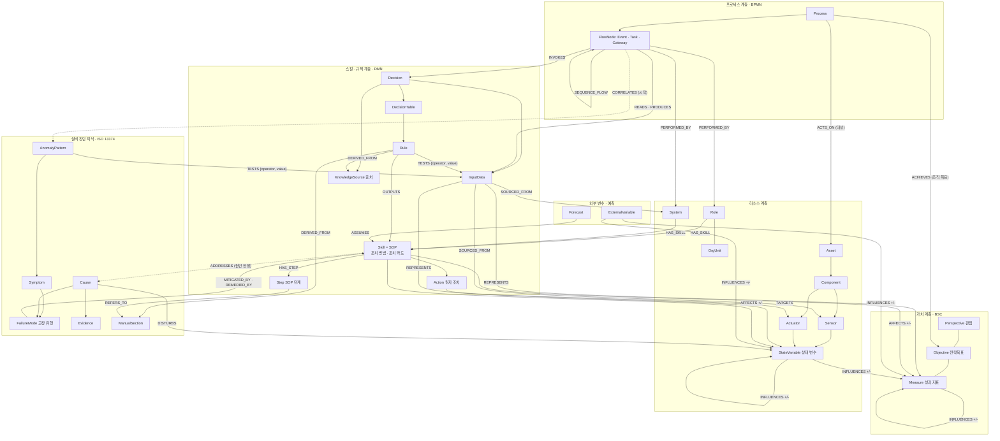
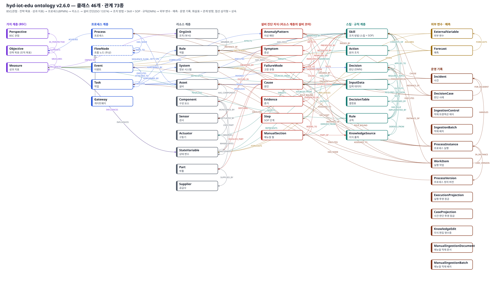
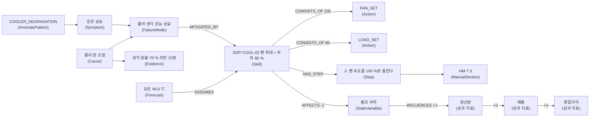

# 온톨로지 스키마 v2 — BSC · 프로세스 · 리소스 · 스킬

2026-10-01 회의의 지시에 따라 L7 온톨로지를 처음부터 다시 설계했다. 이 문서는 스키마(클래스와 관계의 틀)를 설명한다. 인스턴스는 스키마에 맞춰 따로 만든다.

v2.1(2026-10-02)은 세 표준을 미니멀 셋으로 다시 다듬었다. BPMN에서 프로세스의 시작 · 대상 · 실행 데이터 연결성을, DMN에서 임계값 기반 규정 · 판단 규칙을, BSC에서 지표 간 가치 상충과 소유 부서를 속성으로 담고, 세 결함 시나리오가 쓰지 않는 표준 요소는 뺐다 (3절의 미니멀 셋 표).

## 1. 왜 다시 만들었나

v1은 "시작 대상 → 조회 정보 → 규정 판단 → 실행"이라는 일의 순서를 노드로 그렸다. 그것은 프로세스이고 BPM이 이미 다루는 영역이다. "판단 시나리오", "정보 유형" 같은 노드는 클래스가 아니었고, 스키마 그림과 인스턴스 그림이 섞여 사람도 기계도 해석하기 어려웠다.

v2의 설계 원칙은 여섯 가지다.

1. **계층:** 맨 위에 BSC(관점 · 전략 목표 · 성과 지표), 그 아래 전략 목표(조직 목표)를 달성하는 프로세스, 일을 하는 리소스, 조치 방법인 스킬과 규칙이 있다. 옆에 외부 변수와 예측이 붙는다.
1. **조치 방법은 Skill이다:** 스킬 하나가 SOP 하나다. 스킬은 SOP 번호와 단계를 직접 갖고, 고장 유형(FailureMode)에 즉시 완화 또는 근본 조치로 매칭된다.
2. **상충 관계가 핵심이다:** BSC 성과 지표끼리, 그리고 설비 상태와 성과 지표 사이에 `+`/`-` 영향 관계를 둔다. 에이전트는 이 관계를 따라 거시적으로 판단한다. 관계가 없으면 선을 긋지 않는다.
3. **표준에서 준용한다:** 가치는 BSC, 프로세스는 BPMN, 규정과 판단은 DMN, 설비 진단은 ISO 13374 / MIMOSA(아키텍처 v4)를 따른다. 시나리오에 필요한 만큼만 가져왔다.
4. **스키마가 먼저다:** 클래스와 관계, 속성 정의(`schema.json`)가 단일 원본이다. 인스턴스 스크립트, Neo4j 제약, OWL 파일, 에이전트용 스키마 설명은 모두 이 원본을 따른다.
5. **평가할 수 있어야 한다:** 그래프가 스키마를 지키는지 기계로 검사한다. 질의 예시마다 기대 결과가 있다.

## 2. 계층 구조



## 3. 표준 준용

| 표준 | 가져온 요소 | v2 클래스 · 관계 |
|---|---|---|
| BSC | 관점, 전략 목표(조직 목표), 성과 지표, 전략맵 인과 | Perspective, Objective, Measure, `SUPPORTS`, `MEASURES`, `INFLUENCES`, `ACHIEVES`(프로세스 → 전략 목표) |
| BPMN 2.0 | Process와 그 대상, Event(트리거는 eventDefinition · messageRef · correlationKey 속성), Task(user · service · businessRule), Gateway, SequenceFlow, 수행자, 데이터 입력 · 출력, 경계 이벤트 | Process, FlowNode, Event, Task, Gateway, `ACTS_ON`, `CORRELATES`, `SEQUENCE_FLOW`, `PERFORMED_BY`, `READS`, `PRODUCES`, `ATTACHED_TO` |
| DMN 1.x | Decision, InputData, Decision Table(hit policy, Rule = 입력 항목의 임계값 검사), Knowledge Source, 정보 · 권한 요구 | Decision, InputData, DecisionTable, Rule, KnowledgeSource, `TESTS {operator, value}`, `REQUIRES_INPUT`, `REQUIRES_DECISION`, `GOVERNED_BY`, `DERIVED_FROM` |
| BPMN ↔ DMN | businessRuleTask가 Decision을 호출 | `Task-[:INVOKES]->Decision` |
| ISO 13374 / MIMOSA | SD 상태 감지, HA 건강 평가, AG 권고 | AnomalyPattern, Symptom, FailureMode, Cause, Evidence, ManualSection. AG 권고는 고장 유형에 매칭된 Skill(= SOP)과 Step |
| ISO 14224 취지 | 설비 단위, 정비 가능 품목, 고장 모드 · 원인 | Asset, Component, FailureMode, Cause |

### 미니멀 셋 — 시나리오가 쓰는 것만

표준의 모든 요소를 담지 않았다. 세 결함 시나리오(쿨러 핀 오염, 펌프 내부 누설, 팬 베어링 마모)가 실제로 쓰는 요소만 두었다. `validate`는 인스턴스가 쓰지 않는 스키마 요소를 보고하며, 지금은 0개다.

| 표준 | 시나리오에 꼭 필요해서 담은 것 | 쓰지 않아 뺀 것 |
|---|---|---|
| BPMN | 시작 이벤트(메시지 = 경보, 상관 키 = 설비), 경계 타이머(선택 시간 초과), 종료(종결 · 에스컬레이션), 작업 3종(user · service · businessRule), 배타 게이트웨이, 작업의 데이터 입력 · 출력, 수행자, 프로세스 대상 | 중간 이벤트, 조건 · 신호 · 오류 이벤트, 병렬 · 포괄 게이트웨이, 수동 작업, 풀 · 레인 · 메시지 흐름, 하위 프로세스 |
| DMN | 판단, 입력 데이터, 결정표, 임계값 검사(연산자 6종), hit policy 3종(PRIORITY · COLLECT · UNIQUE), 지식 출처, 정보 · 권한 요구 | hit policy FIRST · RULE ORDER, 업무 지식 모델(BKM), FEEL 함수, 출력 열 정의, 결정 서비스 |
| BSC | 관점 4개, 전략목표, 성과 지표(방향 · 목표 · 경고 · 위험 임계값 · 계산식), 성과 지표 간 `+`/`-` 영향, 성과 지표 소유 부서 | 실행 과제(Initiative) 별도 클래스, 가중치 스코어카드, 목표 대비 실적 시계열 |

## 4. 클래스

### 클래스 이름 (영문 · 한글)

스키마 원본의 label_ko에서 생성한 표다 ([class-table.md](class-table.md)). 모든 클래스와 관계를 한 장에 그린 그림은 [ontology-classes.svg](ontology-classes.svg)다.



| 계층 | 클래스 (영문) | 클래스 (한글) | 준용 표준 |
|---|---|---|---|
| 가치 계층 (BSC) | Perspective | BSC 관점 | BSC Perspective |
| 가치 계층 (BSC) | Objective | 전략 목표 (조직 목표) | BSC Strategic Objective |
| 가치 계층 (BSC) | Measure | 성과 지표 | BSC Measure (성과 지표) |
| 프로세스 계층 | Process | 프로세스 | BPMN Process |
| 프로세스 계층 | FlowNode | 흐름 노드 (추상) | BPMN FlowNode (추상) |
| 프로세스 계층 | Event | 이벤트 | BPMN Event |
| 프로세스 계층 | Task | 작업 | BPMN Task |
| 프로세스 계층 | Gateway | 게이트웨이 | BPMN Gateway |
| 리소스 계층 | OrgUnit | 조직 (부서) | 조직 단위 |
| 리소스 계층 | Role | 역할 | BPMN Performer / 직무 |
| 리소스 계층 | System | 정보 시스템 | 정보 시스템 (BPMN DataStore 취지) |
| 리소스 계층 | Asset | 설비 | ISO 14224 Equipment unit / MIMOSA Asset |
| 리소스 계층 | Component | 구성 요소 | ISO 14224 Maintainable item |
| 리소스 계층 | Sensor | 센서 | MIMOSA DA (Data Acquisition) |
| 리소스 계층 | Actuator | 구동기 | 구동기 (PLC 쓰기 대상) |
| 리소스 계층 | StateVariable | 상태 변수 | 공정 상태 변수 |
| 리소스 계층 | Part | 부품 | 예비품 / 자재 |
| 리소스 계층 | Supplier | 공급사 | 공급사 |
| 설비 진단 지식 (리소스 계층의 설비 코어) | AnomalyPattern | 이상 패턴 | ISO 13374 SD (State Detection) |
| 설비 진단 지식 (리소스 계층의 설비 코어) | Symptom | 증상 | ISO 13374 HA (Health Assessment) — 관측 증상 |
| 설비 진단 지식 (리소스 계층의 설비 코어) | FailureMode | 고장 유형 | ISO 14224 Failure mode |
| 설비 진단 지식 (리소스 계층의 설비 코어) | Cause | 원인 | ISO 14224 Failure cause |
| 설비 진단 지식 (리소스 계층의 설비 코어) | Evidence | 증거 | MIMOSA 확증 규칙 |
| 설비 진단 지식 (리소스 계층의 설비 코어) | Step | SOP 단계 | SOP 단계 |
| 설비 진단 지식 (리소스 계층의 설비 코어) | ManualSection | 매뉴얼 절 | 지식 베이스 문서 조각 |
| 스킬 · 규칙 계층 | Skill | 조치 방법 (스킬 = SOP) | 조치 방법 = SOP (DMN 판단의 출력 · BPMN 서비스 작업이 수행) |
| 스킬 · 규칙 계층 | Action | 원자 조치 | 원자 조치 (PLC 쓰기 또는 시스템 트랜잭션) |
| 스킬 · 규칙 계층 | Decision | 판단 (DMN) | DMN Decision |
| 스킬 · 규칙 계층 | InputData | 입력 데이터 | DMN InputData |
| 스킬 · 규칙 계층 | DecisionTable | 결정표 | DMN Decision Table |
| 스킬 · 규칙 계층 | Rule | 규칙 | DMN Decision Rule |
| 스킬 · 규칙 계층 | KnowledgeSource | 지식 출처 | DMN KnowledgeSource |
| 외부 변수 · 예측 | ExternalVariable | 외부 변수 | 외생 변수 |
| 외부 변수 · 예측 | Forecast | 예측 | 예측 |
| 운영 기록 | Incident | 사건 | 사건 기록 |
| 운영 기록 | DecisionCase | 판단 사례 | DMN 판단의 실행 인스턴스 |

### 클래스 속성


전체 속성은 [schema_prompt.md](../../it/neo4j/v2/schema_prompt.md)에 있다. `!`는 필수 속성이다.

| 계층 | 클래스 | 핵심 속성 | 뜻 |
|---|---|---|---|
| BSC | Perspective | order! | BSC 관점. 학습=1 … 재무=4 |
| | Objective | name! | 전략 목표 (조직 목표). 프로세스가 달성하려는 대상 |
| | Measure | unit!, direction! (UP · DOWN), formula, target, thresholdWarn · thresholdCrit | BSC 성과 지표. 상충 관계의 노드 |
| 프로세스 | Process | isExecutable | 업무 프로세스 |
| | Event : FlowNode | position! (start · boundary · end), eventDefinition! (none · message · timer · escalation), messageRef, correlationKey, timer | 시작 · 경계 · 종료 이벤트. 트리거는 이 속성들이다 |
| | Task : FlowNode | taskType! (user · service · businessRule) | 작업. 읽는 데이터(READS)와 만드는 데이터(PRODUCES)를 가진다 |
| | Gateway : FlowNode | gatewayType! (exclusive) | 분기 |
| 리소스 | OrgUnit · Role · System | level!, zone! | 조직, 역할, 정보 시스템(에이전트 포함) |
| | Asset · Component · Sensor · Actuator | tag!, resource! | 설비와 계측 · 구동 |
| | StateVariable | unit!, kind! (manipulated · controlled · disturbance) | 물리량. 물리 영향을 성과 지표로 잇는 다리 |
| | Part · Supplier | avl! | 교체 부품과 공급사 |
| 설비 진단 | AnomalyPattern | code!, rule!, holdSeconds | CEP 탐지 패턴. 탐지 임계값은 TESTS로 입력 데이터에 건다 |
| | Symptom · FailureMode · Cause | prior! | 증상, 고장 모드, 원인 |
| | Evidence | rule!, weight!, sql | 원인 확증 근거 |
| | ManualSection | ref!, title! | 매뉴얼 절 |
| 스킬 · 규칙 | Skill | sopId!, kind! (control · work_order · business), description! | 조치 방법 = SOP = 조치 가이드 카드 한 장. 단계가 1개 이상, 고장 유형 매칭이 1개 이상 있어야 한다 |
| | Step | order!, text! | SOP 단계. 근거 매뉴얼 절을 가리킨다 |
| | Action | code!, kind!, param, min, max | 원자 조치 (PLC 쓰기 · 시스템 트랜잭션) |
| | Decision | question! | 판단 정의 |
| | InputData | variable!, typeRef! | 판단 · 작업 사이를 흐르는 데이터. 출처(SOURCED_FROM)나 만든 작업(PRODUCES)이 있고, 상태 변수 · 성과 지표를 가리킨다(REPRESENTS) |
| | DecisionTable · Rule | hitPolicy! (PRIORITY · COLLECT · UNIQUE — 엔진이 평가하는 표는 cards.EXECUTED_HIT_POLICIES와 같아야 한다), when!, effect! (SELECT · EXCLUDE · PENALTY · WARN · RANK) | 결정표와 규칙. 규칙은 임계값 검사(TESTS)를 하나 이상 가진다 (RANK 제외) |
| | KnowledgeSource | kind! (manual · regulation · policy · strategy) | 매뉴얼, 사내 규정, 정책, 전략맵 |
| 외부 · 예측 | ExternalVariable · Forecast | unit!, value!, method! | 외생 변수, 조치별 예측값 |
| 운영 기록 | Incident · DecisionCase | alertId!, followedRecommendation! | 사건과 사람의 판단 사례(선례) |

## 5. 상충 관계 규칙

- `INFLUENCES {sign}`: 성과 지표 · 상태 변수 · 외부 변수가 다른 성과 지표나 상태 변수를 움직인다. 원천이 오르면 대상이 `sign` 방향(+1 · -1)으로 움직인다.
- `AFFECTS {sign, delta}`: 스킬이 상태 변수나 성과 지표를 움직인다. 스킬의 효과는 `AFFECTS` 한 번 뒤 `INFLUENCES*`를 따라 영업이익까지 이어진다. 경로의 sign을 곱하면 이익에 대한 방향이 나온다.
- 관계가 없으면 만들지 않는다. sign 0은 허용하지 않는다. 예: 재고량과 매출 사이에는 선이 없다.
- 조건부 영향은 `condition`에 조건을 적는다. 예: 부품 단가와 품질의 관계는 "공급사를 바꿔 단가를 낮출 때"만 성립한다. 환율로 같은 부품 값이 오를 때는 성립하지 않는다.

회의에서 든 예시가 인스턴스에 그대로 들어 있다.

```
매출 +→ 영업이익,  총비용 -→ 영업이익
재고량 +→ 재고 보관비 +→ 총비용           (재고량과 매출: 선 없음)
부품 단가 +→ 부품 구매비 +→ 총비용         → 단가를 낮추면 이익 +
부품 단가 +→ 부품 품질 -→ 품질 클레임 -→ 브랜드 신뢰 +→ 매출   → 공급사를 바꿔 낮추면 이익 -
환율 +→ 부품 단가,  환율 -→ 매출 (가격 정책 조건부),  환율 +→ 재고량 (가격 정책 조건부)
```

### 조치 방법 = Skill = SOP, 고장 유형에 매칭

조치 방법은 Skill 하나로 표현한다. 스킬 하나가 SOP 하나다.

- **SOP를 직접 갖는다:** 스킬은 `sopId`와 단계(`HAS_STEP → Step → REFERS_TO → ManualSection`)를 직접 갖는다. 별도 절차 클래스는 없다.
- **고장 유형에 매칭된다:** `(:FailureMode)-[:MITIGATED_BY]->(:Skill)`은 즉시 완화, `(:FailureMode)-[:REMEDIED_BY]->(:Skill)`은 근본 조치다.
- **원인 한정:** 근본 조치가 고장 유형의 특정 원인에만 맞으면 `(:Skill)-[:ADDRESSES]->(:Cause)`를 단다. 같은 "쿨러 냉각 성능 상실"이라도 핀 오염이면 세척, 외기 고온이면 환기 개선이다.
- **스키마가 강제한다:** 단계가 없거나 고장 유형에 매칭되지 않은 스킬은 `validate`에서 위반으로 잡힌다.

| 고장 유형 | 즉시 완화 SOP | 근본 조치 SOP |
|---|---|---|
| 쿨러 냉각 성능 상실 | SOP-COOL-01 팬 최대, SOP-COOL-02 팬 최대 + 부하 80 %, SOP-COOL-03 부하 70 % + 야간 세척 (핀 오염 한정) | SOP-COOL-04 쿨러 핀 세척 (핀 오염 한정), SOP-COOL-05 캐비닛 환기 개선 (외기 고온 한정) |
| 펌프 체적 효율 저하 | SOP-PMP-01 예비 펌프 전환, SOP-PMP-02 부하 70 %, SOP-PMP-03 압력 설정 상향 (구 절차, 규정상 제외) | SOP-PMP-04 펌프 축 씰 교체 |
| 팬 베어링 열화 | SOP-FAN-01 팬 40 % + 부하 80 %, SOP-FAN-02 팬 40 % | SOP-FAN-03 계획 정지 + 베어링 교체, SOP-FAN-04 팬 베어링 교체 |
| 과열 정지 | SOP-TRIP-01 냉각 후 리셋 | 원인 고장 유형(냉각 성능 상실)의 근본 조치를 따른다 |

### 임계값 규칙 (DMN)

- 임계값은 문장이 아니라 관계다: `(:Rule|AnomalyPattern)-[:TESTS {operator, value, unit}]->(:InputData)`. 연산자는 `<`, `<=`, `>`, `>=`, `==`, `!=`다.
- 한 규칙의 검사는 모두 AND다 (결정표의 한 행). OR는 행을 나눈다. 예: "트립 중"과 "과열 정지로 판정"은 별도 행 두 개가 같은 리셋 스킬을 낸다.
- `when`은 같은 조건을 사람이 읽게 쓴 문장이다. 검사기가 `when`과 TESTS가 같은 변수 · 연산자 · 값인지 확인한다.
- 입력 데이터는 `REPRESENTS`로 상태 변수나 성과 지표를 가리킨다. 그래서 "예측 유온 ≥ 65 ℃" 규칙이 유온의 인터록 한계 65 ℃와 같은 값임을 질의로 확인할 수 있다.
- 탐지 임계값과 규칙 임계값 모두 근거 문서(`DERIVED_FROM`)를 가진다.
- 온도와 압력 규칙이 모두 있다. 온도: 유온 > 55 ℃ 탐지, 예측 유온 ≥ 55 경고, ≥ 65 제외. 압력: 토출 압력 < 165 bar 탐지 · 원인 판정, 예측 압력 < 165 bar 경고, 저압 인터록 130 bar.

### 세 결함 시나리오 — 시작 · 대상 · 데이터 · 임계값 · 상충

| | 쿨러 핀 오염 | 펌프 내부 누설 | 팬 베어링 마모 |
|---|---|---|---|
| 시작 (BPMN) | 메시지 시작 이벤트 `alerts`, 상관 키 asset | 같음 | 같음 |
| 대상 (BPMN) | 설비 HYD-01 (`ACTS_ON`) | 같음 | 같음 |
| 탐지 임계값 (DMN) | ts1 > 55 ℃, ce < 70 %, ts1_slope > 0 [HM-7.3] | ps1 < 165 bar, fs1 < 8.0 l/min, load ≥ 80 % [HM-5.2] | vs1 > 1.2 mm/s, vs1_slope > 0 [HM-8.1] |
| 원인 판정 규칙 (DMN) | pattern == COOLER_DEGRADATION, ce < 70 | pattern == PUMP_LEAKAGE | pattern == FAN_VIBRATION, ts1 < 52 |
| 고장 유형 | 쿨러 냉각 성능 상실 | 펌프 체적 효율 저하 | 팬 베어링 열화 |
| 조치 카드 (스킬 = SOP) | SOP-COOL-01 · 02 · 03 | SOP-PMP-01 · 02 · 03 | SOP-FAN-01 · 02 · 03 |
| 걸리는 규정 (DMN) | 예측 유온 ≥ 55 경고, 팬 100 % > 24 h 감점, REMOTE_AUTO 아니면 제외 | 압력 상향 제외 (누설 시), 예비 펌프 미가용 시 제외, REMOTE_AUTO 아니면 제외 | 예측 유온 ≥ 55 경고, REMOTE_AUTO 아니면 제외 |
| 상충 (BSC) | 생산량 · 매출 [생산팀] 대 보전비 · 작동유 수명 [설비보전팀] 대 전력 [에너지팀] | 가동률 [생산팀] 대 예비 설비 여유 · MTBF [설비보전팀] | 진동 · MTBF [설비보전팀] 대 인터록 여유 · 생산량 [생산팀] |

데이터는 작업 사이를 이렇게 흐른다 (q13). 원인 진단이 센서 · CEP 값을 읽어 고장 유형과 원인을 만든다. 조치 후보 조회가 그것을 읽어 예측 유온과 후보 속성을 만든다. 규정 검토와 우선순위가 그 값과 시스템 값(운전 모드, 예비 펌프 가용, 오더 납기)을 읽는다. 사람이 고른 스킬이 PLC 명령 또는 작업지시 작업으로 넘어간다.

## 6. 스키마 그림과 인스턴스 그림

위 2절의 그림은 스키마 그림이다. 상자는 클래스, 화살표는 관계 종류다. 아래는 같은 스키마에 맞춘 인스턴스 경로 하나다. 쿨러 핀 오염 사건에서 에이전트가 찾는 경로이며, 상자는 실제 노드다.



Neo4j Browser에서 스키마 그림은 `CALL db.schema.visualization()`으로, 인스턴스 그림은 질의 결과로 따로 본다.

## 7. 에이전트가 쓰는 방법

GraphRAG는 Text2SQL과 같은 구조다. Text2SQL이 DDL과 질문을 함께 LLM에 주고 SQL을 받듯이, 에이전트는 온톨로지 스키마와 질문을 함께 주고 Cypher를 받는다.

```
사용자 질문 ─┐
             ├─▶ LLM ─▶ Cypher ─▶ Neo4j ─▶ 연결된 경로(그래프) ─▶ 조치 카드
schema_prompt.md (스키마) ─┘
```

1. **엔티티 인식:** 질문의 말을 전문 검색 색인 `ont_names`로 노드에 붙인다. "유온 냉각"이라는 말은 증상 "냉각 효율 저하", 상태 변수 "유온", 증상 "유온 상승"으로 이어진다.
2. **경로 질의:** 증상에서 고장 유형과 원인, 증거를 찾고, 그 고장 유형에 매칭된 조치 방법(스킬 = SOP)과 원자 조치, 단계, 매뉴얼까지 한 번에 가져온다.
3. **카드 작성:** 고장 유형에 맞는 후보 스킬을 결정표 규칙으로 고르고, 규정 규칙으로 거르고, 예측값과 득실 성과 지표를 붙인다.
4. **사람 확인:** 카드마다 출처(규칙의 근거 문서, SOP 단계의 매뉴얼 절, 원인의 증거)를 보여 준다.
5. **선례:** 사람의 선택은 DecisionCase로 남고, 다음 판단에서 같은 원인의 선택 이력으로 읽힌다.

질의 예시는 [queries.cypher](../../it/neo4j/v2/queries.cypher)에 있다. 블록마다 자연어 질문과 정답 Cypher가 있다.

| 질의 | 질문 | 확인한 결과 |
|---|---|---|
| q1 | "유온 냉각"이 가리키는 노드 | 냉각 효율 저하, 유온, 유온 상승 순으로 찾음 |
| q2 | 유온 상승의 고장 유형 · 원인 · 증거 · 조치 방법(SOP) · 매뉴얼 | 원인 2개. 핀 오염은 SOP 4개, 외기 고온은 SOP 3개(근본 조치는 환기 개선) |
| q2b | 고장 유형별 조치 방법 | 고장 유형 4개에 SOP 14개, 단계 수와 원인 한정 여부 |
| q3 | 쿨러 핀 오염 카드 비교 | 3장(SOP-COOL-01 · 02 · 03). 예측 유온 55.4 · 49.0 · 52.2 ℃와 걸리는 규칙, 승인 역할 |
| q4 | "팬 최대 + 부하 80 %"의 이익 경로 | 득 경로(유온 ↓ → 트립 회피 → 가동률 · 매출)와 실 경로(전력 · 생산량) |
| q5 | 팬 베어링 마모 카드별 득실 성과 지표와 소유 부서 | 조건 없는 득실과 조건부 득실을 나눠, 성과 지표마다 부서를 붙여 표시 (BSC 상충) |
| q6 | "예비 펌프 전환" 카드의 출처 | 원인, 증거 2개, 선택 · 제한 규칙과 근거 절, SOP 단계 |
| q7 | 성과 지표 → 프로세스 → 리소스 → 스킬 | 가동률 성과 지표부터 작업, 수행자, 스킬까지 |
| q8 | 부품 단가를 낮추면 | 구매비 경로는 이익 +, 품질 경로 6개는 이익 - (공급사 변경 조건) |
| q9 | 환율이 오르면 | 부품 단가 ↑ 이익 -, 매출 · 재고는 가격 정책 조건부 |
| q10 | 쿨러 핀 오염의 선례 | 고른 카드, 횟수, 사유, 권고와 다르게 고른 횟수 |
| q11 | 설비 이상 조치 프로세스 | 순서, 수행자, 각 단계가 부르는 판단, 분기 조건 |
| q12 | 펌프 누설 시나리오 프로필 | 시작(메시지 · 상관 키), 대상 HYD-01, 탐지 임계값 3개, 원인 판정 규칙, 고장 유형, 카드 3장, 걸리는 규정 |
| q13 | 작업별 데이터 흐름 | 작업 9개가 읽는 데이터의 출처(센서 · 시스템 · 앞 작업)와 만드는 데이터 |
| q14 | 수치 임계값 전체 | 임계값 13개와 가리키는 상태 변수의 한계, 근거 문서. 예측 유온 ≥ 65 규칙 = 유온 한계 65 |

**온톨로지의 몫과 판단 엔진의 몫:** 온톨로지는 방향과 경로, 출처를 준다. q5처럼 한 카드에 득과 실이 함께 나오면, 어느 쪽이 더 큰지는 예측값(Forecast)과 기업 시스템의 금액 사실로 판단 엔진이 계산한다. DMN 결정표 `dt:rank-actions`가 그 자리다.

## 8. v1에서 v2로

| v1 | v2 | 이유 |
|---|---|---|
| Scenario (판단 시나리오) | 없음. 질문은 Decision.question, 흐름은 Process | 시나리오는 클래스가 아니라 인스턴스 경로다 |
| InfoType (무슨 정보) | InputData (DMN) + `SOURCED_FROM` System | 표준의 입력 데이터 개념으로 바꿈 |
| Option (대안) | Skill (= SOP. 원자 조치를 값과 함께 묶은 조치 카드) | 조치 방법이 스킬 계층의 단위 |
| Cause -MITIGATED_BY · REMEDIED_BY-> Action, Action -FOLLOWS-> Procedure | FailureMode -MITIGATED_BY · REMEDIED_BY-> Skill, Skill -HAS_STEP-> Step, 필요하면 Skill -ADDRESSES-> Cause | 조치 방법은 SOP인 스킬이고 고장 유형에 매칭된다 |
| Option -IMPACTS{expr}-> 성과 지표 | Skill -AFFECTS{sign}-> StateVariable · 성과 지표, 그 뒤 INFLUENCES* | 영향을 식 하나에 숨기지 않고 관계로 드러냄 |
| Policy (HARD · SOFT) | Rule (EXCLUDE · PENALTY · WARN) in DecisionTable, `DERIVED_FROM` KnowledgeSource | 규정은 DMN 규칙과 출처로 |
| Goal | Objective (BSC) + Perspective | 전략맵 구조 |
| BusinessProcess (이름에 순서를 적은 노드) | Process + Event · Task · Gateway + SEQUENCE_FLOW | 순서를 관계로 표현 |
| Decision (승인 기록) | DecisionCase -INSTANCE_OF-> Decision | 판단 정의와 실행 사례를 분리 |
| Constraint | Rule (EXCLUDE) | 규칙 하나로 통일 |
| Action (조치) | Action (원자 조치) + Skill | 카드와 명령을 분리 |
| Procedure (SOP) | Skill에 합침 (sopId, HAS_STEP) | 조치 방법과 SOP는 같은 것 |
| 설비 진단 지식 | 유지 (ISO 13374), Cause -DISTURBS-> StateVariable 추가 | 원인이 물리 영향 경로로 이어지게 |

## 9. 파일과 실행

| 파일 | 내용 |
|---|---|
| `it/neo4j/v2/schema.json` | **스키마 원본.** 계층, 클래스(속성 · 준용 표준), 관계(끝점 · 다중도 · 관계 속성) |
| `it/neo4j/v2/ontology-schema.ttl` | OWL 스키마 파일 (Turtle). 생성 파일. Neo4j n10s나 Protégé로 불러올 수 있다 |
| `it/neo4j/v2/schema_prompt.md` | 에이전트에게 주는 스키마 설명. 생성 파일 |
| `it/neo4j/v2/constraints.cypher` | id 고유 제약과 엔티티 인식 색인. 생성 파일 |
| `it/neo4j/v2/instances.cypher` | 가상 기업 "경남유압" 인스턴스 (세 결함 · 회의 예시 포함) |
| `it/neo4j/v2/queries.cypher` | 자연어 질문과 정답 Cypher 15개 |
| `scripts/ontology_v2.py` | 생성 · 적재 · 검사 · 질의 실행 |
| `tests/test_ontology_schema.py` | 스키마 정합성, 생성 파일 최신 여부, 검사기 동작 |

운영 Neo4j(컨테이너 `hyd-iot-edu-neo4j-1`, 포트 7687)는 kg-seed가 v2를 적재한다. 스키마 검사와 질의 예시는 운영 그래프에 바로 돌린다.

```bash
python scripts/ontology_v2.py gen                                    # schema.json을 고쳤으면 먼저 (OWL · 설명문 · 제약 · SVG · 표 생성)
docker compose up -d --force-recreate kg-seed                         # 운영 그래프에 다시 적재 (멱등, 사람이 고친 스킬 이름 · 설명은 유지)
python scripts/ontology_v2.py validate --uri bolt://127.0.0.1:7687    # PASS가 나와야 한다
python scripts/ontology_v2.py queries  --uri bolt://127.0.0.1:7687
```

`load --wipe`는 그래프를 비우고 다시 적재하므로 운영 그래프에는 쓰지 않는다. 스키마를 실험할 때는 별도 Neo4j를 띄워 기본 주소(7688)로 쓴다:
`docker run -d --name hyd-onto-v2 -p 127.0.0.1:7688:7687 -e NEO4J_AUTH=neo4j/hydpass123 neo4j:5.26-community`.

Neo4j Browser는 http://127.0.0.1:7474 (neo4j / hydpass123)다.

검증 결과 (2026-10-02):

| 항목 | 결과 |
|---|---|
| 스키마 | v2.1. 클래스 36, 관계 66 |
| 인스턴스 | 노드 276, 관계 696 |
| 스키마 검사 | 위반 0건 (PASS). 스킬 14개 모두 SOP 단계와 고장 유형 매칭 있음 |
| 미니멀 셋 | 인스턴스가 쓰지 않는 스키마 요소 0개 (클래스 · 속성 · enum 값 · 관계 · 관계 속성) |
| DMN · BPMN 일관성 | 규칙 문장과 임계값 일치, 규칙 입력의 판단 선언, 판단 작업의 입력 읽기, 데이터 출처 · 생산자 모두 통과 |
| 질의 예시 | 15개 모두 결과 있음 |
| OWL 파일 | rdflib로 파싱 성공 |
| 단위 테스트 | 온톨로지 13개 포함 전체 150개 통과 |

## 10. AI가 만든 온톨로지를 평가하는 질문

1. 클래스 이름이 객체인가? 일의 순서("시작 대상", "조회할 정보")나 사례("판단 시나리오")가 클래스로 올라오지 않았는가?
2. 각 클래스가 어느 표준의 어느 요소를 준용했는지 말할 수 있는가?
3. 스키마 그림과 인스턴스 그림이 따로 있는가?
4. 성과 지표 사이에 `+`/`-` 관계가 있고, 관계가 없는 쌍은 선이 없는가?
5. 질문 하나("이 이상에 무엇을 해야 하고 이익에 어떤 영향이 있나")에 대해 Cypher 한 번으로 연결된 경로가 나오는가?
6. 조치 카드의 모든 주장에 출처 노드(규칙의 근거, 매뉴얼 절, 증거)가 있는가?
1. 조치 방법이 SOP인 스킬로 명시되어 있고, 모든 스킬이 고장 유형에 매칭되는가?
1. 임계값이 문장이 아니라 연산자 · 값 · 근거를 가진 관계로 있는가?
1. 작업마다 읽는 데이터의 출처와 만드는 데이터가 이어져 있는가?
1. 시나리오가 쓰지 않는 표준 요소가 스키마에 남아 있지 않은가?
1. `validate`가 PASS인가?

## 11. 서비스가 v2를 쓰는 방식 (2026-10-02 이전 완료)

실행 중인 프로토타입은 이제 v2 그래프만 쓴다. kg-seed가 v1 노드를 한 번 지우고 v2를 적재한다 (v1 시드와 템플릿은 `it/neo4j/v1/`에 보관).

| 서비스 | v2에서 하는 일 | 쓰는 템플릿 |
|---|---|---|
| 에이전트 (L8) | 경보 → 원인 후보 · 증거 → 고장 유형의 SOP 스킬 → 가이드 카드 → DMN 후보 · 규정 규칙 → 예측 · BSC 득실 · 선례로 카드 순위 → 프로세스에 제출 | t1_causes, t2_skills, t3_dmn, t3_inputs, t3_skills, t3_tradeoffs, t3_forecasts, t3_precedents |
| 프로세스 (L9) | 사람이 카드(SOP) 하나를 고르면 역할 권한 검사 → PLC 명령은 인시던트 · 게이트웨이로, 작업지시 · 구매는 CMMS · ERP로 → `DecisionCase`와 `Incident`를 그래프에 기록 | — (쓰기 질의) |
| 포탈 | 지식 지도(계층별 열 · 이상 패턴 경로), 조치 판단 규칙(사실을 바꿔 규칙 반응 실습), HITL 카드 선택, 스킬(SOP) 카탈로그, 매뉴얼 → SOP 스킬 인제스천 | t0_patterns, t0_graph_* |

판단 엔진은 LLM 없이 결정론적이다. 점수 식은 온톨로지의 `rule:rank-value` 주석에 적혀 있고, 에이전트는 그 식을 그대로 쓴다.

## 12. 남은 일

- 펌프 누설과 팬 베어링 결함은 온톨로지와 판단 엔진에는 들어 있지만 설비 시뮬레이터와 CEP에는 아직 없다. 지금은 "조치 판단 규칙" 화면에서 가정 실행으로만 볼 수 있고, 해당 예측값은 설계 목표값이다. PLC에는 펌프 전환 · 정지 명령이 없어서 게이트웨이가 허용 목록에서 거부한다.
- 기존 전사 판단 시나리오 4개(납기, 구매, 품질 보류, 피크 전력)는 v2에서 빠졌다. 구매 시나리오의 상충은 q8의 부품가 경로로 들어 있다.
- 설명 영상은 v1 화면으로 녹화되어 있다.
