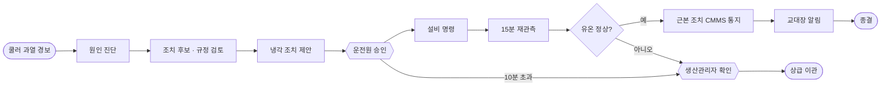
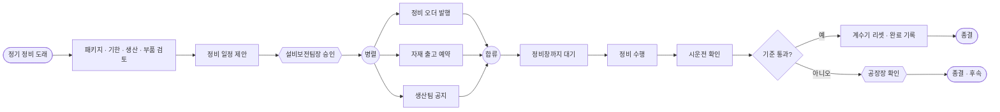
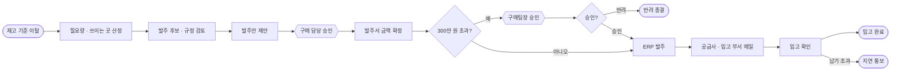

# 수업 시나리오 3개 — 긴급 대응 · 정기 정비 · 예비품 구매

> 2026-10-09 · 보고용 요약
> 상태: **추천안**. B 정기 정비와 아래 "확정할 것" 4개는 결정을 기다리는 중입니다.
> 근거: 조사 문서 `docs/handoff/verification/2026-10-09/scenario-selection.md`(후보 16개 비교, 출처 약 50개), `scenario-research.md`(저장소 확인)

---

## 한눈에 보기

같은 공장, 같은 기종의 유압 파워팩 3대(HYD-01~03)에서 **알려 주는 곳이 다른 업무 세 건**을 다룹니다.

| | A 긴급 대응 | B 정기 정비 | C 예비품 구매 |
|---|---|---|---|
| **한 문장** | 쿨러가 막혀 기름이 뜨거워지니, 설비가 서기 전에 식힌다 | 2,000시간마다 하는 정기 점검 때가 됐으니, 생산을 덜 잃는 날로 잡아 미리 고친다 | 씰 키트가 곧 모자라니, 규정에 맞고 총비용이 가장 낮은 곳에서 사 둔다 |
| **누가 알려 주나** | 설비 센서 — "지금 이상하다" | 운전시간 계수기 — "때가 됐다" | 창고 재고 — "곧 모자란다" |
| **업무 갈래** | 운전 · 복구 | 보전 · 예방 | 구매 · 조달 |
| **시간 단위** | 분 | 일 (정비창) | 일~주 (납기) |
| **에이전트가 답하는 질문** | 무엇이 잘못됐고, 지금 무엇을 하나? | 언제, 무엇을 묶어서 하나? | 얼마나, 어디서, 얼마에 사나? |
| **승인하는 사람** | 운전원 | 설비보전팀장 | 구매 담당 (+ 구매팀장) |
| **확인하고 닫는 것** | 유온 정상 · 경보 해제 | 시운전 정상 · 계수기 리셋 | 입고 확인 |

**세 시나리오 공통 원칙**

- **사람은 승인만 합니다.** 판단은 에이전트가 근거를 모아서 하고, "이렇게 하겠습니다"를 제안합니다.
- **시작은 자동입니다.** 수업에서는 버튼으로 원인을 만들고, 감지와 처리 건 시작은 시스템이 합니다.
- **쓰기는 승인 뒤에만 합니다.** 설비 명령 · 발주 · 메일은 승인 뒤 시스템 단계가 실행합니다. 에이전트는 조회와 계산만 합니다.
- **끝까지 닫습니다.** 실행한 뒤 잘 됐는지 확인하고 종결합니다.
- **온톨로지가 중심입니다.** 시나리오마다 자기 문서를 따로 인제스천해 지식 그래프를 채우고, 에이전트는 그 그래프를 근거로 판단합니다.
- **설비 · 시스템 구조 · 온톨로지 스키마는 그대로**이고, 시나리오마다 내용(문서 · 지식 · 에이전트 · 도구 · 담당자 · 흐름)이 다릅니다.

---

## 상세 비교

| 항목 | A 긴급 대응 | B 정기 정비 | C 예비품 구매 |
|---|---|---|---|
| **설비** | HYD-01 | HYD-02 (HYD-03은 묶음 판단 대상) | HYD-01~03에 들어가는 펌프 씰 키트 |
| **시작 신호** | 센서 경보 `COOLER_DEGRADATION` | CMMS `PM_DUE` (1,950 h / 주기 2,000 h) | ERP `SPARE_BELOW_MIN` (재고 < 재주문점) |
| **수업 버튼** | 쿨러 열화 주입 (있음) | 운전시간 빨리 감기 +300 h (새로 만듦) | 자재 출고, 씰 키트 −2 (새로 만듦) |
| **인제스천할 문서** | 쿨러 과열 대응 매뉴얼 | OEM 정기 점검표 (2,000 · 4,000 · 8,000 h 패키지, 허용 오차, 잔압 해제, 시운전 기준) | 예비품 관리 · 구매 규정 (재주문점, 승인 공급사, 300만 원 전결) |
| **문서에서 생기는 지식** | 고장 유형 · 원인(핀 오염 / 외기 고온 / 팬 고장) · 증거 · 냉각 SOP · 온도 규칙 | 정비 패키지 SOP와 단계 · 주기 · 허용 오차 규칙 · 부품(씰 키트, 리턴 필터) | 공급 조건(단가 · 불량률 · 납기 · 승인 여부) · 비승인 공급사 금지 규칙 · 금액 전결 규칙 · 발주 SOP |
| **에이전트** | 냉각 긴급 대응 에이전트 | 정기 정비 계획 에이전트 | 예비품 구매 에이전트 |
| **판단 근거** | 센서 추세, 원인 증거, 예측 유온, 납기, 팬 수명, 전력 | 기한 · 허용 오차(±10 %), 생산 오더 납기, 묶음 여부(HYD-03 1,880 h), 부품 재고 영향 | 필요량(목표 − 가용 − 입고 예정), 공급사 3곳 총비용, 불량 기대비용, 단가와 품질의 상충, 규정 |
| **제안 예** | 팬 최대 + 부하 80 % | 오늘 밤 HYD-02만 정비, HYD-03은 다음 정비창 | B-OEM에서 6개, 330만 원 |
| **지는 대안** | 팬만 최대 (온도가 충분히 안 내려감) · 부하 70 % (OEM 납기 놓침) | 지금 바로 정지 (오더 손실) · 허용 오차 밖으로 미루기 (보증 기록 위반) · 두 대 묶기 (인력 부족) | A정밀 (싸지만 불량 12 %) · C트레이딩 (가장 싸지만 비승인이라 제외) |
| **도구 (읽기만)** | 진단 · 판단 규칙, 센서 시계열, SCADA | CMMS (계획 · 계수기 · 백로그), MES 오더, 자재 키트 상태 | 지식 그래프 (부품 · 공급사 경로), SCM, ERP 재고 |
| **스킬** | 인터록까지 남은 시간부터 계산하고, 명령은 제안만 한다 | 기한 · 허용 오차부터 쓰고, 정비창 후보마다 손실과 부품 영향을 표로 보인다 | 필요량 근거를 먼저 쓰고, 공급사마다 총비용 · 납기 · 규정 결과를 표로 보인다 |
| **승인** | 운전원 (10분 넘으면 생산관리자) | 설비보전팀장 | 구매 담당 → 300만 원 넘으면 구매팀장 추가 승인 |
| **승인 뒤 시스템** | 설비 명령 → 15분 재관측 → 근본 조치를 CMMS에 통지 → 교대장 알림 | 정비 오더 발행 ∥ 자재 출고 예약 ∥ 생산팀 공지 → 정비창까지 대기 → 정비 수행 → 시운전 | ERP 발주 → 공급사 · 입고 부서 메일 → 입고 대기 |
| **확인 · 종결** | 유온 55 ℃ 미만 · 경보 해제 | 시운전 압력 · 유량 · 진동 정상 → 계수기 리셋, 다음 기한 기록 | 입고 확인 |
| **실패 가지** | 회복 안 되면 생산관리자 확인 | 기준 미달이면 공장장 확인 | 팀장 반려 · 납기 초과 시 지연 통보 |
| **흐름 모양** | 승인 타이머 + 재관측 분기 | **병렬 분기** 3갈래 | **금액 분기** + 2차 승인 |
| **흐름 크기** | 작업 9개 · 분기 1 | 작업 10개 · 병렬 1 + 분기 1 | 작업 10개 · 분기 2 |
| **회사 지표** | 경보 → 승인 · 회복 시간, 인터록 정지 0, 납기 · 전력비 | 정비 기한 준수, 계획 정비 비율, 생산 손실 | 결품 0, 총 구매비, 공급사 품질 |

---

## A 긴급 대응 — HYD-01 쿨러 과열

**이야기.** 쿨러 핀이 먼지와 기름때로 막혀 냉각 효율이 84 %에서 65 %로 떨어지고 유온이 오릅니다. 65 ℃ 인터록에 닿으면 설비가 서고 긴급 오더 납기를 놓칩니다. 에이전트가 원인을 가리고 냉각 조치를 제안하면, 운전원이 승인하고 시스템이 식힌 뒤 확인합니다.

---

## B 정기 정비 — HYD-02 운전시간 2,000 h 도래

**이야기.** CMMS가 "HYD-02 운전시간 1,950 h, 주기 2,000 h"를 알립니다. 에이전트는 서로 부딪치는 근거 넷을 저울질합니다.

1. **기한:** 허용 오차 ±10 %를 넘기면(2,200 h) 보증 기록 요건을 어깁니다.
2. **생산:** HYD-03에 OEM 오더 납기가 3시간 남았습니다.
3. **묶음:** HYD-03도 1,880 h라 같이 할지 정해야 합니다. 묶으면 인력과 생산 용량이 모자랍니다.
4. **부품:** 씰 키트를 출고하면 재고가 재주문점 아래로 내려갑니다(C 예고).

그래서 "오늘 밤 정비창에 HYD-02만 하고, HYD-03은 허용 오차 안에서 다음 창으로"를 제안하고, 설비보전팀장이 승인합니다.

**근거.** SAP · Maximo 같은 정비 시스템은 운전시간 계수기 계획으로 사람 요청 없이 오더를 만들고, 허용 오차로 날짜를 조정합니다. 파워팩 제조사 매뉴얼은 시간 단위 점검표를 주고 보증 기간 중 점검 기록을 의무로 둡니다. 2,000 h 주기와 ±10 %는 교육용 회사 설정입니다.

---

## C 예비품 구매 — 씰 키트 재고 < 재주문점

**이야기.** 펌프 씰 키트 재고가 재주문점 아래로 떨어집니다. 에이전트가 필요량을 계산하고 공급사 셋을 비교합니다.

| 공급사 | 단가 | 불량률 | 납기 | 승인 공급사 | 결과 |
|---|---|---|---|---|---|
| A정밀 | 35만 원 | 12 % | 2일 | 예 | 싸지만 불량 기대비용이 큼 |
| **B-OEM** | **55만 원** | **2 %** | **5일** | **예** | **추천 — 6개 330만 원** |
| C트레이딩 | 20만 원 | 30 % | 1일 | 아니오 | 규정상 제외 |

330만 원이 전결 기준 300만 원을 넘으므로 구매 담당 승인 뒤 구매팀장이 한 번 더 승인합니다.

---

## 한 공장의 한 주로 잇기

세 시나리오는 각자 자기 버튼으로 따로 시작할 수 있고, 이야기로는 이렇게 이어집니다. 흐름끼리 서로 부르지 않고 **데이터로만** 이어집니다.

| 언제 | 사건 | 다음으로 넘어가는 것 |
|---|---|---|
| 월요일 오후 | **A** HYD-01 쿨러 과열 → 팬 최대 + 부하 80 %로 식힘 | 핀 세척을 CMMS에 통지 |
| 수요일 | **B** HYD-02 운전시간 2,000 h → 오늘 밤 단독 정비, 씰 키트 출고 | 출고로 씰 키트 재고 감소 |
| 수요일 밤 | **C** 씰 키트 재고 < 재주문점 → B-OEM 발주, 구매팀장 추가 승인 | 금요일 입고 |

---

## 겹치지 않는지 확인

추천 조합을 7가지 축으로 짝지어 비교했습니다. **기각할 만한 겹침은 없고**, 부분적으로 겹치는 3곳은 이유가 있거나 정리할 방법이 있습니다.

| 축 | A × B | A × C | B × C |
|---|---|---|---|
| 시작 출처 | 다름 (센서 / 계수기) | 다름 (센서 / 재고) | 다름 (계수기 / 재고) |
| 업무 목적 | 다름 (복구 / 예방) | 다름 (복구 / 조달) | 다름 (예방 / 조달) |
| 흐름 모양 | 다름 (재관측 분기 / 병렬) | 다름 (재관측 / 금액 2단 결재) | 다름 (병렬 / 금액 2단 결재) |
| 판단 종류 | 다름 (진단 · 즉시 완화 / 일정 · 묶음) | 다름 (진단 / 공급원 · 수량) | 다름 (언제 / 어디서 · 얼마) |
| 도구 | 부분 — 둘 다 생산 오더(납기)를 읽음. 생산 영향은 두 판단 모두의 근거 | 다름 | 부분 — 지금은 업무 MCP 서버가 하나. **보전용 · 구매용으로 나누면 해소** |
| 문서 · 스킬 | 다름 | 다름 | 부분 — 같은 씰 키트를 가리킴. B가 쓰고 C가 채우는 연결점 |
| 승인자 | 다름 | 다름 | 다름 |

---

## 왜 이 조합인가 (후보 16개 중)

| 후보 | A와 안 겹침 (5점) | 나머지 기준 합 (40점) | 판정 |
|---|---|---|---|
| A 센서 긴급 대응 | 기준 | 40 | 유지 |
| 운전시간 정기 정비 | 5 | 34 | **B로 채택** |
| 예비품 재주문 구매 | 5 | 34 | **C 유지** |
| 입고 검사 · 공급사 품질 | 5 | 29 | 차점 (C 다음 심화 과제 후보) |
| 전력 피크 관리 | 2 | 32 | 탈락 — 흐름과 승인자가 A와 같음 |
| 오일 분석 결과 | 3 | 31 | 보류 — 진단 사슬이 A와 같음 |
| 기존 B 예지 정비 (펌프 효율 저하) | 2 | 30 | 탈락 — 센서 진단이라 A와 같음 |
| 경보 합리화 | 3 | 27 | 랩업 소재로 권장 |
| 교대 인계 · 안전 작업 허가 · 보증 · 교정 · 누유 · 변경 관리 | — | 20~24 | 탈락 — 사람이 시작하거나, 닫고 확인할 것이 없거나, 시뮬레이터가 없음 |

나머지 기준(각 5점): 흐름이 자연스럽게 다른가 · 에이전트 판단이 풍부한가 · 스키마로 표현되는가 · 노베이스가 한 문장으로 이해하는가 · 수업 버튼으로 원인을 만들 수 있는가 · 끝까지 닫을 수 있는가 · 구현 부담.

---

## 확정할 것

| # | 결정 | 권고 | 이유 |
|---|---|---|---|
| 1 | B를 운전시간 기반 정기 정비로 바꾼다 | 예 | 기존 B(펌프 효율 저하)는 센서로 알 수 있어 A와 겹침 |
| 2 | 온톨로지에 관계 하나 추가: `고장 유형 -[예방]-> SOP` | 예 | 정기 점검과 고장 수리를 그래프에서 구분. 기존 것은 바꾸지 않고 같은 형식으로 덧붙이기만 함 |
| 3 | 업무 MCP를 보전용 · 구매용 둘로 나눈다 | 예 | B와 C 에이전트의 도구가 겹치지 않게 |
| 4 | B 시운전이 실패하면 공장장이 확인한다 | 예 | A의 상급자(생산관리자)와 겹치지 않게 |

**스스로 판정할 질문**

- 학생이 세 시나리오를 "센서가 / 달력이 / 재고가 알려 준 일"로 한 번에 구분할 수 있는가?
- 같은 스키마인데 문서를 바꿔 넣으면 그래프의 내용이 달라지는 것이 눈에 보이는가?
- 각 시나리오에서 에이전트의 제안이 "지는 대안"보다 왜 나은지 근거를 대고 있는가?

---

## 구현 현황 (2026-10-09)

| 작업 | 내용 | 상태 |
|---|---|---|
| 지식 | 시드 두 판(수업용 구조판 · 회귀용 전체판), 문서 → 고장 유형 · 원인 · 규칙 · 조치까지 인제스천 확장, 시나리오 문서 작성 | 진행 중 (B 부분은 확정 뒤) |
| 실행 | 승인 뒤 부품: 메일(수업용 수신함, 실제 발송 없음) · ERP 발주 · 금액 분기 · 대기 · 정비 수행 흉내 · 입고 확인, 재고 감시기, 수업 버튼 | 진행 중 (B 부분은 확정 뒤) |
| 화면 | 실시간 스트리밍 최우선, process-gpt-vue3 · Dify 화면을 따라 정리, 기존 화면 결함 수정 | 진행 중 |
| 조립 | 시나리오별 에이전트 3개 · 흐름 3개, 실제 AI로 A · B · C 완주 검증 | 위 작업 뒤 |
