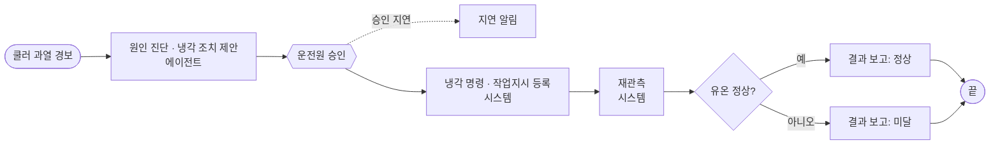
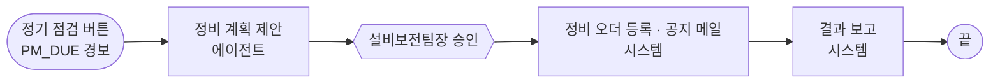
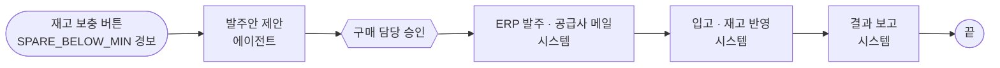

# 수업 시나리오 3개 — 긴급 대응 · 정기 정비 · 예비품 구매

> 2026-10-09 · 보고용 요약
> 상태: **시나리오 3개와 흐름 모양 확정.** 2026-10-09 저녁 수정: **B · C는 설비까지 가지 않습니다** — 승인 뒤 시스템이 처리하면(B 정비 오더 · 공지, C 발주 · 메일 · 재고 반영) 결과 보고로 끝납니다. 시작은 포털 "결함 실험"의 버튼입니다.
> 근거: 조사 문서 `docs/handoff/verification/2026-10-09/scenario-selection.md`(후보 16개 비교, 출처 약 50개), `scenario-research.md`(저장소 확인)

---

## 한눈에 보기

같은 공장, 같은 기종의 유압 파워팩 3대(HYD-01~03)에서 **알려 주는 곳이 다른 업무 세 건**을 다룹니다.

| | A 긴급 대응 | B 정기 정비 | C 예비품 구매 |
|---|---|---|---|
| **한 문장** | 쿨러가 막혀 기름이 뜨거워지니, 설비가 서기 전에 식힌다 | 2,000시간마다 하는 정기 점검 때가 됐으니, 생산을 덜 잃는 시간으로 잡아 미리 고친다 | 씰 키트가 곧 모자라니, 규정에 맞고 총비용이 가장 낮은 곳에서 사 둔다 |
| **누가 알려 주나** | 설비 센서 — "지금 이상하다" | 운전시간 계수기 — "때가 됐다" | 창고 재고 — "곧 모자란다" |
| **업무 갈래** | 운전 · 복구 | 보전 · 예방 | 구매 · 조달 |
| **시간 단위** | 분 | 처리되면 끝 (정비 시점은 오더에 기록) | 처리되면 끝 (바로 입고 · 재고 반영) |
| **에이전트가 답하는 질문** | 무엇이 잘못됐고, 지금 무엇을 하나? | 언제, 무엇을 묶어서 하나? | 얼마나, 어디서, 얼마에 사나? |
| **승인하는 사람 (1회)** | 운전원 | 설비보전팀장 | 구매 담당 |
| **시스템이 하는 것 → 끝** | 냉각 명령 → 재관측(유온 정상 · 경보 해제) → 작업지시 | 정비 오더 등록 · 생산팀 공지 메일 | ERP 발주 · 공급사 메일 → 입고 · 재고 반영(재주문점 위로) |

**세 시나리오 공통 원칙**

- **사람은 자기 담당 업무를 딱 한 번 승인합니다.** 2차 결재(팀장 · 상급자)나 사람이 확인하는 단계는 없습니다.
- **에이전트는 근거를 다 모아 핵심만 요약해서 가져옵니다.** 추천안 하나와 이유 몇 줄이고, 다른 안이 왜 졌는지는 펼쳐 봅니다.
- **해피패스가 아닙니다.** 모든 시나리오에서 대안들이 회사 목표(BSC) · 성과 지표(KPI) · 규정으로 경쟁하고, 지는 안은 실제 손익 이유로 집니다. 결과 확인에서 "미달" 가지도 실제로 밟을 수 있습니다.
- **시작.** A는 버튼으로 원인(쿨러 열화)을 만들고 감지 · 처리 건 시작은 시스템이 합니다. B · C는 화면을 처음 열면 이미 "정기 점검 도래"(HYD-02) · "재고 보충 필요"(HYD-03) 표시가 떠 있고, [정기 점검] · [재고 보충] 버튼이 그 처리 건을 바로 엽니다(업무 감시와 같은 경보 계약 · 같은 접수 경로).
- **B · C는 설비까지 가지 않습니다.** 예정된 정비 시간 대기 · 정비 수행 · 시운전 · 납기 대기가 없습니다. 처리 건이 끝나면 그 설비 위의 표시가 사라지고, 옆의 [초기화]가 수업 시작 상태로 되돌립니다.
- **쓰기는 승인 뒤에만 합니다.** 설비 명령 · 발주 · 메일은 승인 뒤 시스템이 실행합니다. 에이전트는 조회와 계산만 합니다.
- **결과 보고는 시스템이 올립니다.** 담당자는 화면에서 보기만 합니다. A만 설비 재관측으로 정상 · 미달을 가립니다.
- **온톨로지가 중심입니다.** 시나리오마다 자기 문서를 따로 인제스천해 지식 그래프를 채우고, 에이전트는 그 그래프를 근거로 판단합니다.
- **설비 · 시스템 구조 · 온톨로지 스키마는 그대로**이고, 시나리오마다 내용(문서 · 지식 · 에이전트 · 도구 · 담당자 · 흐름)이 다릅니다.

---

## 흐름 모양 (확정)

세 흐름 모두 같은 앞부분(제안 → 승인 1회 → 시스템)입니다. 학생이 bpmn.io로 직접 그리기에 적당한 크기(레인 3개: 담당자 / 에이전트 / 시스템)입니다. 정의 원본: `scripts/c3_flows.py`.

```
A: 시작(센서 경보) → ① 제안 → ② 운전원 승인 → ③ 냉각 명령 → ④ 재관측 → ◇정상? → 작업지시 → 결과 보고 → 끝   (task 8개)
B: 시작([정기 점검]) → ① 정비 계획 제안 → ② 설비보전팀장 승인 → ③ 정비 오더 등록 · 공지 메일 → 결과 보고 → 끝   (task 4개)
C: 시작([재고 보충]) → ① 발주안 제안 → ② 구매 담당 승인 → ③ ERP 발주 · 공급사 메일 → 입고 · 재고 반영 → 결과 보고 → 끝   (task 5개)
```

**task를 나누는 기준.** 하는 사람이 바뀌거나 다른 시스템 · 결과물이 생길 때만 나눕니다. 같은 사람이 같은 목적으로 이어서 하는 일은 하나로 묶습니다. 예를 들어 원인 진단 → 후보 → 규정 검토 → 제안은 에이전트의 "판단 · 제안" task 하나이고, 그 안의 과정은 실행 화면의 실시간 기록으로 보여 줍니다.

| | ① 에이전트 | ② 담당자 (1회) | ③ 시스템 처리 | ④ 시스템 결과 확인 → 보고 | 그리며 배우는 요소 |
|---|---|---|---|---|---|
| **A 긴급 대응** | 원인 진단 · 냉각 조치 제안 | 운전원 승인 | 냉각 명령 → 작업지시 등록 | 재관측해 유온 정상 여부 → 결과 보고 | 승인 지연 타이머, 정상/미달 분기 |
| **B 정기 정비** | 정비 계획 제안 | 설비보전팀장 승인 | 정비 오더 등록(고른 카드의 정비 시점) · 생산팀 공지 메일 | 결과 보고(오더 번호 · 시점 · 메일) — 끝 | 가장 짧은 흐름, 승인 1회 → 시스템 1개 |
| **C 예비품 구매** | 발주안 제안 | 구매 담당 승인 | ERP 발주 · 공급사 메일 → 입고 · 재고 반영 | 결과 보고(입고 수량 · 가용 재고 ≥ 재주문점) — 끝 | 시스템 task 두 개 잇기 |

---

## 상세 비교

| 항목 | A 긴급 대응 | B 정기 정비 | C 예비품 구매 |
|---|---|---|---|
| **설비** | HYD-01 | HYD-02 (HYD-03은 묶음 판단 대상) | HYD-01~03에 들어가는 펌프 씰 키트 |
| **시작 신호** | 센서 경보 `COOLER_DEGRADATION` | 버튼 → CMMS `PM_DUE` 경보 (1,950 h / 주기 2,000 h) | 버튼 → ERP `SPARE_BELOW_MIN` 경보 (재고 < 재주문점) |
| **수업 버튼 (결함 실험, 왼쪽부터)** | [쿨러 열화 주입] [쿨러 복구] | [정기 점검] [초기화] | [재고 보충] [초기화] |
| **처음 화면 표시** | 없음 (버튼 뒤 경보) | HYD-02 "정기 점검 도래" (1,950 h, 이번 회차 오더 없음) | HYD-03 "재고 보충 필요" (가용 1 < 재주문점 2) |
| **표시가 사라지는 때** | — | 처리 건이 정비 오더를 등록하면 (`ent.pm_status.pm_alert`) | 입고로 가용 7 ≥ 재주문점 2 |
| **인제스천할 문서** | 쿨러 · 팬 매뉴얼 (판정 기준 · 원인 · 냉각 SOP) | OEM 정기 점검표 (2,000 · 4,000 · 8,000 h 패키지, 허용 오차, 잔압 해제, 시운전 기준) | 예비품 관리 기준서 (재주문점, 승인 공급사, 총비용 비교, 전결 기준) |
| **문서에서 생기는 지식** | 고장 유형 · 원인(핀 오염 / 외기 고온 / 팬 고장) · 증거 · 냉각 SOP · 온도 규칙 | 정비 패키지 SOP와 단계 · 주기 · 허용 오차 규칙 · 펌프 고장 지식 · 부품(씰 키트, 리턴 필터) | 공급 조건(단가 · 불량률 · 납기 · 승인 여부) · 비승인 공급사 금지 규칙 · 발주 SOP |
| **에이전트** | 냉각 긴급 대응 에이전트 | 정기 정비 계획 에이전트 | 예비품 구매 에이전트 |
| **경쟁하는 근거** | 예측 유온 여유 ↔ 납기 ↔ 팬 수명 ↔ 전력비 | 정비 기한 · 허용 오차 ↔ 생산 오더 납기 ↔ 묶음 정비 인력 ↔ 부품 재고 | 단가 ↔ 품질(불량 기대비용) ↔ 납기 ↔ 규정 |
| **제안 예** | 팬 최대 + 부하 80 % | 오늘 밤 HYD-02만 정비, HYD-03은 허용 오차 안에서 다음 정비 시간으로 | B-OEM에서 6개 (330만 원, 전결 기준 초과 표시) |
| **지는 대안과 이유** | 팬만 최대 → 온도가 충분히 안 내려감 · 부하 70 % → OEM 납기 놓침 | 지금 바로 정지 → 오더 손실 · 허용 오차 밖으로 미루기 → 보증 기록 위반으로 제외 · 두 대 묶기 → 인력 부족 감점 + 씰 키트 1개라 제외(C와 이어짐) | A정밀 → 싸지만 불량 12 % · C트레이딩 → 가장 싸지만 비승인이라 제외 |
| **도구 (읽기만)** | 진단 · 판단 규칙, 센서 시계열, SCADA | CMMS (계획 · 계수기 · 백로그), MES 오더, 자재 키트 상태 | 지식 그래프 (부품 · 공급사 경로), SCM, ERP 재고 |
| **승인 (1회)** | 운전원 | 설비보전팀장 | 구매 담당 |
| **승인 뒤 시스템** | 냉각 명령 → 작업지시 등록 | 정비 오더 등록 · 생산팀 공지 메일 → 끝 | ERP 발주 · 공급사 · 입고 부서 메일 → 바로 입고 · 재고 반영 → 끝 |
| **시스템 결과 확인** | 15분 재관측: 유온 55 ℃ 미만 · 경보 해제 | 없음 (설비까지 가지 않음) — 결과 보고에 오더 번호 · 정비 시점 · 메일 | 없음 (설비까지 가지 않음) — 결과 보고에 입고 수량 · 가용 재고 대 재주문점 |
| **비해피 가지** | 유온이 안 내려감 → "미달" 결과 보고 | 판단 안에서: 미루기 제외 · 지금 정지 감점 · 묶기 제외 | 판단 안에서: C트레이딩 비AVL 제외 · A정밀 불량 감점 · 300만 원 초과 경고 |
| **회사 지표 (KPI)** | 경보 → 승인 · 회복 시간, 인터록 정지 0, 납기 · 전력비 | 정비 기한 준수, 계획 정비 비율, 생산 손실 | 결품 0, 총 구매비, 공급사 품질 |

---

## A 긴급 대응 — HYD-01 쿨러 과열

**이야기.** 쿨러 핀이 먼지와 기름때로 막혀 냉각 효율이 84 %에서 65 %로 떨어지고 유온이 오릅니다. 65 ℃ 인터록에 닿으면 설비가 서고 긴급 오더 납기를 놓칩니다. 에이전트가 원인을 가리고 냉각 조치를 요약해 가져오면, 운전원이 승인하고 시스템이 식힌 뒤 확인해 결과를 보고합니다.



---

## B 정기 정비 — HYD-02 운전시간 2,000 h 도래

**이야기.** CMMS가 "HYD-02 운전시간 1,950 h, 주기 2,000 h"를 알립니다. 에이전트는 서로 부딪치는 근거 넷을 저울질합니다.

1. **기한:** 허용 오차 ±10 %를 넘기면(2,200 h) 보증 기록 요건을 어깁니다.
2. **생산:** HYD-03에 OEM 오더 납기가 3시간 남았습니다.
3. **묶음:** HYD-03도 1,880 h라 같이 할지 정해야 합니다. 묶으면 인력과 생산 용량이 모자랍니다.
4. **부품:** 씰 키트를 쓰면 재고가 재주문점 아래로 내려갑니다(C 예고).

그래서 "오늘 밤 예정된 정비 시간에 HYD-02만 하고, HYD-03은 허용 오차 안에서 다음으로"를 요약해 가져오고, 설비보전팀장이 한 번 승인합니다. 시스템은 정비 오더를 고른 카드의 정비 시점으로 CMMS에 등록하고 생산팀에 공지 메일을 보낸 뒤 결과 보고로 끝냅니다. **설비까지 가지 않습니다**(정비 시간 대기 · 정비 수행 · 시운전 없음). 오더가 등록되면 HYD-02 위 "정기 점검 도래" 표시가 사라집니다.



**근거.** SAP · Maximo 같은 정비 시스템은 운전시간 계수기 계획으로 사람 요청 없이 오더를 만들고, 허용 오차로 날짜를 조정합니다. 파워팩 제조사 매뉴얼은 시간 단위 점검표를 주고 보증 기간 중 점검 기록을 의무로 둡니다. 2,000 h 주기와 ±10 %는 교육용 회사 설정입니다.

---

## C 예비품 구매 — 씰 키트 재고 < 재주문점

**이야기.** 펌프 씰 키트 재고가 재주문점 아래로 떨어집니다. 에이전트가 필요량을 계산하고 공급사 셋을 비교해 발주안을 요약해 가져옵니다.

| 공급사 | 단가 | 불량률 | 납기 | 승인 공급사 | 결과 |
|---|---|---|---|---|---|
| A정밀 | 35만 원 | 12 % | 2일 | 예 | 싸지만 불량 기대비용이 큼 |
| **B-OEM** | **55만 원** | **2 %** | **5일** | **예** | **추천 — 6개 330만 원** |
| C트레이딩 | 20만 원 | 30 % | 1일 | 아니오 | 규정상 제외 |

금액이 전결 기준(300만 원)을 넘는다는 점은 에이전트 요약에 표시만 하고, 승인은 구매 담당 한 번입니다. 시스템이 ERP 발주 · 공급사 메일을 내고, 납기를 기다리지 않고 바로 입고 · 재고를 반영합니다(가용 1 → 7, 재주문점 2 위). 그러면 HYD-03 위 "재고 보충 필요" 표시가 사라집니다. **설비까지 가지 않습니다.**



---

## 한 공장의 한 주로 잇기

세 시나리오는 각자 자기 버튼으로 따로 시작할 수 있고, 이야기로는 이렇게 이어집니다. 흐름끼리 서로 부르지 않고 **데이터로만** 이어집니다.

| 언제 | 사건 | 다음으로 넘어가는 것 |
|---|---|---|
| 월요일 오후 | **A** HYD-01 쿨러 과열 → 팬 최대 + 부하 80 %로 식힘 | 핀 세척 작업지시가 CMMS에 남음 |
| 수요일 | **B** HYD-02 운전시간 1,950 h → 오늘 밤 단독 정비 오더 (씰 키트가 1개뿐이라 두 대 묶기는 제외) | 오더 · 공지 메일 |
| 수요일 밤 | **C** 씰 키트 재고 < 재주문점 → B-OEM 발주 | 바로 입고 · 재고 반영 (수업) |

---

## 겹치지 않는지 확인

| 축 | A × B | A × C | B × C |
|---|---|---|---|
| 시작 출처 | 다름 (센서 / 계수기) | 다름 (센서 / 재고) | 다름 (계수기 / 재고) |
| 업무 목적 | 다름 (복구 / 예방) | 다름 (복구 / 조달) | 다름 (예방 / 조달) |
| 흐름 | 다름 (설비 명령 · 재관측 분기 / 오더 등록으로 끝) | 다름 (재관측 / 발주 → 입고 두 시스템 task) | 다름 (오더 하나 / 발주 · 입고 둘) |
| 판단 종류 | 다름 (진단 · 즉시 완화 / 일정 · 묶음) | 다름 (진단 / 공급원 · 수량) | 다름 (언제 / 어디서 · 얼마) |
| 도구 | 부분 — 둘 다 생산 오더(납기)를 읽음. 생산 영향은 두 판단 모두의 근거 | 다름 | 부분 — 지금은 업무 MCP 서버가 하나. 보전용 · 구매용으로 나누면 해소 |
| 문서 · 스킬 | 다름 | 다름 | 부분 — 같은 씰 키트를 가리킴. B가 쓰고 C가 채우는 연결점 |
| 승인자 | 다름 | 다름 | 다름 |

---

## 왜 이 조합인가 (후보 16개 중)

| 후보 | A와 안 겹침 (5점) | 나머지 기준 합 (40점) | 판정 |
|---|---|---|---|
| A 센서 긴급 대응 | 기준 | 40 | 유지 |
| 운전시간 정기 정비 | 5 | 34 | **B로 채택** |
| 예비품 재주문 구매 | 5 | 34 | **C 유지** |
| 입고 검사 · 공급사 품질 | 5 | 29 | 차점 |
| 전력 피크 관리 | 2 | 32 | 탈락 — 흐름과 승인자가 A와 같음 |
| 오일 분석 결과 | 3 | 31 | 보류 — 진단 사슬이 A와 같음 |
| 예지 정비 (펌프 효율 저하) | 2 | 30 | 탈락 — 센서 진단이라 A와 같음 |
| 경보 합리화 | 3 | 27 | 랩업 소재 후보 |
| 교대 인계 · 안전 작업 허가 · 보증 · 교정 · 누유 · 변경 관리 | — | 20~24 | 탈락 — 사람이 시작하거나, 닫고 확인할 것이 없거나, 시뮬레이터가 없음 |

---

## 확정할 것

| # | 결정 | 권고 | 이유 |
|---|---|---|---|
| 1 | 온톨로지에 관계 하나 추가: `고장 유형 -[예방]-> SOP` | 예 | 정기 점검과 고장 수리를 그래프에서 구분. 기존 것은 바꾸지 않고 같은 형식으로 덧붙이기만 함 |
| 2 | 업무 MCP를 보전용 · 구매용 둘로 나눈다 | 예 | B와 C 에이전트의 도구가 겹치지 않게 |

**스스로 판정할 질문**

- 학생이 세 시나리오를 "센서가 / 달력이 / 재고가 알려 준 일"로 한 번에 구분할 수 있는가?
- 같은 스키마인데 문서를 바꿔 넣으면 그래프의 내용과 에이전트의 제안이 달라지는 것이 눈에 보이는가?
- 각 시나리오에서 에이전트의 추천이 "지는 대안"보다 왜 나은지 회사 목표 · 지표로 설명하고 있는가?

---

## 구현 현황 (2026-10-09 밤, 실제 워커 완주)

구조판 그래프(새 neo4j 볼륨)에 실제 LLM 추출로 HM-8 → PM-02 → PR-07을 적재(192 · 227 · 161초)하고, 포털 화면 버튼으로 A · B · C를 한 번씩 끝까지 돌렸습니다(20배속, 학생 대역 1명, 한 번에 한 건). 증거와 화면: `.evidence/a161-c3/live/`(1440 · 390 화면, 처리 건 · 판단 JSON, 걸린 시간 `durations.json`).

| | 버튼 → 처리 건 | 에이전트 제안 | 사람 승인(대기) | 시스템 처리 | 결과 보고 | 버튼 → 끝 |
|---|---|---|---|---|---|---|
| A 긴급 대응 | 45초 (감지기가 경보) | 106초 | 7초 | 냉각 명령 0.8초 → 재관측 60초 → 작업지시 0.5초 | 0.2초 (정상) | 219초 |
| B 정기 정비 | 1.6초 | 47초 | 12초 | 정비 오더 · 공지 메일 0.6초 | 0.2초 (정상, 오더 · 야간 정비 시점 · 메일) | 64초 |
| C 예비품 구매 | 1.6초 | 49초 | 12초 | 발주 · 메일 0.3초 → 입고 · 재고 반영 0.5초 | 0.3초 (입고 완료, 가용 7 ≥ 재주문점 2) | 67초 |

(2026-10-10 새벽 4차 완주 — 근본 수정 뒤. 에이전트 시간은 실제 LLM 이라 회차마다 다르다: A 46~106초, B 43~47초, C 49~55초.)

- B · C가 끝나면 그 설비 위 표시가 "처리됨"으로 바뀌고, [초기화]를 누르면 "정기 점검 도래" · "재고 보충 필요"가 다시 뜹니다(화면 `R-after-reset-*`).
- 버튼을 누른 사람 · 때는 처리 건 기록(`SCENARIO_BUTTON`)과 시작 경보 근거에 남고, 설비 카드 버튼 아래에 "마지막: [버튼] 누가 · 때"로 보입니다. [쿨러 열화 주입]은 설비 주입에 실린 누름 id 로 그 주입이 연 처리 건에 이어집니다.
- 에이전트가 가져온 값 · 출처 · 읽은 방법은 판단 기록(`GET /api/decisions/{id}` provenance, A · B · C 각 35개)에 남습니다.
- 남은 차이: C는 실제 추출된 PR-07 지식에서 "불량 기대비용" 감점 규칙이 빠지고 SOP-PUR-13이 A정밀로 연결되어, 추천이 설계(B-OEM)와 달리 "최단 납기 긴급 발주(A정밀, 210만 원)"였습니다. B-OEM은 금액 · 전결 경고로 졌습니다. 적재 전 검토 단계에서 사람이 고쳐야 할 지점입니다(C3 보고서 8절).
